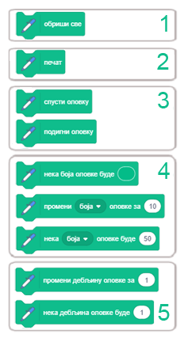
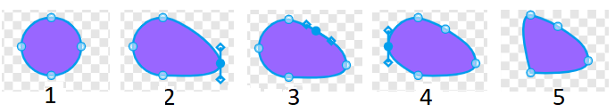

Додаци
======

.. include:: blokovi3.txt

.. include:: ikone3.txt

.. infonote::

  |paleta11|

Функције блокова
----------------

Облик блокова у Скречу обезбеђује да се њиховим повезивањем могу могу формирати само скрипте које су синтаксно исправне. Постоје самостални и функцијски блокови. Самостални блокови (почетни, стек, С-блокови и завршни) одговарају наредбама језика. Функцијски (блокови репортери и логички блокови) чувају вредности за самосталне блокове. Типовима блокова у Скречу детаљније смо се бавили у 3. лекцији овог практикума, а сада ћемо представити функције основних група блокова и неких група из проширења. 

Блокови кретања
~~~~~~~~~~~~~~~

.. sidebar:: |kretanje| Кретање
    
   |sl11_1|
 

    
   
Наредбе придружене блоковима из ове групе могу извршавати само ликови. Позорница је непокретна и зато не може бити извршилац ни једне наредбе кретања. У групи *Кретање* налази се 18 блокова, један више него верзији Scratch 2.0. Додат је блок |klizi_do|.  

Да бисмо их лакше користили, блокови који врше сличне функције стоје близу један до другог и образују подгрупе. Функције подгрупа су следеће:

1.	померање лика прволинијски или кружно,

2.	одвођење лика на задату позицију,

3.	усмеравање лика,

4.	премештање лика променом његових координата,

5.	задржавање лика у границама позорнице,

6.	задавање начина окретања лика,

7.	чување текућих координата и усмерења лика.

Блокови првих шест група су стек блокови, а блокови у седмој групи су репортери чија је функција да чувају податке. Они не могу да стоје самостално већ се умећу у улазна поља других блокова и тако прецизирају њихове акције.

Блокови прве групе врше релативно кретање, померање у односу на текућу позицију усмерење. За разлику од њих, блокови друге групе премештају лик на задату тачку позорнице без обзира где се лик тренутно налази. Такво кретање назива се апсолутно кретање.

У улазна поља блокова кретања уносе се бројни подаци: вредности координата одредишта, угао ротације, број корака или трајање кретања. Један корак одговара једном пикселу. Време се изражава у секундама, а углови у степенима.

Код неких блокова одредиште се бира из падајуће листе. То може бити показивач миша или неки од ликова који учествују у пројекту, као и тачка чије координате се генеришу на случајан начин.

Блок ``подеси начин окретања`` може да постави један од три могућа начина окретања: *на све стране*,  *лево-десно* и *без окретања*. Први начин значи да се лик може окренути за ма који од 360 степени.  Лево-десно значи да лик може бити окренут само лево или десно, а свако друго усмерење је онемогућено. Последњи начин значи да је лик увек окренут надесно.

Блокови групе *Кретање* детаљно су обрађени у 2. лекцији овог практикума.

.....

Блокови изгледа
~~~~~~~~~~~~~~~

.. sidebar:: |izgled| Изглед
    
   |sl11_2|
 

Блокови ове групе контролишу изглед ликова. Седам од укупно 21 блока групе *Изглед* може да управља изгледом позорнице. 
Кад је лик у фокусу види се 20 блокова, а када је позорница у фокусу виде се 3 подгупе. Блок |zameni_poz_cekaj| који омогућава да се промени позадина и чека док се то не догоди није видљив када је лик у фокусу.Остали блокови који могу да се придруже позорници виде се и у овом случају. Функције подгрупа су следеће:

1. приказивање шта лик говори или мисли

2. промена костима лика или позадине позорнице

3. промена величине лика

4. рад са графичким ефектима који могу да се придруже ликовима и позорници

5. приказивање или сакривање лика

6. одвођење лика на жељени слој приказа

7. репортери који указују на текући костим и величину лика, односно текућу позадину позорнице.

Графички ефекти који се могу придружиту лику су: 

.. hlist::
    :columns: 1

    * боја - мења боју лика,
    * рибље око - приказује лик као да се гледа кроз широугаоно сочиво,
    * вртлог - уврће лик око његовог центра, 
    * позрнати - пикселизује лик, 
    * мозаик - ствара више мањих слика лика, 
    * осветљеност - мења осветљеност лика и 
    * дух - мења провидност лика. 

Променом боје може се, на пример, постићи илузија да лик исказује емоције или трепери, а може изгледати и да се појавила нека сасвим нова ствар. Ако промену боје користите са наредбом ``печат``, можете направити атрактивне узорке, на пример дугу. 

Ефектом рибље око може се постићи илузија да се лик приближава или удаљава од екрана, да се дебља и слично. Може се користити као прелаз између костима.

Ефекат вртлог може да симболизује путовање кроз време, телепортацију, али и вртоглавицу, мучнину.

Ефекат пикселизације чини да ликови изгледају као у првим рачунарским играма када су монитори имали малу резолуцију, а такође да се лик цензурише или блокира на позорници.

Ефектом мозаик врши се умножавање лика без клонирања.

Мењањем осветљености лик може да засија или потамни, а ефектом дух лик се може учинити невидљивим за корисника, али други ликови пројекта га могу детектовати.

Блокови |predji_napred| и |predji_napred| разликују се од блокова који су вршили сличне функције у претходној верзији Скреча.

Када је позорница у фокусу види се 8 блокова подељених у 3 подгрупе: за промену позадине, за постављање графичких ефеката позадини и 
репортер који указује на текућу позадину. Репортер ``Backdrop Name``, који је постојао у верзији Scratch 2.0, не постоји у новој верзији. 

Блокови групе *Изглед* детаљно су обрађени почев од 3. лекције овог практикума.

.....

Блокови звука
~~~~~~~~~~~~~

.. sidebar:: |zvuk| Звук
    
   |sl11_3|
 

У пројектима се могу користити две врсте звукова: звуци и ноте. Блокови ове групе користе се за рад са звуцима, а блокови из проширења *Музика* нотама. Звуци су доступни само увозом, снимањем или из уграђене библиотеке звукова. Репродукују се помоћу звучних блокова који контролишу јачину звука, темпо и још много тога. Група блокова *Звук* знатно је измењена у односу на то како је била организована у Scratch 2.0 верзији језика. Део блокова, који су раније били у овој групи, премештен је у проширење *Музика*. У групи *Звук* сада има 9 блокова, који су подељени  у 3 подгрупе. Могу се применити и на ликове и на позадину. 

Функције подгрупа су следеће:

1. покретање, заустављање и репродукција звукова

2. примена звучних ефеката

3. контрола јачине звука

**Покретање, заустављање и репродукција звукова**

Блок ``репродукуј звук до краја`` репродукује одређени звук, при чему паузира своју скрипту све док се не заврши. За разлику од њега, блок ``покрени звук`` репродукује звук без задржавања своје скрипте.
Зато се блок ``покрени звук`` обично користи да најави неку акцију, обавести да је лик постигао циљ или да нагласи неке догађаје.

С друге стране, блок ``репродукуј звук до краја`` обично се користи за пуштање "позадинске музике". Наиме, овај блок се постави у блок ``понављај заувек`` и тако се одговарајућа музичка тема репродукује све време извршавања пројекта. Такође може да се користи за задржавање извршавања скрипте уместо управљачког блока ``чекај``.

Блок ``заустави све звукове`` ће зауставити све звукове који се тренутно пуштају - свих ликова и позорнице. На пример, ако пројекат нуди могућност музике или не, овај блок служи за искључивање музике. Такође је уобичајено да се прекину сви звукови пре но што се пројекат пребаци на следећу сцену и слично.

**Примена звучних ефеката**

Блокови који постављају и мењају звучне ефекте уведени су у Scratch 3.0 верзији. Мада нови звучни едитор омогућава више звучних ефеката (види ниже у одељку о звучном едитору), блокови подржавају само два: постављање и промену висине тона и померање лево/десно звучног записа. 

**Контрола јачине звука**

Ови блокови утичу само на лик (или позадину) коме су придружени. На пример, клик на лик може да доведе до утишавања звука, ако се лик смањује и тиме изгледа као да се удаљава од корисника може и звук да се утишава. Такође, ако се користе блокови из проширења музика, може се поставити да се неки делови композиције чују гласније, а други тише.

Осам од ових блокова су стек блокови, а један је репортер који чува информацију о јачини звука.

.....

Блокови догађаја
~~~~~~~~~~~~~~~~

.. sidebar:: |dogadjaji| Догађаји
    
   |sl11_4|
 

Блокови ове групе покрећу извршавање скрипти и слање и примање порука. Има их 9 и подељени су 3 подгрупе. Како је у овој верзији Скреча видео детекција пребачена у проширења, из падајуће листе блока |kad_vece| избачена је ова детекција.

Функције подгрупа су следеће:

1. покретање скрипти акцијом корисника 

2. покретање скрипти ако је испуњен неки услов при извршавању пројекта 

3. омогућавање разглашавања и пријема порука.

**Покретање скрипти акцијом корисника**

Корисник може да покрене извршање пројекта кликом на дугме |gf|, неки од ликова пројекта, позадину или притиском на дирку тастатуре. Уобичајено је да се извршавање пројекта започиње кликом на зелену заставицу. Тада се активирају све скрипте које почињу овим блоком. То су скрипте које врше разне иницијализације, па предају управљање другим скриптама. На пример, бришу све елементе листе, ресетују променљиве, постављају сцене приказивањем или скривањем ликова и променом њихових костима, бришу све што је нацртано, покрећу позадинску музику и слично. Мада је у потпуности могуће направити пројекте без овог блока, то се не препоручује. Једини начин на који би се пројекат могао покренути без овог блока био би да се активирају скрипте које започињу неким другим блоком из ове подгрупе. У том случају пројекат би трајао само док не заврше скрипте које зависе од почетних скрипти. 

Напомена. Блок |klik_pozornica| је видљив само када је позорница у фокусу.

**Покретање скрипти испуњавањем услова при извршавању пројекта**

Промена позадине, истек одређеног времена или повећање јачине звука преко одређеног нивоа могу бити догађаји за покретање извршавања скрипти које на врху имају неки од блокова из ове групе.

**Разглашавање и примање порука**

Размена порука је главни механизам за усклађивање понашања ликова у пројекту, а може да послужи за реализацију процедура. Разглашавање се користи за позивање скрипти које треба да се активирају када су испуњене одређени услови. Скрипте, чији је први блок |kad_primim|, ће се позивати након што задата порука буде разглашена. Ако се иста порука поново пошаље док скрипта још увек ради, текуће извршавање ће се прекинути и скрипта ће поново радити испочетка. Тако, ако у скрипту која почиње блоком ``кад примим`` поставимо блок који разглашава поруку на коју се скрипта одазива, имамо ситуацију да скрипта позива саму себе. Ово се назива **рекурзија** и може се користити за креирање фрактала, прављење петље заувек и слично.

.....

Блокови управљања
~~~~~~~~~~~~~~~~~

.. sidebar:: |upravljanje| Управљање
    
   |sl11_5|
 

Блокови ове групе управљају током извршавања скрипти. Омогућавају гранања, понављања и прекидање извршавања, као и рад са клоновима ликова. Има их укупно 11, од чега је један почетни, 2 су завршни, 3 су стек бокови, 5 су С-блокови, а блок ``ако_онда_иначе`` је Е облика. Подељени су 5 подгрупа чије су функције следеће:

1. блок за чекање

2. блокови за понављања

3. блокови за гранања 

4. блокови за условна понављања

5. блок за заустављање

6. блокови за рад са клоновима

Детаљније о функцијама ових блокова говорили смо у лекцијама 5, 6 и 7 овог практикума.

**Рад са клоновима**

Клонирање је функција која омогућава лику да створи копију самог себе док пројекат траје. Сваки клон (умножак) има исте костиме, звукове и скрипте као оригинал, али иначе је независан. Клонирање се разликује од остављања слике лика печатом на позорници по томе што клонови засебни ликови који могу да покрећу скрипте и понашају се у складу са њима. Разликује се и од ликова који настају умножавањем постојећег лика по томе што су обични дупликати стални и појављују се листи ликова, а клонова нема у листи ликова и нестају када се пројекат заврши.

Клонирање се користи кад у пројектима постоје слични ликови који раде сличне ствари. Пошто клонове креира пројекат, а не корисник, клонирање ослобађа корисника од прављења истих промена у сваком од многих ликова. На пример, клонирање се може користити за стварање пуно ликова пријатеља и непријатеља у играма и за специјалне ефекте као што су ватромет и снег.

Клонови обично врше акцију онда када су створени. Блок |kad_umnozak| покреће скрипту која се извршава када се креира клон. Лику може бити придружено више скрипти које почињу овим блоком и све оне ће се покренути истовремено када се креира клон. Сама скрипта може бити покренута на више клонова одједном. Неке од таквих радњи које овај блок може извести су постављање клона на случајну позицију или померање клона док се не судари са неким ликом.

.....

Блокови осећаја
~~~~~~~~~~~~~~~

.. sidebar:: |osecaji| Осећаји
    
   |sl11_6|
 

Ову групу чине блокови који омогућавају да пројекат прихвата улазне податке са различитих уређаја, слично као што човек чулима прикупља информације из свог окружења.
У групи *Осећаји* налази се 18 блокова. За разлику од верзије Scratch 2.0, у овој групи више нема 3 блока који су се односили на подешавање видеа и праћење покрета које видео региструје, али је додат блок |neka_prevlacenje|. Овај блок регулише да се лик у режиму приказа преко целог екрана може превлачити или не, што се раније подешавало у информацијама о лику. Блокови који се односе на видео детекцију пребачени су у одговарајуће проширење.

Блокови су подељени у 6 подгрупа чије функције су следеће:

1.	чување информација о положају лика у односу на показивач миша и друге објекте,

2.	уношење улазних података са тастатуре,

3.	чување информација о текућим операцијама миша и тастатуре,

4.	чување текуће вредност јачине звука,

5.	чување параметара ликова и позорнице,

6.	чување информација о текућем времену и кориснику.

Међу блоковима ове групе само 3 могу да стоје самостално, сви остали су функционални. Тако се блокови прве групе умећу у управљачке блокове који треба да обезбеде да се изврше различите акције у зависности од положаја лика. Блокови друге групе одговарају информацијама које човек прикупља чулом додира, а треће информацијама које се прикупљају чулом слуха. Тајмер може да се користи за ограничавање времена игре или времена за које треба решити неки задатак у тесту. Блок који чува параметре ликова и позорнице може да пружи многе податке о свим објектима који учествују у пројекту. Информације које човек прикупља чулом вида, а рачунар видео камером могу се користити ако се у пројекат укључи проширење *Видео детекција*.

Функције већине блокова ове групе обрадили смо кроз примере у претходним лекацијама. Овде ћемо само напоменути функције логичких блокова и репортера текућег времена.

**Логички блокови**

Међу блоковима ове групе налази се 5 логичких блокова. Сваки од њих може да врати само једну од 2 вредности: true или false, у зависности од тога да ли је услов који се њима задаје испуњен или не.
Логички блокови се постављају у улазна поља шестоугаоног облика управљачких блокова.

**Информације о текућем времену и кориснику**

Репортер |vreme| може дати следеће информације о текућем времену.

.. image:: ../_images/11/tekuce_vreme.png
     :width: 200px   
     :align: center

.....

Блокови оператора
~~~~~~~~~~~~~~~~~

.. sidebar:: |operatori| Оператори
    
   |sl11_7|
 

У групи *Оператори*  нема самосталних блокова који одговарају наредбама језика. Сви блокови су функцијски, односно чувају вредности бројевних, стринг или логичких израза и постављају се у одговарајућа улазна поља самосталних блокова или других функцијских блокова. Нови блок ове групе је |tekst_sadrzi|, који враћа вредност true или false у зависности од тога да ли стринг садржи или не дати знак. 

Група *Оператори* садржи укупно 18 блокова - 11 репортера и 7 логичких блокова, који омогућавају следеће врсте операција:

1.	основне аритметичке – сабирање, одузимање, множење и дељење,

2.	генерисање случајних бројева,

3.	поређења - мање, веће, једнако,

4.	формирања сложених логичких израза,

5.	операције са стринговима,

6.	целобројне операције, 

7.	израчунавање вредности математичких функција.

Основне аритметичке операције могу се вршити над целим и реалним бројевима. Једино дељење нулом (делилац = 0) може довести до проблема, јер не постоји број који би помножен нулом дао број различит од нуле (количник * делилац = дељеник). Зато у програмима треба спречити да дође до дељења нулом. Како се то ради показали смо у пројекту *Мали математичар* у 7. лекцији овог практикума. 

Скреч интерпретатор као резултат дељења нулом враћа једну од вредности  Infinity, NaN или -Infinity  (бесконачно, није број или -бесконачно), у зависности од тога да ли је дељеник позитиван број, 0 или негативан број. 

Коришћење случајних бројева, логичких израза и сложених логичких израза који се формирају помоћу логичких операција *и*, *или* и *не* објаснили смо кроз примере у претходним лекцијама.

Операције са стринговима омогућавају повезивање два стринга, издвајање знака који се налази на задатој позицији стринга, утврђивање дужине стринга и проверу да ли стринг садржи дати знак. Операције са стринговима детаљно су обрађене у 9. лекцији овог приручника.

Целобројне операције подржане у Скречу су рачунање остатка при целобројном дељењу и заокруживање бројева.

Математичке функције које се бирају се из падајуће листе блока |funkcija| су:

.. hlist::
    :columns: 6

    * abs
    * floor
    * ceiling
    * sqrt
    * sin
    * cos
    * tan
    * asin
    * acos
    * atan
    * e^
    * 10^ 

.....

Блокови променљивих и листа
~~~~~~~~~~~~~~~~~~~~~~~~~~~

.. sidebar:: |promenljive| Променљиве и листе
    
   |sl11_8|
 

Функције подгрупа су следеће:

За променљиве

1. репортери корисникових променљивих,

2. задавање и промена вредности променљиве,  

3. приказивање или сакривање репортера променљиве на позорници.

За листе

4. репортери корисникових листа,

5. додавање елемента на крај листе,

6. операције над листом, 

7. враћање информација о листи, 

8. приказивање или сакривање репортера листе на позорници.

Операције које су подржане за рад са листама су: 

.. hlist::
    :columns: 1

    * брисање елемента са задате позиције,
    * брисање свих елемената,
    * уметање елемента на задату позицију и 
    * замена елемента са задате позиције.

О листи се могу добити следеће информације: 

.. hlist::
    :columns: 1

    * који елемент се налази на задатој позицији, 
    * на којој позицији се налази задати елемент, 
    * колико листа има елемената и 
    * да ли листа садржи задати елемент. 

Променљиве и листе могу бити глобалне - за све ликове, или локалне - само за један лик. Променљиве и листе које се креирају за позорницу видљиве су за све ликове.

Текуће вредности променљивих могу се пратити на позорници преко монитора променљивих. Монитори променљивих могу се појавити у три формата: 

.. hlist::
    :columns: 1
    
    * приказ вредности са именом променљиве,
    * велики приказ вредности без припадајућег имена, 
    * са клизачем који омогућава промену вредности променљиве.

О раду са променљивим детаљно смо говорили у 7. лекцији, а о раду са листама у 9. лекцији овог практикума.
 
.....

Моји блокови
~~~~~~~~~~~~

.. sidebar:: |moji_blokovi| Моји блокови
    
   |sl11_9|
 

Почев од верзије Scratch 2.0 уведена је могућност да корисник направи сопствене блокове и на тај начин реализује процедуре. У новој верзији Скреча измењена је боја и форма корисникових блокова. 

Када корисник затражи да уведе нови блок, појављује се почетни блок - дефиниција, на који треба надовезати акције које треба да извршава новоуведени блок. Потом се у листи блокова појављује стек блок са именом које му је додељено у дефиницији. Нови блок који је дефинисао корисник надаље може да се користи као и сви остали блокови. 

Нови блок може да има и улазна поља. У улазна поља заглавља дефиниције уносе се *параметри*. Процедуре могу имати и више параметара. Када се новим блоком позива процедура, у његова улазна поља уписују се *аргументи*. Аргументи замењују свако појављивање одговарајућих параметра у процедури. 

Детаљније о начину креирања и коришћења уведених блокова говорили смо у 8. лекцији овог практикума.

.....

Блокови проширења оловка
~~~~~~~~~~~~~~~~~~~~~~~~~

.. sidebar:: |olovka| Оловка
    
   |sl11_10|
 

У Скречу се сваком лику могу задати положај, смер и правац кретања и при кретању може да оставља траг. Притом величина, облик и боја самог лика немају утицаја на траг који оставља, јер ликови цртају оловком. Лик може бити и невидљив или се састојати од једне једине тачке, али то нема утицаја на његово цртање. Могућност лика да оставља траг при кретању заснована је на блоковима из ове групе. Слика коју ликови формирају памти се као колекција фигура, заједно са њиховим параметрима. За такав начин дефинисања слике користи се назив *векторска графика*. 

Блокови у проширењу *Оловка* организовани су у 5 подгрупа. Укинуте су наредбе за рад са сенком оловке који су коришћени у претходним верзијама језика, а уместо задавања боје оловке само бројем сада се боја дефинише атрибутима нијанса, засићење и осветљеност. Сви блокови ове групе у стек блокови.

Функције подгрупа су следеће:

1.	брисање свега што је нацртано,

2.	остављање печата лика,

3.	подизање и спуштање оловке,

4.	постављање и мењање атрибута оловке,

5.	постављање и мењање дебљине оловке.

Графички едитор у овој верзији Скреча ради са тзв. HSB (Hue, Saturation, Brightness) моделом боја. То значи да се боја формира задавањем 3 компоненете: нијансом (Hue), засићењем (Saturation) и осветљеношћу (Brightness) боје. Нијанса боје означава број боје у спектралној палети, односно саму боју. Описује се у колорном кругу у којем угао 0° представља црвену боју (број боје 0), а 180° плавозелену (цијан, број боје 100). Засићеност боје говори о њеном интензитету - што је већа то је боја чистија. Засићеност може да буде од 0 до 100%, при чему интензитет 0% представља белу, а интензитет 100% чисту боју. Осветљеност боје зависи од количине црне боје која се меша са посматраном бојом. 

.....

Блокови проширења текст у говор  и преведи
~~~~~~~~~~~~~~~~~~~~~~~~~~~~~~~~~~~~~~~~~~

.. sidebar:: |tekst_govor| Текст у говор и |prevedi| Преведи
    
   |sl11_11|
 

**Проширење текст у говор**

Ово проширење може да се користи само ако је рачунар повезан на интернет |zahteva|, јер користи Amazon Web Services.

Када из групе *Проширења* изабереш |tekst_govor|, у палети блокова појавиће се три нова блока. Они  омогућавају да лик на језику који поставиш трећим блоком ове групе изговори текст који упишеш у улазно поље  првог блока. Можеш да поставиш и глас којим ће текст бити изговорен: женски (сопран или алт) или мушки (тенор или бас). Ово се задаје другим блоком ове групе. Како изговор за српски језик засад није подржан, изабери руски језик. То ће омогућити да текст исписан ћирилицом у улазном пољу првог блока буде коректно изговорен.

**Проширење преведи**

Ово проширење може да се користи само ако је рачунар повезан на интернет |zahteva|, јер користи Google. 

Када из групе *Проширења* изабереш |prevedi|, у палети блокова појавиће се два нова блока. Они омогућавају да текст исписан у једном језику буде преведен на други језик. Блок |jezik| јавља на који је језик постављен Скреч. Текст који је написан у текућем језику у првом улазном пољу блока |prevedi_na| преводи се на језик који се одабере из падајуће листе другог улазног поља. Ако се блок за превођење постави у улазно поље блока ``изговори`` или ``замисли``, можеш да видиш превод. Нажалост, квалитет превода са српског језика одговара оном који даје гугл преводилац. За језике који се више користе превод је бољи.

Употреба уграђеног графичког едитора
------------------------------------

Скреч има уграђен едитор слика који можеш да користиш за креирање и измене ликова, костима и позадина. Овај едитор подржава цртање у два режима: растерском и векторском. 

.. infonote:: 

  Рачунари могу да памте слике на два начина: растерском и векторском.
  
  У **растерској графици** слика се памти као правоугаонa мрежa пиксела - битмапа. Битмапа је технички одређена ширином и висином лика у пикселима и 
  бројем потребних битова да се упамти боја пиксела. На пример, ако имамо само 16 боја, потребна су 4 бита по пикселу за памћење његове боје. 
  Растерска графика је зависна од резолуције. Растерске слике се не могу увећавати без губитка квалитета снимка. 

  Овај недостатак је превазиђен применом **векторске графике**, која памти слику као колекцију фигура, заједно са њиховим подацима (параметрима) који дефинишу 
  како ће фигура бити исцртана и где ће бити лоцирана. Корњача графика је пример векторске графике.

  .. image:: ../_images/11/raster_vektor.png
     :width: 210px   
     :align: center

Кориснички интерфејс
~~~~~~~~~~~~~~~~~~~~

На следећој слици приказан је изглед уграђеног едитора слика када се налази у векторском и растерском режиму рада. 

.. sidebar:: Нови костим
    
   |novi|
 

**Област костима**

Сасвим лево је област костима (1) у којој се налазе иконе за сваки костим и редни број костима.  На дну области костима је дугме за креирање нових костима. Да би уредио различите костиме у едитору слика, једноставно кликни на икону жељеног костима и одговарајућа слика ће се појавити у области уређивања - платну за цртање (7). 

Нови костим (или позадину) можеш да додаш тако што задржиш показивач изнад  дугмета |dugme_lik| на дну ове области и изабереш једну од опција које ће се притом појавити. Можеш одабрати костим из библиотеке костима, нацртати сопствени, преузети датотеку слике са рачунара, сликати се или одабрати „костим изненађења“, који се из библиотеке костима бира на случајан начин.

Напомена. У библиотеци костима налазе се појединачни костими свих ликова који се налазе у библиотеци ликова.

.. sidebar:: Замена режима рада
    
   |prevedi_raster|
   
   |prevedi_vektor|
 

**Пребацивање из векторског у растерски режим и обрнуто**

Испод доњег левог угла платна за цртање налази се дугме (2) које пребацује едитор из једног у други режим рада. Лево од платна за цртање налазе се алати специфични за одговарајући режим, на нашој слици (5) за векторски, а (6) за растерски. Изнад платна у горњем реду налазе се опције. Неко од њих су заједничке за оба режима, на слици издвојене црвеним оквиром (3), а неке су специфичне за векторски начин рада - издвојене сивим оквиром (4). 

Опције које се користе у оба режима
~~~~~~~~~~~~~~~~~~~~~~~~~~~~~~~~~~~

Ове опције налазе се изнад платна за цртање.

.. sidebar::  Промена боје
    
   |promena_boje|
 

|popuni| **Промена боје**

Кликом на улазно поље блока за задавање боје отвара се падајући мени у коме се налазе клизачи: боја, засићење и осветљеност и испод њих алатка пипета за узимање узорка боје. Жељену боју можеш да поставиш померањем клизача или кликом на пипету.

Померањем клизача *боја* мењаш нијансу боје (на пример, од црвене у плаву). Овај алат се највише користи јер има највећу разлику између боја.
Померањем клизача *засићење* мењаш интензитет боје: засићеност 100 је одабрана боја, 50 - светлија боја, а 0 - потпуно бела. Померањем клизача *осветљеност* подешаваш  колико ће боја бити затамњена: осветљеност 0 је потпуно црна, док је 100 одабрана боја.

Ако се кликне на пипету, појављује се лупа са кружићем у центру. За избор жељене боје треба да поставиш центар лупе изнад дела сликарског платна на коме се та боја налази и кликнеш. 

Изнад три клизача налазе се четири опције. Оне омогућавају различите начине попуњавања. Област можеш да попуниш равномерно једном бојом или градијентно, нијансама боја. Ако кликнеш на неку од опција осим опције пуне боје, приказаће се две изабране боје: |zameni_boje|. Кликом на прву или другу боју можеш да их поставиш. Кликом на *замени* између две боје мењаш њихов редослед. Стилови попуњавања редом су: једнобојни, вертикално линеарно градијентни, хоризонтално линеарно градијентни и кружно градијентни. 

|debljina| **Промена дебљине оловке**

Постоји улаз за одабир дебљине оловке. Унеси величину или користи стрелице са стране да је промениш. Што је већи број, линија ће бити дебља.

|ime| **Именовање костима**

Име костима важно је за организацију, а понекад и за програмирање пројекта. Како је сваком костиму придружен и његов редни број, није добро именовати костиме као само бројеве без икаквих других знакова. Костиму дајеш ново име тако што кликнеш на траку текста у горњем левом делу опција и откуцаш име. 

|alat6| **Копирање и** |alat5| **лепљење** 

У другом реду опција налазе се дугмад за копирање и лепљење. Опција копирања копира одабрану област, док је лепљење ставља на друго место. Можеш да користиш и пречице: Ctrl+C за копирање и Ctrl+V за лепљење. Прво изабери правоугaону облaст коjу желиш дa копираш, а онда је превуци до места где желиш да поставиш копију.

|redo| **Поништи и поново**

Десно од имена костима налазе се два дугмет аза поништавање и понављање. Ова дугмад омогућавају да поништиш последњу радњу и да поновиш поништену радњу. Дугме за понављање не може да се користи ако претходно није употребљено дугме за поништавање. Ако напустиш едитор слика, све што си у њему радио постаје трајно и може се поништити само ручно. Пречица на тастатури за поништавање је Ctrl+Z.

|alat3| **Хоризонтално**  |alat4| **и вертикално окретање**

Када одабереш предмет, постоји могућност да га хоризонтално или вертикално окренеш (преврнеш). У другој линији опција налазе се два дугмета са по две стрелице усмерене према испрекиданој линији. Оно с леве стране окреће изабрани објекат хоризонтално, а друго - вертикално.

Опције које важе само за векторски режим
~~~~~~~~~~~~~~~~~~~~~~~~~~~~~~~~~~~~~~~~

Ове опције расположиве су само када се графички едитор користи у векторском режиму и не појављују се када се ради у растерском режиму.

**Прецизно померање објекта**

Када се изабере неки објект у векторском режиму, тастери са стрелицама се могу користити за прецизно померање тачно за један пиксел. И када се ради у растерском режиму изабрана област се такође може померати помоћу тастера са стрелицама. Ова опција може бити корисна ако желиш да направиш прецизан цртеж или поравнаваш објекте.

.. sidebar::  Промена контуре
    
   |promena_konture|
 

|kontura| **Задавање контуре**

Десно од опције за постављање боје налази се падајући мени који омогућава мењање контуре објекта. Овај падајући мени такође има три клизача, али за разлику од менија за задавање боје, овде  немаш могућност за мешање две боје. Десно од падајућег менија је текстуално поље у коме се задаје дебљина контуре. Можеш да унесеш број или да га промениш помоћу стрелица.

**Организација приказа по слојевима**

За објашњење као се ликови приказују на позорници можемо користити следећу аналогију. Замислите да је сваки лик насликан на посебној провидној фолији и да су све фолије наслагане једна на другу преко оне на којој је наслика позадина. Кретање лика можемо представити као померање фолије на којој је насликан. Оно што одговара транспарентним фолијама у Скречу су **слојеви**. Сваким померањем лик заклања све оно што се налази у слојевима испод њега. 

У горњем десном опција едитора слика налазе се четири дугмета која омогућавају да помераш ликове кроз слојеве: 

.. hlist::
    :columns: 1
    
    * |valat10| помера објекaт један слој испред,
    * |valat12| помера објекат сасвим испред,
    * |valat11| помера објекат један слој испод,
    * |valat13| помера објекат сасвим испод.

|valat14| **Груписање** |valat15| **и разгруписавање**

Ова опција користи се за груписање више објеката у једну целину. Када постоји много објеката које треба преместити или обрисати одједном,  корисно је да их групишеш. На тај начин ће сви истовремено моћи да се померају или бришу. Кликни и превуци преко објеката (или држи притиснут Shift и клини на сваки од њих) да их изабереш, а затим кликни на дугме за груписање. Сви објекти се надаље третирају као један објекат. 

Дугме за разгруписавање чини супротно - изабрана група  може се рашчланити на мање делове. Ово дугме постаје видљиво када изабереш групу и омогућава ти да разгрупишеш објекте.

|valat16| **Заобљено** |valat17| **или шиљато**

Када користиш алат за промену облика, постоје две опције, десно од контуре, које омогућавају да  криве буду заобљене попут елипсе, или зашиљене, као правоугаоник. Ово је корисно када креираш облике са закривљеним и шиљастим ивицама. Ако је изабрано више тачака (држи тастер shift и кликни на више), на све изабране тачке ће се применити наведена промена.

Рад у растерском режиму
~~~~~~~~~~~~~~~~~~~~~~~

.. sidebar:: Aлати растерског режима

 |rasterski|

  
|ralat1| **Цртање слободном руком**

Боју цртања и дебљину четкице можеш да поставиш одговарајућим опцијама. Користи опције за поништавање и понављање акције ако погрешиш. У случају грешке помаже и гумица за брисање.

|ralat2| **Цртање праве линије**

Дебљину линије можеш да промениш одговарајућом опцијом. Користи Shift + превлачење за цртање хоризонталних или вертикалних линија. 

|ralat4| **Цртање елипсе**

Може се цртати празна или попуњена елипса. Користи Shift + превлачење за цртање круга.
Одговарајућим опцијама можеш да одабереш стил попуњавања и промениш дебљину контура.

|ralat3| **Цртање правоугаоника**

Може се цртати празан или попуњен правоугаоник. Користи Shift + превлачње за цртање квадрата. 
Одговарајућим опцијама можеш да одабереш стил попуњавања и промениш дебљину контура.

.. sidebar:: Текст

 |tekst|

|ralat5| **Испис текста**

Кликни било где на платно, па укуцај свој текст када видиш курсор. Затим кликни изван области текста.
Алатка за селектовање аутоматски бира текст, тако да можеш да промениш његову величину и оријентацију.
Користи хватаљке (кружиће и стрелице око текста) да промениш величину и оријентацију текста.

|ralat6|  **Попуњавање затворене области**
 
Област можеш да попуниш равномерно једном бојом или градијентно, нијансама боја коришћењем одговарајуће опције за попуњавање.

|ralat7| **Брисање потезима слободне руке**

Подеси величину гумице одговарајућом опцијом. Области које си избрисао постају провидне.

|ralat8| **Избор правоугаоне области**

Изабрану област можеш да:

1.	помериш на нову локацију превлачењем,

2.	повећаш, смањиш и ротираш,

3. избришеш притиском на дирку за брисање Del

Рад у векторском режиму
~~~~~~~~~~~~~~~~~~~~~~~

.. sidebar:: Aлати векторског режима

 |vektorski|

|valat1| **Избор објекта**

Овај алат користи за померање, брисање, промена величине или ротацију објекта.
Када се кликне на објекат, око њега се појављује оквир |izbor_objekta| што значи да је објекат изабран.

.. |izbor_objekta| image:: ../_images/11/izbor_objekta.png

Ако желиш да изабереш више објеката одједном, држи притиснуто лево дугме миша и превуци мишем преко њих или држи притиснут тастер Shift и кликни на све објекте које желиш истовремено да изабереш.
Када помераш курсор близу центра објекта, показивач миша мења облик у руку, што значи да можеш да помераш објекат по платну. Објекат такође може да се помера и диркама са стрелицама на тастатури.
Изабрани објекат се брише притиском на тастер Del. Можеш да промениш величину објекта повпачењем било које од хватаљки - кружића око ивице објекта.
За ротирање објекта око његовог центра, ухвати и повуци стрелице за ротацију.

|valat2| **Промена облика објекта**

Кликни на објекат који желиш да преобликујеш и појавиће се скуп контролних тачака на ободу објекта, као што је приказано на слици (1). Кликни на неку од њих и превуци је (2). Можеш да креираш додатне контролне тачке кликом на контуру објекта (3). Контролну тачку можеш да избришеш тако што показивачем дођеш до ње (4). Изабрана тачка ће променити боју, па тада кликни на њу (5).
Дугмад |valat16| и |valat17|, која се појављује у опцијама, омогућавају да заоблиш или заоштриш ивице са контуре објекта.	

|valat3| **Цртање слободном руком**

Ова алатка је слична алатки одговарајућој алатки у растерском режиму. Држи курсор миша и померај га за цртање криве линије. Уместо пикселима, овде је крива дефинисана скупом контролних тачака. Изглед линије можеш да промениш помоћу алатке *Преобликуј*.

|valat9| **Брисање**

Ова алатка је слична алатки одговарајућој алатки у растерском режиму.

|valat8| **Попуњавање бојом затворене области или бојење контуре објекта**

Кантица у векторском режиму функционише другачије него у растерском моду, где алат попуњава ма коју изабрану затворену област. Кантица у векторском режиму ради само са векторским објектима.
Након избора ове алатке кликом на објекат можеш да промениш његову боју или боју његове контуре.

|valat7| **Испис текста**

Изабери ову алатку, па кликни било где на платно, и унеси свој текст када се појави курсор. Када завршиш, кликни изван области текста. Алатка *Изабери* ће аутоматски селектовати текст, тако да можеш да промениш његову величину и оријентацију. За разлику од текста у растерском режиму, текст креиран у векторском режиму може бити едитован у било које време, чак и након што изађеш из графичког едитора. Да би могао да мењаш његов садржај, довољно је да селектујеш текст.

|valat4| **Цртање праве линије**

Линија је дефинисана помоћу две контролне тачке на оба краја. За цртање линије, кликни мишем тамо где желиш да буде почетак линије и превуци до крајње тачке. За цртање хоризонталне или вертикалне линије, држи притиснут тастер Shift док превлачиш мишем.

За цртање криве линије, почни са правом линијом, а онда избери алатку *Преобликуј*, па уради Shift +клик било где на линији и превлачи нову контролну тачку. То је начин да за обликовање криве линије.

|valat6| **Цртање елипсе**

Користи ову алатку за цртање елипсе бојом цртања. Кликни да маркираш горњи леви угао, а затим превлачи (Shift + превлачење за круг) до величине елипсе коју желиш. Можеш да промениш стил попуњавања (попуњена или празна) и дебљину линије користећи дугмад у области опција. Добијена елипса има 4 равномерно распоређене контролне тачаке. 

|valat5| **Цртање правоугаоника**

Користи ову алатку за цртање правоугаоника бојом цртања. Кликни да маркираш прво теме и затим превлачи (Shift + превлачење за квадрат) до величине правоугаоника коју желиш. Можеш да промениш стил попуњавања (попуњен или празан) и дебљину линије користећи дугмад у области опција. Добијени правоугаоник има четири контролне тачке, у сваком темену по једну.

Употреба уграђеног звучног едитора
----------------------------------

Звучни едитор у Скречу омогућава корисницима да уређују и ремиксују звуке. У музици се термин *ремикс* користи за нову, измењену верзију неке музичке композиције. 

Кориснички интерфејс
~~~~~~~~~~~~~~~~~~~~

Прозор звучног едитора подељен је у две области: листу звукова (1) и област уређивања (2).

.. sidebar:: Нови звук

 |novi_zvuk|

**Листа звукова**

Листа звукова налази се на левој страни прозора и служи за одабирање звукова које ћемо уређивати у области за едитовање. Избор звука врши се кликом на њега. Звук који је изабран добија плави оквир око своје иконе слично активном лику у листи ликова. У горњем десном делу активног звука појављује знак "х", који омогућава његово брисање. Десни клик на икону звука отвара приручни мени који нуди умножавање, извоз и брисање звука.

На дну ове области налази се дугме |dugme_zvuk| које омогућава увођење нових звукова.

**Област уређивања** 

Област уређивања садржи траку на врху (3), графички приказ звука у средини (4) и траку испод (5), која садржи 7 алатки. 

У траци изнад графичког приказа звука налазе се алатке које омогућавају едитовање звука, али не производе ефекте. Ту су:

.. hlist::
    :columns: 1
    
    * поље за давање имена звуку,
    * дугмад за опозив и понављање последње акције и
    * дугме |opseci| за опсецање снимка.

У траци испод налазе се алатке које омогућавају специјалне ефекте при репродукцији звука:

.. hlist::
    :columns: 1

    * |faster| убрзавање,
    * |slower| успоравање,
    * |echo| одјек,
    * |robot| роботизацију,
    * |louder| појачавање,
    * |softer| утишавање и
    * |reverse| окретање звучног записа уназад. 
    
Убрзавање и успоравање реализује се тако што се уместо ноте репродукује виша или нижа од ње. Ефекат ехо постиже се поновним пуштањем звука после 0.15 секунди.

