Наредбе гранања
===============

.. include:: blokovi3.txt

.. include:: ikone3.txt

.. infonote::

 |paleta6|

У овоj лекцији ћемо научити како се користе управљачки блокови који омогућавају **условно извршавање**, односно гранање у програму.  Условно извршавање корака реализује се помоћу услова и два низа наредби. Ако је услов испуњен извршава се први низ наредби – тзв. **ДА грана**, а ако није – извршава се други низ наредби - тзв. **НЕ грана**. Показаћемо и како се граде сложени услови на основу којих се доносе одлуке. Систематизоваћемо блокове који омогућавају реализацију основних елемената програмске логике у Скречу. Упознаћемо више блокова из групе *Осећаји* и показати како се користи едитор слика у векторском режиму.

.. topic:: Наредбе гранања

 У пројектима са простом линијском структуром, свака наредба извршава се тачно једанпут.
 У претходној лекцији упознали смо се са С-блоковима за опис циклуса који омогућавају да се наредбе које се у њих уметну извршавају више пута - блоковима за опис циклуса. Осим блокова који описују циклусе, и блокови који омогућавају гранање имају улаз за скрипте. У зависности од тога да ли је испуњен услов гранања, уложене наредбе ће се извршити или се неће извршити.
 
 Наредба гранања којој одговaра С-блок, осим улаза за логички израз, има и један улаз за скрипте, а она којој одговара Е-блок - два улаза за скрипте. Прва наредба омогућава да се изврше наредбе уложене у *ако...онда* "уста" када је услов гранања испуњен, а ако није, онда се неће извршити ни једанпут и прећи ће се на извршавање прве наредбе која следи за наредбом условног преласка.

 .. image:: ../_images/6/sl6_1.png
   :width: 500px   
   :align: center

 Друга наредба условног гранања прескаче неке наредбе било да је услов гранања испуњен или не. Ако је услов гранања испуњен, неће се извршити наредбе из НЕ гране, а ако услов није испуњен, неће се извршити наредбе из ДА гране.
 Дакле, за разлику од простих линијских програма у којима се свака наредба извршава тачно једанпут, цикличних у којима постоје наредбе које се могу извршавати више пута (у оквиру тела циклуса), код програма са разгранатом структуром постоје наредбе које се неће извршити ниједном.

 .. image:: ../_images/6/sl6_2.png
   :width: 520px   
   :align: center

.. topic:: Основни елементи програмске логике у Скречу

 Као што смо рекли, скрипте описују понашање објеката којима су придружене. Сви сценарији понашања објеката, ма како сложени били, састоје се од комбинација основних елемената програмске логике, а то су:
 
 * низови корака, 

 * понављање и 

 * гранање.
 
 У информатици се уместо речи *скрипта* користи термин **алгоритам**. Појам алгоритма је познат вековима, али посебан значај добија тек појавом рачунара. Можемо рећи да сваки скуп разумљивих и прецизних упутстава како да се реши постављени задатак представља алгоритам.
 
 Прелазак улице, припрема хране по рецепту, обављање телефонског разговора, решавање математичког задатка – све то се своди на извршавање појединих елементарних операција задатим редоследом. Елементарне операције се у алгоритмима називају **команде**, **кораци** или **наредбе**. 
 
 Алгоритам можемо мање или више прецизно задати речима. Међутим, много бољи увид у структуру и редослед извршавања инструкција даје графички запис алгоритма. Графичка шема која својим симболима указује на природу појединих алгоритамских корака назива се **блок дијаграм**. У блок дијаграмима се користе специјални симболи за запис појединих врста алгоритамских корака.

.. sidebar:: Симболи појединих врста алгоритамских корака

    |simboli|

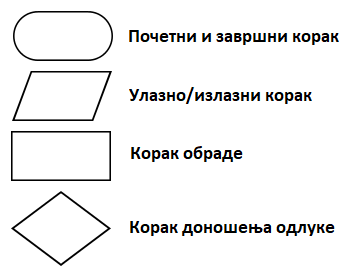

Основни циљ блок дијаграма је да укаже на редослед извршавања појединих алгоритамских корака. Он даје прегледну везу између детаља и целине алгоритма и омогућава лако откривање грешака у његовој структури.

Алгоритми могу имати просту линијску, разгранату и цикличну структуру. Код алгоритама са простом линијском структуром кораци се извршавају један за другим од почетка до краја. Код алгоритама са разгранатом структуром постоји неколико алтернативних праваца извршавања. Тако се, у зависности од података, неки кораци уопште неће извршити. Код алгоритама са цикличном структуром неки кораци се могу извршавати више пута.

На следећој слици приказане су блок шеме за израчунавање вредности *х* на основу задате улазне вредности по три типа алгоритма: са простом линијском, разгранатом и цикличном структуром. 
 
 
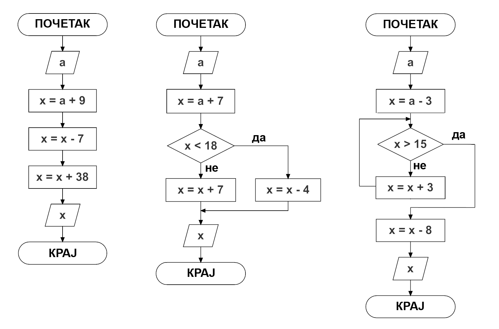

Примери су преузети из уџбеника математике за други разред основне школе. Покушајте да на основу њих одговорите на следећа питања.

* Колика ће бити вредност *х* по извршавању сваког од алгоритама ако је улазна вредност *а=5*, а колика ако је *а=16*? 
* Који од корака у алгоритму са разгранатом структуром се неће извршити ако је *а=5*, а који ако је *а=16*?
* Колико пута ће се извршити додела *х=х+3* у алгоритму са цикличном структуром ако је *а=5*, а колико пута ако је *а=16*? 
 
Запис ових алгоритама у Скречу приказан је на следећим сликама.
 
Првом алгоритму просте линијске структуре одговара скрипта са низањем корака.
 
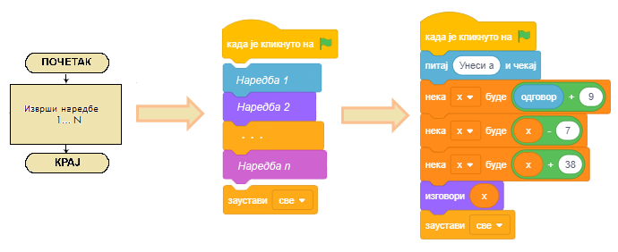

Другом алгоритму разгранате структуре одговара скрипта са гранањем. 
 
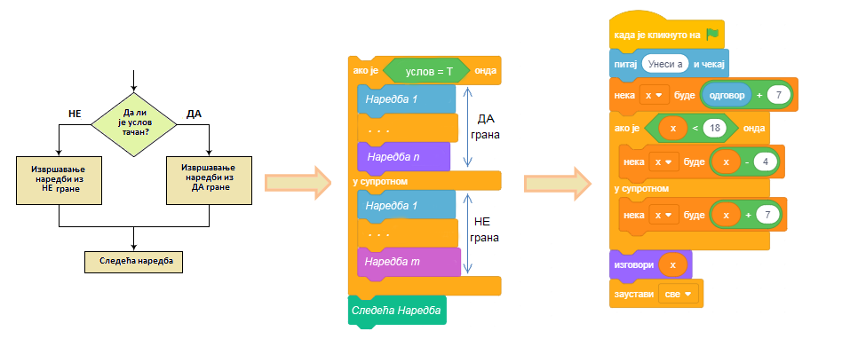

Трећем алгоритму цикличне структуре одговара скрипта са понављањем.

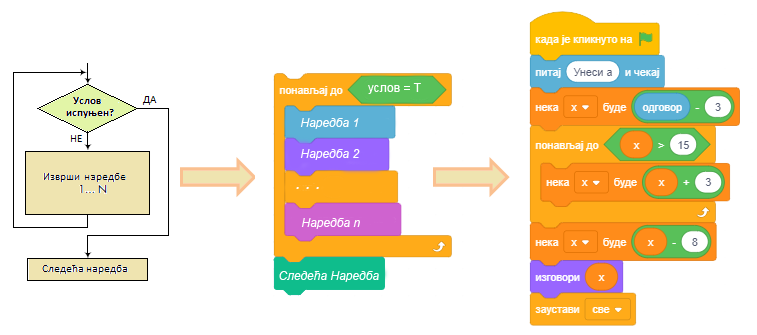
 

**Скрипте у Скречу изгледају као запис алгоритама блок дијаграмима.**

.. topic:: Функције блокова из групе *Осећаји*

 Групу *Осећаји* чине блокови који омогућавају да пројекат прихвата улазне податке са различитих уређаја, слично као што човек чулима прикупља информације из свог окружења. Тако постоје блокови чувају податке који одговарају онима које човек прикупља чулом додира, чулом вида или чулом слуха. Неки блокови ове групе омогућавају да се покрену различите акције у зависности од положаја лика, времена, датума и слично. 
 
 **Осећаји као начин за преношење информација између ликова**

 За преношење  информација између ликова  до сада смо користили размену порука. Осећаји се такође могу посматрати као начин за преношење информација: један лик може да осети да додирује други лик, додирује боју која је део слике другог лика или позадине, а такође може да осети и колика је његова удаљеност од  других ликова. 
 
 У овој лекцији упознаћемо блокове који:

 * чувају информација о положају лика у односу на показивач миша и друге објекте,
 * омогућавају уношење улазних података са тастатуре,
 * чувају информације о текућим операцијама миша и тастатуре.

 Преостале блокове из групе *Осећаји* упознаћеш у наредним лекцијама, а комплетан преглед њихових функција можеш видети у *Додацима*.

|prouci| Проучи следеће примере пројеката
-----------------------------------------

Пример 1 - Пројекат „Избор”
~~~~~~~~~~~~~~~~~~~~~~~~~~~

.. level:: 1

У овом пројекту стари чаробњак треба да изабере помоћника. 

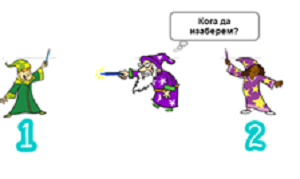
   
Сам не може да одлучи кога, па тражи од корисника да му помогне тако што ће унети редни број кандидата за помоћника.

.. image:: ../_images/6/sl6_9.png
   :width: 475px   
   :align: center
   
Ова вредност пореди се наредбом условног преласка са бројем кандидата. Ако је корисник унео број 1, чаробњак се окреће улево ка кандидату 1, 
а у супротном удесно ка кандидату 2.

.. image:: ../_images/6/sl6_10.png
   :width: 400px   
   :align: center

Комплетна скрипта која описује понашање чаробњака приказана је на следећој слици.

.. image:: ../_images/6/sl6_11.png
   :width: 300px   
   :align: center

.....

Пример 2 - Пројекат „Опасне пахуље”
~~~~~~~~~~~~~~~~~~~~~~~~~~~~~~~~~~~

.. level:: 2

Пројекат *Опасне пахуље* је једноставна игра у којој корисник покушава да спасе Снешка Белића од крупних опасних пахуља које непрестано падају. 
Корисник помоћу дирки са стрелицама на тастатури води Снешка лево-десно и покушава да избегне пахуље које са врха екрана падају различитом брзином и под различитим угловима. 
Ако пахуља додирне Снешка, он се надује и деформише и игра је готова. 

**Ликови и позадина**

Када започнеш нови пројекат, учитај из библиотеке позадину *Slopes* и ликове *Snow flake* и *Snowman*. Први лик преименуј у *Пахуља*, а други у *Снешко*. 
Постави Снешка у доњи десни угао позорнице и можеш да почнеш са програмирањем.

**Понашање пахуље**

Да би се унела неизвесност потребно је да се пахуље појављују на различитим местима и падају различитим брзинама и у различитим правцима. 
Све те неизвесности постижемо коришћењем блока |slucajan_broj|.

Пахуља треба да се појави при врху позорнице и да клизи до њеног дна. Следећи блок наредби описује њено кретање. 

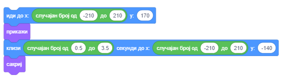

Прва наредба поставља пахуљу на место чија се х координата генерише на случајан начин. Трећа наредба задаје тачку до које пахуља клизи између 0.5 и 3.5 секунди и нестаје. 

Овај блок наредби уметнућемо у петљу која ће се понављати све док пахуља не додирне Снешка. Када га додирне, игра се завршава. 

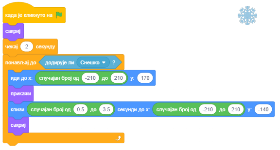

**Понашање Снешка**

Снешку су придружене 3 скрипте – рекације на клик на зелену заставицу и притисак на дирке лева и десна стрелица. 
На почетку Снешко даје упутство за игру и у бесконачној петљи проверава да ли га је додирнула пахуља. 
Ако јесте, саопштава да је крај игре и зауставља све скрипте. 

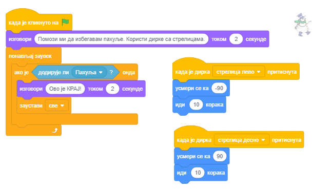

Да би игра била атрактивнија, додаћемо и специјалне ефекте које можемо остварити блоковима из групе *Изглед*. 
Као што смо видели у примеру 2 лекције *Низање корака*, наредба |promeni_efekat|  може да промени лик на више начина. 

Када пахуља додирне Снешка, ми ћемо мењати његову величину и применити ефекте рибље око и боја. Те промене ћемо поновити 5 пута уз малу паузу после сваке промене (сл. A). 
Да Снешко при поновном покретању програма не би био деформисан, на почетку ћемо уклонити све графичке ефекте и поставити величину на 100%.  (сл. Б). 

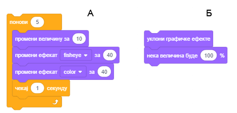

.....

Пример 3 - Пројекат „Дан и ноћ”
~~~~~~~~~~~~~~~~~~~~~~~~~~~~~~~

.. level:: 3

У овом пројекту се два лика, куца и маца, различито понашају у зависности од тога да ли је дан или ноћ. 

На позорници се налазе две кућице од којих једна припада маци, а друга куци. Придружене су им две позадине – *дан* и *ноћ*. 

У позадини *дан* виде се сунце, светло плаво небо и трава. 
У позадини *ноћ* све осим кућица је тамно плаве боје, а на небу се виде звезде и млад месец. Позадине дан и ноћ смењују се сваких 5 секунди. 

Када је дан, маца и куца излазе из својих кућица и јуре се. Маца трчи у круг, а куца се усмерава према маци и покушава да јој приђе. 

Када је ноћ, маца и куца иду у своје кућице и мирују.

.. image:: ../_images/6/sl6_16.png
   :width: 500px   
   :align: center

**Креирање ликова**

Обриши *Лик1* па унеси из библиотеке ликове пса (*Dog2*) и мачка (*Cat2*). Преименуј ликове у *куца* и *маца*. 
Куца има 3 костима, од којих ћемо користити само прва два, па трећи обриши. Маца има само један костим, па треба да нацртамо још један, како бисмо могли да направимо анимацију кретања.
За креирање другог костима маце користићемо едитор слика у векторском режиму. Десним кликом на костим маце отварамо приручни мени и бирамо *Умножи*. 
Добијамо нови костим (*Cat3*) који ћемо изменити у корацима које илуструје следећа слика.

.. image:: ../_images/6/sl6_17.png
   :width: 380px   
   :align: center

**Креирање позадине**

Кликни на дугме *Одабери позадину* (десно од листе ликова), па изабери опцију *Насликај*.  
Из палете векторских алата изабери |valat5|, а начин цртања нека буде без попуњавања. Нацртај кућицу као што је приказано на следећој слици.

.. image:: ../_images/6/sl6_18.png
   :width: 380px   
   :align: center

Пошто си алатком |valat14| груписаo објекте од којих је састављена кућица, коришћењем алатке |alat6| умножи кућицу и копију премести у дољи десни угао позорнице, а оригинал у горњи леви угао. 
Затим подеси величине ликова тако да могу да стану у кућице.

Сада прелазимо на бојење алатком |valat8|. Примена овог алата се код попуњавања области разликује од рада у растерском режиму. 
Наиме, ако област није затворена, у растерском режиму боја „исцури“ на читаву слику. У векторском режиму се то не дешава – уопште не можеш да извршиш бојење. 
Зато на увећаној слици треба прво „затворити“ област. То се ради тако што се помоћу алатке |valat2| кликне на слику, па део слике који није повезан (2) изабереш и повежеш са остатком слике (3). 
Онда коришћењем алатке |valat8| можеш да обојиш како унутрашњост (4), тако и саме линије које образују област (5).

.. image:: ../_images/6/sl6_19.png
   :width: 500px   
   :align: center

Како смо приликом цртања кућице користили алатку |valat5|, не би требало да буде проблема приликом бојења.  
На следећој слици приказан је начин и резултат попуњавања делова кућице.

.. image:: ../_images/6/sl6_20.png
   :width: 380px   
   :align: center

Пошто си обојио кућице, умножи ову позадину. 

Прву позадину ћемо допунити тако да представља ноћ, а другу тако да представља дан.

**Креирање позадине ноћ**

Нацртај попуњен тамно плави правоугаоник преко целе позорнице, а затим помоћу алатке *Назад* |valat13| постави овај правоугаоник иза обе кућице. Исто се може постићи и алатком *Слој назад* |valat11|, али биће потребно да кликнеш на позорницу онолико пута колико слојева има слика. 
Када се буду виделе обе кућице, пређи на цртање месеца и звездица.

Млад месец може се нацртати тако да се прво нацрта попуњен жути круг (1), а затим делимично преко њега већи круг попуњен бојом позадине (2). 

Звездицу формирамо тако што белом бојом нацртамо троугао (3), па га умножимо и заротирамо (4) и на крају цео облик попунимо белом бојом (5). 

.. image:: ../_images/6/sl6_21.png
   :width: 400px   
   :align: center

На крају ископирај готове звездице, распореди их на позадини, неке увећај, а неке смањи и ноћна позадина је завршена.

.. image:: ../_images/6/sl6_22.png
   :width: 380px   
   :align: center

**Креирање позадине дан**

Нацртај сунце алатком |valat6|, а зраке алатком |valat4|. Затим великим светло плавим попуњеним правоугаоником ширине позорнице нацртај небо и пошаљи га онолико слојева испод колико је потребно да се виде сви детаљи.
(Да си прво цртао небо, а после сунце брже би небо поставио у доњи слој, овако треба да га ставиш иза свих зракова сунца).

Затим зеленим попуњеним правоугаоником ширине позорнице нацртај траву и пошаљи и њега у позадину слике.

Поступак креирања позадине дан илуструје следећа слика.

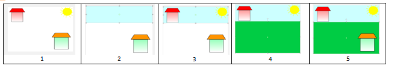

Пошто смо завршили са позадином дан, можемо да кренемо са писањем скрипте за понашање ликова.

**Синхронизација догађаја у пројекту Дан и ноћ**

У овом пројекту основно понашање диктира позадина. Она разглашава поруке *дан* и *ноћ*, на које реагују оба лика. 

.. image:: ../_images/6/sl6_24.png
   :width: 250px   
   :align: center

На следећим сликама приказане су скрипте придружене ликовима из којих се види како реагује на ове поруке.

.. image:: ../_images/6/sl6_25.png
   :width: 680px   
   :align: center

.. image:: ../_images/6/sl6_26.png
   :width: 680px   
   :align: center

|pitaj| Одговори на следећа питања
----------------------------------

Питање 1
~~~~~~~~

.. level:: 1

.. mchoice:: pit6_01
   :answer_a: да
   :answer_b: не
   :correct: a
   :feedback_a: Тачно.
   :feedback_b: Услов 1=1 увек је испуњен.

   Да ли ће лик изговорити *Здраво* по извршењу наредбе условног преласка?
   
   .. image:: ../_images/6/pit6_01.png
      :width: 250px   
      :align: center
   

Питање 2
~~~~~~~~

.. level:: 1

.. mchoice:: pit6_02
   :answer_a: да
   :answer_b: не
   :correct: b
   :feedback_a: Пошто је вредност израза 1=2 увек нетачна, неће се извршити наредба из да гране. 
   :feedback_b: Тачно.
   
   Да ли ће лик изговорити *Здраво* по извршењу наредбе условног преласка?
   
   .. image:: ../_images/6/pit6_02.png
      :width: 255px   
      :align: center
   
Питање 3
~~~~~~~~

.. level:: 1

.. mchoice:: pit6_03
   :multiple_answers:
   :answer_a: 5
   :answer_b: -5
   :answer_c: 0
   :answer_d: 10
   :correct: b,c
   :feedback_a: 
   :feedback_b: 
   :feedback_c: 
   :feedback_d: 

   Који од одговора корисника ће омогућити извршавање наредбе у ДА грани? (Изабери све тачне одговоре)

   .. image:: ../_images/6/pit6_03.png
      :width: 215px   
      :align: center

Питање 4
~~~~~~~~

.. level:: 1

.. mchoice:: pit6_04
   :answer_a: Понеси кишобран.
   :answer_b: Ништа неће изговорити
   :correct: a
   :feedback_a: Тачно. 
   :feedback_b: У том случају услов гранања је испуњен.
   
   Шта ће изговорити лик ако корисник на питање *Да ли пада киша* одговори са *да*?  

   .. image:: ../_images/6/pit6_04.png
      :width: 310px   
      :align: center
   
Питање 5
~~~~~~~~

.. level:: 1

.. mchoice:: pit6_05
   :answer_a: Услов је испуњен.
   :answer_b: Услов није испуњен.
   :correct: a
   :feedback_a: Тачно. 
   :feedback_b: Пошто је вредност израза А=А увек тачна извршава се наредба из да гране.
   
   Шта ће изговорити лик по извршењу наредбе условног преласка?
   
   .. image:: ../_images/6/pit6_05.png
      :width: 315px   
      :align: center
   
Питање 6
~~~~~~~~

.. level:: 1

.. mchoice:: pit6_06
   :answer_a: да
   :answer_b: не
   :correct: b
   :feedback_a: Пошто је вредност израза А=В увек нетачна (А и В нису променљиве), извршава се наредба из не гране. 
   :feedback_b: Тачно.
   
   Да ли ће се приказати лик по извршењу наредбе условног преласка?

   .. image:: ../_images/6/pit6_06.png
      :width: 165px   
      :align: center

Питање 7
~~~~~~~~

.. level:: 2

.. mchoice:: pit6_07
   :answer_a: различит без обзира на позицију лика
   :answer_b: исти без обзира на позицију лика
   :answer_c: различит ако је у различито од 0
   :answer_d: различит ако је х различито од 0
   :correct: b
   :feedback_a: У оба случаја је исти услов да се изговори "У центру си позорнице". 
   :feedback_b: Тачно.
   :feedback_c: Тада није испуњен услов да се изговори "У центру си позорнице" ни у једном од блокова (А) и (В).
   :feedback_d: Тада није испуњен услов да се изговори "У центру си позорнице" ни у једном од блокова (А) и (В).

   Какав је резултат извршавања блокова наредби (А) и (В)?

   .. image:: ../_images/6/pit6_07.png
      :width: 600px   
      :align: center

Питање 8
~~~~~~~~

.. level:: 2

.. mchoice:: pit6_08
   :multiple_answers:
   :answer_a: 
   :answer_b: 
   :answer_c: 
   :correct: a
   :feedback_a:  
   :feedback_b: 
   :feedback_c: 
   
   Која од наредби условног преласка има исправан услов за тврдњу да су координате места лика (0,0), 
   односно да се лик налази у центру позорнице?  (Изабери све тачне одговоре) 

   .. image:: ../_images/6/pit6_08.png
      :width: 1020px   
      :align: center
   
Питање 9
~~~~~~~~

.. level:: 2

.. mchoice:: pit6_09
   :multiple_answers:
   :answer_a:
   :answer_b: 
   :answer_c: 
   :answer_d: 
   :correct: a,d
   :feedback_a: 
   :feedback_b: 
   :feedback_c: 
   :feedback_d: 
   
   У пројекту *Одлучивање* показано је како се операција *мод* користи за проверу да ли је број дељив са 2. 
   Који од следећих услова омогућава да се провери да ли је унети број дељив са 6?  (Изабери све тачне одговоре) 

   .. image:: ../_images/6/pit6_09.png
      :width: 640px   
      :align: center

|pokusaj| Покушај
-----------------

  
Вежба 1
~~~~~~~
.. level:: 1

.. infonote::

  Када се од корисника очекује да унесе неки податак потребно је поставити питање које сугерише и форму одговора, на пример: "Унеси датум рођења (дд.мм.гггг)".
  Формулиши како треба да гласе питања за унос:

  а) Броја између 1 и 10

  б) Броја између -1.0 и 2.25
  
  в) Имена и презимена

  г) Тежине

  д) Висине
  
.....

Вежба 2
~~~~~~~
.. level:: 2

.. infonote::

 У прогрaму за рачунање идеалне тежине од корисника се тражи да унесе своју тежину (у кг) и висину (у cm).
 Напиши делове програма који проверавају да ли је корисник унео коректан податак за тежину, нпр. из интервала [40,160] и висину, нпр.  [140,210].

.....

Вежба 3
~~~~~~~
.. level:: 2

.. infonote::

 Напиши шта треба да буду аргументи операције |slucajan_broj| да би се генерисали бројеви из скупа:

 а) {0, 1}

 б) {0, 1, 2, 3, ... , 10}

 в) {–2, 0, 2, 4, 6, 8}

 г) {0, 10, 20, 30, ... , 100}

 д) {0, 0.1, 0.15, 0.26, 0.38, ... , 1.0}

 Провери своје одговоре тако што ћеш за сваки пример у циклусу који се понавља 5 пута тестирати шта одговарајућа операција враћа.

 .. reveal:: упутство11
   :showtitle: Прикажи упутство
   :hidetitle: Сакриј упутство
 
   **Упутство:**

   За пример а) дат је цео блок наредби, а за остале само део са генерисањем бројева који треба да поставиш у блок ``изговори``.
   
   Из примера д) можеш да видиш да је довољно да једну границу наведеш са децималном тачком да би се генерисали децимални бројеви. 

   .. image:: ../_images/6/vezba6_3.png
      :width: 400px   
      :align: center 

.....

Вежба 4
~~~~~~~
.. level:: 3

.. infonote::

 Напиши наредбу условног преласка са сложеним условом еквивалентну следећим композицијама наредби условног преласка:

 .. image:: ../_images/6/vezba6_4.png
     :width: 530px   
     :align: center
  
 Провери своје одговоре тако што ћеш тестирати своје одговоре у Скреч окружењу.

.....

Вежба 5
~~~~~~~
.. level:: 2

.. infonote::

 Креирај минипројекат *Већи* у коме лик тражи од корисника да унесе број између 1 и 100. 
 Затим сам замисли (коришћењем операције случајан број) број од 1 до 100 и саопштава кориснику чији број је већи.
 Дијалог треба да се покрене кликом на лик.

 .. reveal:: упутство12
   :showtitle: Прикажи упутство
   :hidetitle: Сакриј упутство
 
   **Упутство:**

   .. image:: ../_images/6/vezba6_5.png
      :width: 390px   
      :align: center   

|bug| Исправи грешке
--------------------

Грешка 1
~~~~~~~~
.. level:: 1

:Питање:
   Ученик је желео да направи скрипту која омогућава да се кретањем лика управља помоћу дирки са стрелицама. Написао је програм приказан на слици лево. 
   Онда је приметио да се 4 пута понавља наредба |idi_koraka|, па је преправио скрипту у прогрaм приказан на слици десно. Међутим, његовим извршавањем није постигао 
   жељено понашање лика. У чему је грешка?

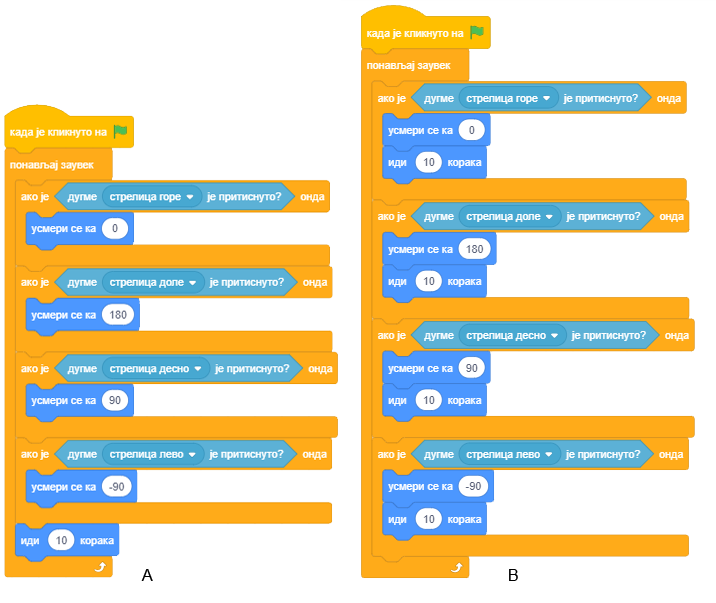

.. reveal:: сакривање13
   :showtitle: Прикажи одговор
   :hidetitle: Сакриј одговор
 
   **Одговор:**
     
   У преправљеном програму наредба |idi_koraka| ће се стално извршавати и лик ће ићи у смеру који је последњи пут био изабран, без обзира да ли је притиснута или не дирка са тим смером.
   
Грешка 2
~~~~~~~~

.. level:: 2

:Питање:
   Ученик је желео да измени понашање кандидата за избор помоћника чаробњака у пројекту "Избор". Када чаробњак изабере девојчицу за помоћника, 
   дечак треба да замисли: "Зашто си изабрао њу?". Зато је дечаку придружио следећу скрипту. Али, дечак је то замислио на самом почетку, још пре но што је чаробњак 
   извршио избор. Како да се ускладе акције чаробњака и дечака?
   
.. image:: ../_images/6/greska6_2.png
   :width: 220px   
   :align: center

.. reveal:: сакривање16
   :showtitle: Прикажи одговор
   :hidetitle: Сакриј одговор
 
   **Одговор:**
     
   Један начин је да чаробњак разгласи поруком да је извршио избор и да дечак одреагује тек када прими ту поруку. Разуме се, ако желимо да дечак не реагује ако је чаробњак изабрао њега,
   треба ову комуникацију порукама проширити и провером ко је изабран.

   .. image:: ../_images/6/resenje6_2.png
       :width: 595px   
       :align: center  

Грешка 3
~~~~~~~~

.. level:: 2

:Питање:
   Ученик је желео да његов лик који се води диркама стрелица лево и стрелица десно упоредо са кретањем изговара и реч "лево" док се налази на левој половини позорнице, 
   а реч "десно" када је на десној половини. Придружио је лику следеће скрипте, али лик уопште није мењао реч коју би изговорио на почетку, без обзира на то
   што је прелазио на другу страну позорнице. Шта треба променити у скриптама?
   
.. image:: ../_images/6/greska6_3.png
   :width: 510px   
   :align: center

.. reveal:: сакривање17
   :showtitle: Прикажи одговор
   :hidetitle: Сакриј одговор
 
   **Одговор:**
     
   Провера на којој је страни позорнице врши се само једном по покретању пројекта. Потребно је испитивање уметнути у бесконачан циклус.
   
   .. image:: ../_images/6/resenje6_3.png
       :width: 240px   
       :align: center       
   

|knjiga| Шта смо научили
------------------------

У овој лекцији бавили смо се наредбама гранања које омогућавају креирање скрипти разгранате структуре. Представили смо блокове из групе *Осећаји* и показали како се у Скречу извршава наредба за унос података са тастатуре. Научили смо и како се може управљати понашањем ликова коришћењем осећаја. Показали смо како се користе алати у векторском режиму уграђеног едитора слика. 

Напомена. У 11. лекцији овог Практикума дат је детаљан преглед могућности Скречовог едитора слика и у растерском и у векторском режиму. 

**Примери пројеката**: 6Studio_

.. _6Studio: https://scratch.mit.edu/studios/24292223/

**Појмови**:  алгоритми, врсте алгоритамских корка, структура алгоритма, условно извршавање, сложени услов, осећаји као начин за преношење информација, векторски алати едитора слика.

**Наредбе**: |upravljanje| - |ako_onda|, |ako_onda_inace|, |cekaj_dok_ne|; |izgled| - |zameni_pozadinu|, |pozadina_broj|; 

|osecaji| - |dodiruje|; |operatori| - |jednako|

|project| Уради неки од следећих пројеката
------------------------------------------

Пројекат 1 – „Падају јабуке”
~~~~~~~~~~~~~~~~~~~~~~~~~~~~

.. level:: 1

Направи игру чији је сценарио сличан сценарију пројекта *Опасне пахуље*. Главни лик овог пројекта треба да буде дечак кога корисник може да води лево-десно диркама са тастатуре. Он треба да избегава јабуке које се појављују на случајној позицији у горњем делу позорнице и клизе до случајне позиције у доњем делу позорнице. Ако при том додирну дечака, игра је готова, а ако не, сакривају се и поново појављују на горњем делу позорнице и клизе наниже. Брзина клизања такође треба да буде одређена на случајан начин, на пример између 1 и 3 секунде. Да би игра била узбудљивија, пошто креираш одговарајућу скрипту за једну јабуку, умножи овај лик тако да, на пример, три јабуке понављају одговарајуће понашање.

Пројекат 2 - „Гладна ајкула”
~~~~~~~~~~~~~~~~~~~~~~~~~~~~

.. level:: 2

Направи пројекат у коме ће главни лик - ајкула ловити рибе. Ајкула треба стално да крстари лево-десно, а када се кликне на размак, треба да се помери навише. Ако ајкула дотакне неку рибу, риба нестаје, али се поново појављује после 3-5 секунди на случајно изабраном месту. Различито трајање паузе између два појављивања риба и различито место на коме ће се појављивати обезбеди коришћењем операције *случајан број*. Ајкула (Shark2) има три костима па се променом костима може приказати њена реакција када дотакне рибу. Рибама, раку и медузи придружи различита кретања, на пример, нека медуза иде горе-доле, рак нека се окреће лево-десно, а рибе нека пливају различитим брзинама. Све ликове: ајкулу, различите рибе, рака, медузу и позадину учитај из библиотека ликова и позадина. Различите рибе можеш добити коришћењем различитих костима лика *Fish*.

Пројекат 3 - „Пас и мачак”
~~~~~~~~~~~~~~~~~~~~~~~~~~

.. level:: 3

Направи пројекат у коме ћеш користити два лика – пса и мачку, и две позадине.  На почетку се мачак полако шета лево-десно  између рубова позорнице, а у облачку блока ``замисли`` треба да се појављују његова размишљања. После десетак секунди појављује се пас, који залаје и уплаши мачка. Мачак бежи, а кад стигне до руба позорнице са првом позадином, треба да се појави друга позадина. Када мачак пређе целу позорницу са овом позадином треба да нестане - успео је да се сакрије. Тек тада се појављује пас, зауставља се, а у облачку блока ``замисли`` се појављује знак питања.

За реализацију овог пројекта треба да:

- напишеш скрипте које описују понашање мачка,

- из библиотеке позадина увезеш лик пса коме ћеш придружити звучни фајл са лавежом и скрипте које описују његово понашање,

- увезеш две позадине, *Playng Field* и *Garden-rock*: прву на којој се мачак сусреће са псом и другу у коју мачак бежи кад зачује лавеж пса,

- синхронизујеш догађај лајања пса и мачкову реакцију на њега – бежање,

- синхронизујеш „понашање“ двеју позадина, односно тренутак њихове замене.

 