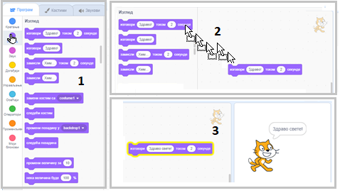
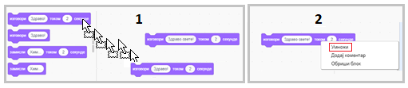
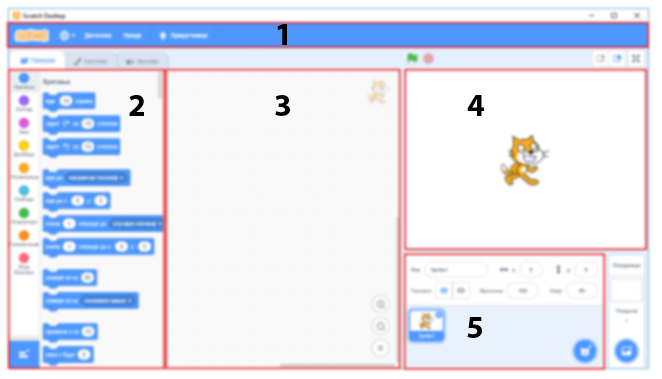
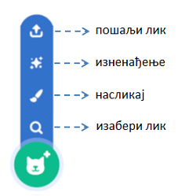
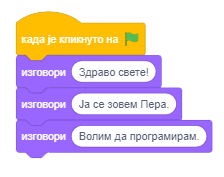

Окружење програмског језика Скреч
=================================

.. include:: blokovi3.txt

.. include:: ikone3.txt

.. infonote::

  |paleta1|

   
Да ли би волео да направиш своју сопствену компјутерску игру, анимирану причу, упутство или презентацију? Скреч је програмски језик који ти омогућава да све то направиш, а и више од тога.

За разлику од многих програмских језика, Скреч је визуални језик – уместо да наредбе пишемо коришћењем тастатуре, програме креирамо повезивањем разнобојних блокова којима су представљене наредбе, слично као што се од Лего коцки конструишу различити објекти.

У Скречу се креирају **пројекти**. Да би се направио пројекат, прво треба увести ликове који у њему учествују. Ликовима се могу придружити различити изгледи, звукови и понашања. Понашање лика описује се **скриптом**. Пројекат садржи једну или више скрипти, од којих је свака придружена неком лику или позорници - месту на коме се одвија пројекат.

Да би написао програм у Скречу неопходно је да претходно упознаш окружење у којем се креирају програми, односно његов **интерфејс**.

.. topic:: Интерфејс програмског језика Скреч.

 Следећа слика приказује интерфејс програмског језика Скреч. 

 .. image:: ../_images/1/sl1_1.png
   :width: 800px   
   :align: center

 За почетак ћемо упознати основне функције његових главних делова, а у наредним лекцијама ћемо постепено упознавати и остале компоненете окружења.

 **Позорница** је место на коме ће се покренути твоје приче, игре и анимације. Сама позорница је непокретна, али на њој се налазе ликови који могу да се крећу и реагују на друге ликове. 

 **Палета блокова** је место где се чувају све расположиве наредбе програмског језика Скреч. Зове се "палета" зато што одговара палети са бојама помоћу којих сликар креира своје слике. Међутим, за разлику од сликара, програмер креира живе слике чији објекти међусобно дејствују.

 **Област скрипти** је простор у коме се креирају скрипте. Да би направио скрипту, потребно је да превучеш одговарајуће блокове из палете блокова у област скрипти, и повежеш их.

 **Листа ликова** приказује сличице свих ликова који су укључени у пројекат. Испод сваког лика је исписано његово име.

 **Линија менија** омогућава да се задају команде за руковање пројектима и подешава само окружење.

.. topic:: Мој први програм

 И најдужа путовања почињу првим кораком. А тај први корак за упознавање неког програмског језика је писање програма који на екрану треба да испише поруку „Здраво свете“. И ми ћемо тако започети са освајањем Скреча.

 Увек када се покрене Скреч, аутоматски се креира **позорницa** коју чини бели правоуганик у коме се налази **лик** мачка.

 Позорница и ликови су **објекти** чије понашање програмирамо наредбама Скреча. Помоћу блокова који одговарају наредбама језика састављамо **скрипте** које описују понашање објеката. Сваки објекат има своје понашање, чак и непокретна позорница која, на пример, може да мења свој изглед.

 Позорници и ликовима поред скрипти могу да буду придружене и **графичке** (слике – цртежи, фотографије) и **звучне** датотеке. Слике ликова називају се **костими**, а слике позорнице - **позадине**.

 **Листа ликова** приказује сличице свих ликова који су укључени у пројекат. Испод сваког лика је исписано његово име.

 Информације о текућем лику можеш да видиш и измениш у простору који се налази изнад листе ликова.

 .. image:: ../_images/1/sl1_2.png
   :width: 650px   
   :align: center
 
 .. infonote::

  1. *Име* лика може се изменити тако што се у пољу имена лика откуца ново име.

  2. *Позиција* лика на позорници задаје се његовим координатама х и у.

  3. Да ли се лик види на позорници или је скривен зависи од тога шта је чекирано у пољу *Прикажи*.

  4. *Величина* лика исказује се у процентима оригиналне величине. Број 100 указује да се лик види у  својој природној величини.

  5. *Смер* указује на  смер којим ће се лик кретати. Плава стрелица на кругу показује усмерење лика. Усмерење можеш да промениш тако што заротираш ту стрелицу или у поље за смер упишеш одговарајући број (0: горе, 90: десно, 180: доле, -90: лево). Ознаке |nacin_okreta| говоре о начину окретања који може бити: *На све стране*, *Лево/десно* или *Без окретања*.

 Да би направио скрипту, потребно је да за активан објекат пренесеш одговарајуће наредбе из палете наредби у област скрипти, и повежеш их.

 **Активан објекат** - лик или позорница, препознаје се по томе што је око његове сличице у листи ликова плави оквир. Све што креирамо: скрипте које описују понашање, костиме који описују изглед, звукове који ће се чути када покренемо пројекат, придружује се објекту који је активан док то радимо.

 Креирање скрипти врши се постављањем блокова једног преко другог. Клик било где у оквиру низа блокова покреће комплетну скрипту која се извршава од врха према дну.  

|prouci| Проучи следеће примере пројеката
-----------------------------------------

Пример 1 - Пројекат „Здраво свете”
~~~~~~~~~~~~~~~~~~~~~~~~~~~~~~~~~~

Мачку, заштитном знаку Скреча, придружићемо на почетку најједноставнију могућу скрипту која се састоји од једне једине наредбе – блока који омогућава лику да „изговори“, односно да се у стрип облачку појави реченица, *Здраво свете*. Ево како се то ради.

|1| Кликни на групу блокова *Изглед* у палети блокова. Појавиће се група љубичастих блокова задужених за визуелне ефекте који се могу доделити ликовима. 

|2| Превуци блок  |izgovori_sec| у област скрипти. 

|3| Затим уместо речи *Здраво* откуцај *Здраво свете* и кликни на тако измењен блок.

Уз мачка ће на позорници током 2 секунде стајати облачак са текстом *Здраво свете*. Као што видиш, сасвим једноставно.

Сада ћемо додати још неколико блокова |izgovori_sec| и тако постићи да наш лик каже још неколико реченица. 

Показаћемо два начина како се може додавати блок који већ постоји у области скрипти. 

- 1. Понављањем поступка који смо већ урадили: превуци још једном блок |izgovori_sec| из палете блокова и уместо текста *Здраво* откуцај *Ја сам мачак*.

- 2. Десним кликом на блок у области скрипти отвори приручни мени и из њега изабери опцију *Умножи*. Затим у копију блока упиши жељени текст, у нашем примеру – *Волим да шетам*. Овај начин омогућава да се брже ради, јер се тако једним потезом може умножити и више блокова који су претходно повезани.

 
Да би се блокови аутоматски извршавали један за другим, потребно их је повезати у целину – стек. То чинимо превлачењем блокова. Када се блокови приближе један другом, око горњег се појављује сенка која значи да ће блокови бити повезани. Повезивањем сва три блока у стек постижемо да, двокликом на њега, лик изговара једну за другом све три реченице, и то једну за другом. 

**Извршавање пројекта**

Приметио си да блок који си користио има удубљење на врху и испупчење на дну. Блок таквог облика назива се **стек блок**. Већини наредби Скреча придружени су стек блокови. Међутим, почетни блок, блок који указује на који догађај ће покренути извршавање скрипте, не треба да има удубљење на врху, јер му ниједан блок не претходи. Већина почетних блокова налази се групи *Догађаји*. Кликни на групу *Догађаји* у палети блокова и превуци блок |zelena_zastavica| у област скрипти. Затим постави овај блок на врх претходно формираног стека и твој први пројекат је готов. Да би га извршио, треба да кликнеш на зелену заставицу која се налази изнад горњег левог угла позорнице. 

**Памћење пројекта**

Пројекат можеш да сачуваш на свом рачунару на следећи начин.

|1| Кликни на ставку *Датотека* у линији менија.

|2| Изабери опцију *Сачувај на свом рачунару*.

|3| У дијалошком прозору који ће се потом отворити изабери фолдер и упиши име под којим ћеш памтити пројекат, па клини на дугме *Save*.

**Надоградња пројекта**

Слично би, уместо приказа облачка са текстом, мачак могао и да заиста изговори овај текст. То можеш да постигнеш тако што изабереш блок
|reprodukuj_kraj| из групе *Звук*, па у едитору звука снимиш реченицу коју треба да изговори. Затим из падајуће листе овог блока уместо звука *мјау* одабери снимљени говор. 

У овој верзији Скреча може се и више од тога. Међу проширењима постоји група *Текст у Говор* која омогућава да ликови у пројектима заиста проговоре. Ово можеш да постигнеш само ако си повезан на интернет, јер се користи *Amazon Web Services*. Нажалост, овај сервис не подржава српски изговор, али се се тај недостатак може превазићи постављањем језика на *Руски* (у коме се такође користи ћирилично писмо).

|pitaj| Одговори на следећа питања
----------------------------------

Да ли си у недоумици како да одговориш на питања која у претходном тексту нису објашњена? Једноставно, покрени Скреч и пробај!

Питање 1
~~~~~~~~

.. level:: 1

.. mchoice:: интерфејс1
   :answer_a: скрипта
   :answer_b: објекат
   :answer_c: интерфејс
   :answer_d: програм
   :correct: c
   :feedback_a: Нетачно.
   :feedback_b: Нетачно.
   :feedback_c: Тачно. 
   :feedback_d: Нетачно.
   
   Назив за све прозоре и дугмад који се виде када се покрене Скреч је?
  

Питање 2
~~~~~~~~
.. level:: 1

Поједини делови Скреч интерфејса на следећој слици означени су бројевима од 1 до 5. 

      
.. dragndrop:: интерфејс2
    :feedback: Покушај поново
    :match_1: позорница|||4
    :match_2: палета наредби|||2
    :match_3: област скрипти|||3
    :match_4: листа ликова|||5
    :match_5: линија менија|||1
    
    Превлачењем упари називе делова окружења са њиховим позицијама на слици.

Питање 3
~~~~~~~~

.. level:: 1

.. mchoice:: интерфејс3
   :answer_a: да
   :answer_b: не
   :correct: b
   :feedback_a: Нетачно. Пројекат мора да има позорницу са бар једном позадином.
   :feedback_b: Тачно.
   
   Да ли може да се направи пројекат који нема позорницу?

Питање 4
~~~~~~~~

.. level:: 1

.. mchoice:: интерфејс4
   :answer_a: да
   :answer_b: не
   :correct: a
   :feedback_a: Тачно.
   :feedback_b: Нетачно. Пројекат може да има само скрипте које су придружене позорници.
   
   Да ли може да се направи пројекат који нема ликове?

Питање 5
~~~~~~~~

.. level:: 1

.. mchoice:: интерфејс5
   :answer_a: да
   :answer_b: не
   :correct: b
   :feedback_a: Нетачно. Објекат мора да има бар један изглед, позорница - позадину, а лик - костим.
   :feedback_b: Тачно.
   
    Да ли се може креирати позорница или лик, а да им се не придружи изглед?

Питање 6
~~~~~~~~

.. level:: 1

.. mchoice:: интерфејс6
   :answer_a: да
   :answer_b: не
   :correct: b
   :feedback_a:  Нетачно. Неки ликови могу да буду само декорација пројекта, као и позорница.
   :feedback_b:  Тачно.
   
   Да ли сваком објекту у пројекту мора да се придружи бар једна скрипта?

Питање 7
~~~~~~~~

.. level:: 1

.. mchoice:: интерфејс7
   :answer_a: да
   :answer_b: не
   :correct: a
   :feedback_a: Тачно. 
   :feedback_b: Нетачно. Извршавање пројекта покеће се кликом на зелену заставицу, а зауставља кликом на црвени знак стоп.
   
   Да ли зелена заставица и црвено дугме стоп омогућавају контролу над извршавањем скрипти?

Питање 8
~~~~~~~~

.. level:: 1

.. mchoice:: интерфејс8
   :answer_a: линија менија
   :answer_b: листа ликова
   :answer_c: област скрипти
   :answer_d: палета наредби
   :correct: b
   :feedback_a: Нетачно.  
   :feedback_b: Тачно.
   :feedback_c: Нетачно. 
   :feedback_d: Нетачно. 
   
   Назив за место где су приказане сличице свих ликова који учествују у пројекту је:  

Питање 9
~~~~~~~~

.. level:: 1

.. mchoice:: интерфејс9
   :answer_a: изгледа
   :answer_b: одела
   :answer_c: костима
   :answer_d: маски
   :correct: c
   :feedback_a: Нетачно.  
   :feedback_b: Нетачно. 
   :feedback_c: Тачно.
   :feedback_d: Нетачно. 
   
   Лик може имати један или више _______ који му омогућавају да промени свој изглед за време извршавања пројекта. 

Питање 10
~~~~~~~~~

.. level:: 1

.. mchoice:: интрефејс10
   :multiple_answers:
   :answer_a: презентације
   :answer_b: скрипте
   :answer_c: графичке датотеке
   :answer_d: звучне датотеке
   :correct: b,c,d
   :feedback_a:  
   :feedback_b: 
   :feedback_c: 
   :feedback_d: 

   Позорници и ликовима могу да буду придружене:
   (Изабери све тачне одговоре)  

Време је за истраживање.

|pokusaj| Покушај
-----------------

Вежба 1 - Истраживање *Приручника*
~~~~~~~~~~~~~~~~~~~~~~~~~~~~~~~~~~

.. level:: 1

.. infonote::

 Кликом на дугме *Приручници* у линији менија (1) отвориће се библиотека кратких упутстава за прављење различитих пројеката у Скречу. Изабери приручник *Први кораци* (2), погледај придружен видео (3), па кликом на зелене стрелице (4) обнови како се прави и извршава једноставан пројекат попут нашег пројекта „Здраво свете“.

 .. image:: ../_images/1/vezba1_1.png
   :width: 1000px   
   :align: center

.....

Вежба 2 - Информације о лику
~~~~~~~~~~~~~~~~~~~~~~~~~~~~

.. level:: 1

.. infonote::

 |1| У информацијама о текућем лику промени смер кретања лика, тако да иде на горе. Шта ће се десити на позорници?

 |2| Како ће бити усмерен лик ако као смер кретања поставиш вредност 45 степени?

 |3| Курсором миша померај лик и прати шта се дешава са координатама у информацијама о текућем лику.

 |4| Провери шта се дешава са ликом ако је у пољу *Прикажи* изабрано да је лик скривен? Како можеш да вратиш лик на позорницу?

 |5| Промени име активног лика.

.....

.. sidebar:: Избор ликова
    
    Нови лик можеш да додаш у пројекат кликом на дугме у доњем десном углу листе ликова.

    |novi_lik|

  
Вежба 3 - Увођење нових ликова
~~~~~~~~~~~~~~~~~~~~~~~~~~~~~~
      
.. level:: 1

.. infonote::

 |1| Увези нови лик из библиотеке ликова. Пошто кликнеш на дугме *Изабери лик* отвориће се прозор библиотеке ликова. Потребно је да кликнеш на лик који желиш - на пример, лик балерине. 

 |2| Нацртај нови лик коришћењем уграђеног едитора слика. Пошто кликнеш на дугме *Насликај* уместо картице *Програм* отвориће се картица *Костими*. На месту где је била област скрипти отвориће се графички едитор у коме треба да нацрташ нови лик. Када завршиш, кликни на картицу *Програм*.
  
 |3| Увези неколико ликова изненађења из библиотеке ликова.

 |4| Увези нови лик из датотеке кликом на дугме *Пошаљи лик*.

.....

Вежба 4 - Умножавање и брисање ликова
~~~~~~~~~~~~~~~~~~~~~~~~~~~~~~~~~~~~~

.. level:: 1

.. infonote::

 |1| Десним кликом на лик у листи ликова отвори приручни мени. Избором опције *умножи* направи 3 његове копије.

 |2| Уклони једну од копију лика избором опције *обриши* из приручног менија.

 |3| Уписивањем бројева 50 и 200 у поље *величина* подеси да једна копија буде двоструко мања, а друга двостуко већа од оригинала.

.....

Вежба 5 - Коришћење звука  
~~~~~~~~~~~~~~~~~~~~~~~~~

Напомена. Ову вежбу можеш да урадиш само ако твој рачунар има могућност за снимање звука! 

Проучи приручник *Сними звук*, па покушај да направиш пројекат  у коме ће лик твојим гласом изговорити реченицу "Здраво свете". Како се у овој вежби користи звучни едитор чију ћемо употребу објаснити касније, у овом тренутку можеш да је прескочиш, па се на њу врати касније.

.. level:: 2

.. infonote::
 
 |1| Покрени Скреч.

 |2| Кликни на групу наредби *Звук* у палети блокова. Појавиће се група светло љубичастих блокова задужених за звучне ефекте који се могу доделити ликовима.
  
 |3| Превуци блок |reprodukuj_kraj| у област скрипти. 
  
 |4| Кликни на картицу *Звукови*. Отвориће се прозор едитора звука.
  
 |5| Кликни на дугме *Изабери звук*, па изабери опцију за снимање.

 |6| Кад се појави дијалошки прозор за снимање, кликни на дугме *сними*, па изговори реченицу "Здраво свете" и заустави снимање.

 |7| Преслушај снимак, па ако си задоваљан кликни на дугме *Сачувај*. У листи звукова придружених лику мачка појавиће се још један звук са именом *recording1*.

 |8| Врати се на картицу *Програми* и уместо звука *Meow* изабери *recording1*. Ако кликнеш на зелену заставицу мачак ће изговорити реченицу коју си снимио.

 |9| Додај још два блока |reprodukuj_kraj|, па у њих додај снимке друге две реченице које изговара мачак.

 |10| Повежи блокове у стек, а на врх постави блок |zelena_zastavica|. Упамти овај пројекат под називом  „Здраво свете2”.

.....

Вежба 6 - Коришћење проширења *Текст у говор*  
~~~~~~~~~~~~~~~~~~~~~~~~~~~~~~~~~~~~~~~~~~~~~

Напомена. Ову вежбу можеш да урадиш само ако је твој рачунар повезан на интернет! 

Проучи приручник *Направи анимације које причају*, па покушај да направиш пројекат  у коме ће лик  изговорити реченицу "Здраво свете" коришћењем блока |govori|. И у овој вежби се користе наредбе које ћемо упознати у наредним лекцијама, па можеш да је прескочиш и да се на њу вратиш касније.
 
.. level:: 3

.. infonote::
 
 |1| Покрени Скреч.

 |2| Кликни на дугме |prosirenja| на дну палете блокова. Појавиће се групе блокова *Проширења*.
  
 |3| Из групе *Проширења* треба да изабереш |tekst_govor|. У палети блокова појавиће се три нова блока, који омогућавају да лик на језику који поставиш наредбом |neka_jezik| изговори текст који упишеш у улазно поље наредбе |govori|. Можеш да поставиш и глас којим ће текст бити изговорен: женски (сопран или алт) или мушки (тенор или бас). Ово се задаје наредбом |neka_glas|.   
  
 |4| Превуци блок |neka_jezik| у област скрипти. Како изговор за српски језик засад није подржан, изабери руски језик. То ће омогућити да текст исписан ћирилицом у улазном пољу блока |govori| буде коректно изговорен.
  
 |5| Превуци блок |neka_glas| у област скрипти и изабери каквим гласом ће говорити лик.
  
 |6| Превуци блок |govori| у област скрипти у његово улазно поље упиши *Здраво свете*. 

 |7| Додај још два блока |govori|, па у њих упиши друге две реченице које изговара мачак.

 |8| Повежи блокове у стек, а на врх постави блок |zelena_zastavica|.

 |9| Упамти овај пројекат под називом  „Здраво свете3”.

|bug| Исправи грешке
--------------------

Грешка 1
~~~~~~~~

Ученик је желео да направи своју верзију пројекта „Здраво свете”. У њему лик треба изговара једну за другом реченице: *Здраво свете*, *Ја се зовем Пера*, *Волим да програмирам*. Лику је придружио следећу скрипту.

Али, после клика на зелену заставицу, лик је изговорио само *Волим да програмирам*. У чему је грешка?

|knjiga| Шта смо научили
------------------------

У првој лекцији упознали смо се са главним деловима интерфејса програмског језика Скреч и написали, извршили и упамтили први програм - пројекат „Здраво свете”. Кроз вежбе смо показали како у Скречу можемо постићи да ликови заиста изговарају поруке које сами снимимо коришћењем едитора звука, или их изговара спикер коришћењем проширења *Текст у говор* (ако је  рачунар повезан на интернет). 

**Примери пројеката**: 1Studio_

.. _1Studio: https://scratch.mit.edu/studios/25117360/

**Појмови**:  интерфејс, Скреч пројекат, активан објекат,  ликови, костими, позорница, позадине, скрипте, наредбе.

**Наредбе**: |dogadjaji| - |zelena_zastavica|; |izgled| - |izgovori_sec|,  |izgovori|; |zvuk| - |*| 
|reprodukuj_kraj|; 

|tekst_govor| -  |*| |neka_jezik|,  |*| |neka_glas|,  |*| |govori|.

Напомена. Наредбе означене знаком  |*| биће обрађене у наредним лекцијама.

|project| Уради неки од следећих пројеката
------------------------------------------

Пројекат 1 - „То сам ја”
~~~~~~~~~~~~~~~~~~~~~~~~

Креирај пројекат који треба да те представи. Изабери лик дечака или девојчице из библиотеке ликова и придружи му скрипту која омогућава да изговар три реченице: „Ја се зовем ...“, „Имам ... година“ и „Идем у школу ...“. Уместо тачкица стави своје податке.

