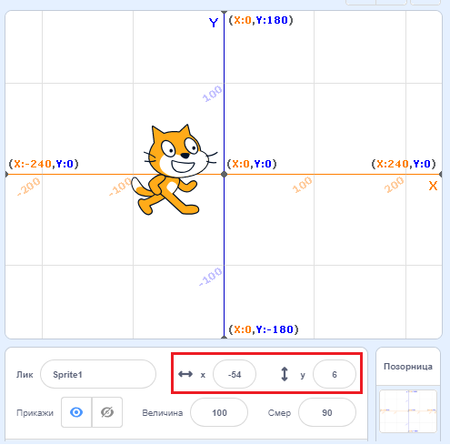
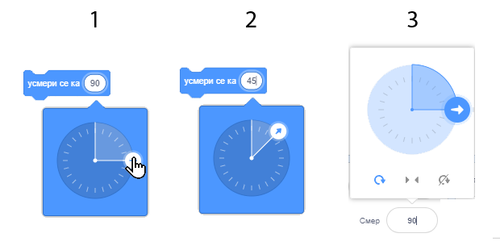
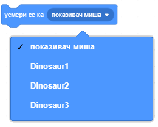
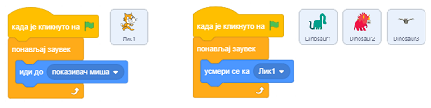
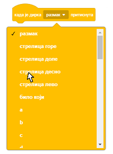
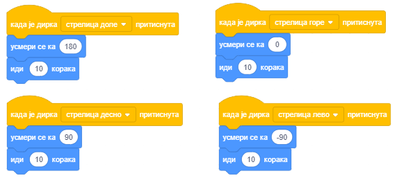
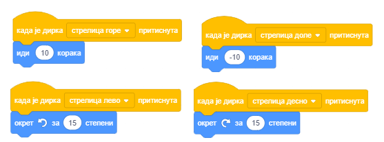
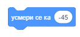
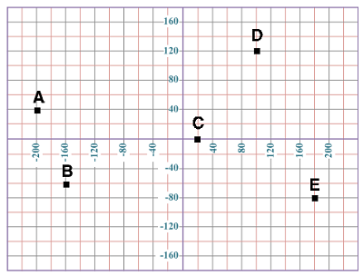
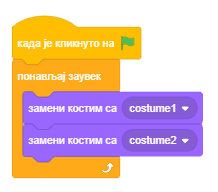

Кажи где да идем - координате и смер
====================================

.. include:: blokovi3.txt

.. include:: ikone3.txt

.. infonote::

  |paleta2|

Пошто си упознао основе окружења, време је да научиш како да пошаљеш ликове на жељена места на позорници. За то је потребно да знаш како је организована позорница и упознаш наредбе које омогућавају кретање.

.. sidebar:: Координате лика

 |pozornica|

.. topic:: Позорница
      
 Када се покрене Скреч, аутоматски се креира позорницa: бели правоуганик, који има 480 тачака по ширини и 360 тачака по висини. Најмања тачка која се може приказати на екрану у рачунарској графици се   назива **пиксел** (енгл. *Pixel*).

 Позорница је место на коме ће се покренути твоје приче, игре и анимације. Она је непокретна, као акваријум, али њени становници – ликови, се стално крећу и ступају у међусобне односе. Да би се лако управљало кретањем ликова, свакој тачки позорнице је придружена адреса - **координате х и у** које представљају удаљеност тачке од центра позорнице. Тачка која се налази у центру позорнице има координате х=0 и у=0, или краће: (0,0).

 Координате омогућавају да се ликови прецизно воде по позорници и да могу да се доведу у произвољну тачку (x,y). Тренутна позиција лика може се видети у информацијама о текућем лику. 

.. topic:: Функције блокова из групе *Кретање*
 
 Свим наредбама које омогућавају постављање ликова на жељену позицију и управљање њиховим усмеравањем и кретањем одговарају блокови који се налазе у групи *Кретање*. Њихов преглед дат је у 11. лекцији овог практикума. У овој лекцији ћемо, кроз примере и вежбе, детаљније упознати блокове који омогућавају кретање и показати како се користе **блокови репортери**. Блокови репортери не одговарају наредбама језика и не могу да стоје самостално у скрипти. Функција репортера из групе *Кретање* је да чувају текуће координате и усмерење лика.

.. topic:: Репортери кретања

 То су блокови |mesto_x| и |mesto_y| који садрже текуће податке о томе где се налази лик (које су његове х и у координате), као и блок |smer|  који показује како је усмерен лик.

 Да би се на позорници видело колике су тренутне координата лика и где гледа треба чекирати поља за потврду поред одговарајућих блокова. Ако се чекирају поља за потврду уз репортере кретања, на позорници се приказују одговарајући монитори преко којих се могу пратити текуће координате и смер лика.
 
 .. image:: ../_images/2/sl2_1b.png
   :width: 390px   
   :align: center
 
 
.. topic:: Апсолутно и релативно кретање

 Лик можеш да пошаљеш на одређено место на позорници на два начина: апсолутним и релативним кретањем.

 **Апсолутно кретање** је померање на одређено место - одредиште, независно од тренутне позиције лика.

 У Скречу се лик може послати на задату позицију (х,у) на позорници, односно извршити апсолутно кретање, коришћењем следећих блокова:

 - |idi_xy| - иди на позицију (х,у), 
 - |klizi_xy| - клизи до позиције (х,у), 
 - |neka_x| - постави координату х позиције, 
 - |neka_y| - постави координату у позиције. 

 Наредбом |idi_xy| лик се тренутно премешта на задату позицију (х,у).

 .. image:: ../_images/2/sl2_2.png
   :width: 400px   
   :align: center

 У нашем примеру, мачка се из тачке (0,0) премешта у тачку (200,100). При том се не усмерава ка одредишту, већ гледа на страну на коју је гледала и пре премештања.

 Слично би са полазне тачке дошла до одредишта и наредбом |klizi_xy|, али премештање се не би десило тренутно, већ би трајало задати број секунди. Што већи број задаш као време клизања, то ће дуже трајати одлазак на одредиште.

 Други начин за задавање одредишта при апсолутном кретању је независним задавањима координата х и у помоћу наредби |neka_x| и |neka_y|.

 .. image:: ../_images/2/sl2_3.png
    :width: 600px   
    :align: center

 **Релативно кретање** је померање на место које је од тренутне позиције лика удаљено задати број корака. Разуме се, треба да се каже и у ком смеру треба ићи (удесно, на горе и слично).

 У нашем примеру одредиште је 4 корака удесно и два корака навише од текућег положаја лика. Пошто је мачак усмерен надесно, прво ћемо га померити 4 корака, а онда га окренути за 90 :sup:`о` улево и померити још 2 корака навише.

 Исто би се постигло и тако да прво направи 2 корака навише, окрене се 90 :sup:`о` удесно и направи још 4 корака. Пошто је на почетку мачак усмерен надесно, пре извршења ове три наредбе требало би га окренути навише, значи кретање на овај други начин подразумева укупно 4 наредбе. 

 .. image:: ../_images/2/sl2_4.png
   :width: 600px   
   :align: center
   
 Други начин за задавање одредишта при релативном кретању је независним задавањима промена координата х и у помоћу наредби |promeni_x| и |promeni_y|.

 У Скречу се лик може послати на позицију удаљену од текуће задати број корака, односно извршити релативно кретање, коришћењем следећих блокова:
 
 - |promeni_x| - помери се задати број пиксела хоризонтално у односу на текућу позицију, 
 - |promeni_y| - помери се задати број пиксела вертикално у односу на текућу позицију (х,у), 
 - |okret_udesno| - окрени се удесно за задати број степени у односу на текући смер, 
 - |okret_ulevo| - окрени се улево за задати број степени у односу на текући смер, 
 - |idi_koraka| - помери се задати број корака у задатом смеру у односу на текућу позицију.
    

.. sidebar::  Наредбе усмеравања
   :subtitle: |usmeri_ka| и |usmeri_objektu|

   Вредност у улазно поље првог блока можеш да поставиш на три начина:

   |usmerenje1|

   (1) да из падајуће листе изабереш једну од понуђених вредности, на пример (0) горе;
   (2) да преко приказане вредности откуцаш нову, на пример 45;
   (3) да у информацијама о текућем лику заротираш плаву стрелицу која показује усмерење.

   Објекат према коме ће се усмеравати лик у другом блоку  бираш из падајуће листе.

   |usmerenje2|

.. topic:: Усмерење и окретање

 Поред наредби за окретање |okret_udesno| и |okret_ulevo|, које омогућавају промену усмерења у односу на то како је лик тренутно усмерен, у Скречу постоје и наредбе које постављају усмерење независно од тренутног положаја лика. 

 То су наредбе |usmeri_ka| и |usmeri_objektu|. 

 На следећој слици приказане су вредности за главна усмерења која можеш да упишеш у улазно поље првог блока: *горе* (север), *десно* (исток), *доле* (југ) и *лево* (запад).

 .. image:: ../_images/2/sl2_5.png
   :width: 380px   
   :align: center

 Можеш да унесеш и друге вредности, на пример 45 усмерава лик ка североистоку, а 135 ка југоистоку. За усмеравање ка западу не мораш да користиш негативне бројеве. Уместо њих можеш да уписујеш бројеве од 180 до 360.  

 Други блок омогућава да се лик усмери ка показивачу миша или неком лику у пројекту. Према коме ће се усмерити лик бираш тако што, кликом на бели троуглић у пољу вредности, отвориш падајућу листу и изабереш. На пример, у пројекту „Обилазак диносауруса”, који ћемо анализирати касније у овој лекцији, мачак може да се усмери према показивачу миша или једном од 3 диносауруса који су ликови овог пројекта. 

  

|prouci| Проучи следеће примере пројеката
-----------------------------------------

Као што смо у пројекту „Здраво свете“ показали једноставан начин како лик може да говори, а онда кроз вежбе надоградили пројекат тако да лик заиста изговара текст, тако ћемо и сада показати основне наредбе помоћу којих се лику задаје кретање, а потом кроз вежбе надограђивати ове могућности.

Пример 1 - Пројекат „Шетња”
~~~~~~~~~~~~~~~~~~~~~~~~~~~

|1| Кликни на групу блокова *Кретање*, па превуци блок |idi_koraka| у област скрипти и кликни на њега. Мачак ће се померити удесно 10 корака. 

|2| Кликни више пута на овај блок и одведи мачка до десног руба екрана. 

То што си више пута кликнуо на блок за померање омогућило је да се извршавање акције коју овај блок задаје понови више пута. Понављање неке радње више пута можемо постићи и програмским путем. 

|3| Врати мачка на средину екрана па кликни на групу наредби *Управљање*. У палети блокова појавиће се блокови различитог облика од блокова које си користио - блокови облика слова С са „устима“ у која можеш да убациш друге блокове.

|4| Изабери блок |zauvek| и превуци га у област скрипти. Клик на овај блок омогућава да се сви блокови који су у њега уложени извршавају заувек (док не зауставиш извршавање програма кликом на знак *стоп*).

|5| Убаци у „уста“ блока за понављање блок за померање и кликни на њих. Мачак ће поново отићи ван екрана.

Постоји начин како се кретање лика може задржати у оквиру граница екрана. То је наредба *ако си на рубу, окрени се*. Одговарајући блок налази у групи *Кретање*.

|6| Заустави извршавање блокова кликом на знак *стоп*, па превуци блок |ako_si| у област скрипти и постави га у „уста“ блока за понављање, иза блока  за кретање. 

.. sidebar:: Скрипта пројекта

  Лику мачка придружена је следећа скрипта

  |skripta|

.. |skripta| image:: ../_images/2/sl2_7.png

Покретањем овако измењене скрипте мачак ће се непрестано кретати од једног до другог руба екрана, али ће улево ићи и наглавачке. Разуме се, постоји начин да и ово исправимо. Један је да променимо начин кретања лика у информацијама о лику, а други да задамо наредбу за начин окретања лика.

|7| Превуци блок |nacin_okretanja| из групе *Кретање* и постави га изнад блока за понављање. Увери се да је из падајуће листе овог блока изабран начин окретања *лево-десно*.

|8| Постави блок |zelena_zastavica| на почетак скрипте, и тиме си  завршио пројекат „Шетња“. 

Пројекат сада можеш да га покрећеш кликом на *зелену заставицу* и заустављаш кликом на *стоп*. Упамти га, па крени у нова истраживања. 

.....

У следећем пројекту показаћемо како се уводе нови ликови и позадине и како се лик води коришћењем показивача миша. Зато, пре но што пређеш на овај пример, проучи приручнике *Додај лик* и *Додај позадину*.

Пример 2 – „Обилазак диносауруса”
~~~~~~~~~~~~~~~~~~~~~~~~~~~~~~~~~

У претходном пројекту користили смо блок ``понављај заувек`` да постигнемо да се мачак заувек креће између рубова екрана, односно све док се не прекине извршавање пројекта кликом на на знак *стоп*. У овом пројекту учествују 4 лика и сваком од њих ћемо придружити скрипту која описује његово поношање. Мачак ће заувек да прати показивач миша, а остала 3 лика - диносауруси, ће заувек да се усмеравају ка мачку. На следећој слици приказан је изглед позорнице на почетку извршавања пројекта.

.. image:: ../_images/2/sl2_8.png
   :width: 490px   
   :align: center

**Израда пројекта**

.. sidebar:: Избор позадине

  Нову позадину можеш да додаш у пројекат кликом на дугме које се налази десно од дугмета за избор нових ликова.

  |nova_pozadina|

.. |nova_pozadina| image:: ../_images/2/sl2_9.png

|1| Кликни на дугме за избор позадина и изабери позадину *Jurassic* из библиотеке позадина.

|2| Изабери ликове *Dinosaur1*, *Dinosaur2* и *Dinosaur3* из библиотеке ликова.

|3| Ликове распореди као на слици горе. Лику *Dinosaur2* треба променити усмерење. Подразумева се да је усмерење ликова постављено на 90 :sup:`о` (гледају на десно) и да им је начин окретања *на све стране*. Ове поставке могу се променити у информацијама о лику или коришћењем одговарајућих блокова у скриптама које су му придружене. У овом пројекту користићемо први начин. 

|4| У информацијама о лику постави да начин окретања буде за лик: *Dinosaur1* - *без окретања*, *Dinosaur2* - *лево/десно*, *Dinosaur3* - *на све стране*. 

|5| Свим диносаурусима придружи исту скрипту која налаже да се све време извршавања пројекта усмеравају ка мачку. Међутим, они ће се различито понашати зато што у информацијама о лику имају постављене различите начине окретања.
   
|6| Лику мачка придружи наредбе које му омогућавају да прати координате показивача миша, односно да се по позорници креће онако како корисник помера миша. 

Скрипте које описују понашање диносауруса и мачка приказне су на следећој слици.

 
Покрени пројекат и померај мачка по позорници. Обрати пажњу да диносауруси на различит начин прате његово кретање.

.....

Пример 3 – „Праволинијско кретање”
~~~~~~~~~~~~~~~~~~~~~~~~~~~~~~~~~~

Проучи приручник *Употреби тастере са стрелицама*, па направи пројекат у коме се мачак води по позорници диркама са тастатуре.

.. sidebar:: Избор дирке

  Дирка тастатуре која ће покренути скрипту бира се тако што се кликне на бели троугао поред назива дирке (размак) и затим из падајуће листе изабере жељена дирка.

  |sl2_11|

|1|	Лику мачка придружи наредбу  |dirka|.

|2| Изабери дирку *стрелица десно*.
 
|3|	Из групе *Кретање* избери наредбу |usmeri_ka|  и повежи је са претходном наредбом.

|4|	Из групе *Кретање* избери наредбу |idi_koraka| и повежи је са претходном наредбом.

|5|	Притисни дирку стрелица десно на тастатури неколико пута. Шта се дешава?

|6|	Умножи ову скрипту (десни клик на прву наредбу, па изабери *умножи*).

|7|	У новој скрипти замени дирку стрелица десно у стрелица лево, у блоку *усмери се* уместо 90 изабери -90.

|8|	Притисни дирку стрелица лево на тастатури неколико пута. Шта се дешава?

|9|	Слично направи још две скрипте: за вођење мачка 10 корака на горе притиском на дирку стрелица горе, односно 10 корака на доле притиском на дирку стрелица доле.
 

.....

Пример 4 – „Кретање са скретањем”
~~~~~~~~~~~~~~~~~~~~~~~~~~~~~~~~~

Направићемо још један пројекат за вођење лика помоћу дирки са тастатуре, али са измењеним функцијама дирки са стрелицама. Избацићемо наредбе за усмеравање, а диркама *стрелица лево* и *стрелица десно* придружићемо наредбе које окрећу лик за 15 степени улево, односно удесно. Диркама *стрелица горе* и *стрелица доле* придружићемо наредбе ``иди 10 корака``, односно ``иди -10 корака``. Одговарајуће скрипте имаће следећи изглед.
 

Покрени пројекат и тестирај како се у њему управља кретањем лика.

|pitaj| Одговори на следећа питања
----------------------------------

Питање 1
~~~~~~~~

.. level:: 1

.. mchoice:: позорница1
   :answer_a: 1280 тачака по ширини и 600 тачака по висини
   :answer_b: 800 тачака по ширини и 600 тачака по висини
   :answer_c: 480 тачака по ширини и 360 тачака по висини
   :answer_d: 360 тачака по ширини и 480 тачака по висини
   :correct: c
   :feedback_a: 
   :feedback_b: 
   :feedback_c: Тачно.
   :feedback_d: 
   
   Колике су димензије позорнице?
   
Питање 2
~~~~~~~~

.. level:: 1

.. mchoice:: позорница2
   :answer_a: у горњем левом углу позорнице
   :answer_b: у доњем левом углу позорнице
   :answer_c: у центру позорнице
   :answer_d: зависи од придружене позадине
   :correct: c
   :feedback_a: 
   :feedback_b: 
   :feedback_c: Тачно.
   :feedback_d: 
   
   Где се налази тачка с координатама (0,0)?
   
   
Питање 3
~~~~~~~~

.. level:: 1

.. mchoice:: блокови1
   :answer_a: Осећаји
   :answer_b: Кретање
   :answer_c: Управљање
   :answer_d: Изглед
   :correct: b
   :feedback_a: 
   :feedback_b: Тачно.
   :feedback_c: 
   :feedback_d: 
   
   Којој групи  припадају блокови који управљају положајем, оријентацијом, окретањем и кретањем ликова?
   

Питање 4
~~~~~~~~

.. level:: 1

.. mchoice:: позорница3
   :answer_a: да
   :answer_b: не
   :correct: b
   :feedback_a: Није тачно, она је непокретна. 
   :feedback_b: Тачно.
   
    Да ли позорница може да извршава наредбе кретања?

Питање 5
~~~~~~~~

.. level:: 2

.. mchoice:: апсолутно_кретање
   :multiple_answers:
   :answer_a: 
   :answer_b: 
   :answer_c: 
   :answer_d: 
   :correct: a, d
   :feedback_a: 
   :feedback_b: 
   :feedback_c: 
   :feedback_d: 

   Које од наредби омогућавају апсолутно кретање? (Изабери све тачне одговоре)

   .. image:: ../_images/2/pitanje2_5.png
      :width: 545px   
      :align: center

Питање 6
~~~~~~~~

.. level:: 2

.. mchoice:: релативно_кретање
   :multiple_answers:
   :answer_a: 
   :answer_b: 
   :answer_c: 
   :answer_d: 
   :correct: b, d
   :feedback_a:  
   :feedback_b: 
   :feedback_c:  
   :feedback_d: 

   Које од наредби омогућавају релативно кретање? (Изабери све тачне одговоре)

   .. image:: ../_images/2/pitanje2_6.png
      :width: 630px   
      :align: center

Питање 7
~~~~~~~~

.. level:: 2

.. mchoice:: репортери_кретања
   :multiple_answers:
   :answer_a: 
   :answer_b: 
   :answer_c: 
   :answer_d: 
   :correct: b, c,d
   :feedback_a: 
   :feedback_b: 
   :feedback_c: 
   :feedback_d: 

   Који од блокова представљају репортере кретања? (Изабери све тачне одговоре)

   .. image:: ../_images/2/pitanje2_7.png
      :width: 335px   
      :align: center

Питање 8
~~~~~~~~

.. level:: 2

.. mchoice:: компас
   :answer_a: југоисток
   :answer_b: југозапад
   :answer_c: североисток
   :answer_d: северозапад
   :correct: d
   :feedback_a: Тамо показује угао од 135 степени.
   :feedback_b: Тамо показује угао од -135 степени.
   :feedback_c: Тамо показује угао од 45 степени.
   :feedback_d: Тачно.
   
   На коју страну света ће гледати лик после извршења наредбе |naredba2_8|?

Питање 9
~~~~~~~~

.. level:: 2

На следећој слици приказани су положаји 5 тачака на позорници.

      
.. mchoice:: koordinate1
   :answer_a: (-200,-40)
   :answer_b: (-200,40)
   :answer_c: (200,-40)
   :answer_d: (200,40)
   :correct: b
   :feedback_a:  
   :feedback_b: Тачно.
   :feedback_c: 
   :feedback_d: 
   
   Које су координате тачке А? 
  
.. mchoice:: koordinate2
   :multiple_answers:
   :answer_a: Тачка A
   :answer_b: Тачка B
   :answer_c: Тачка D
   :answer_d: Тачка E
   :correct: b, d
   :feedback_a:  
   :feedback_b: 
   :feedback_c: 
   :feedback_d: 

   Које тачке имају негативну **y** координату?
   (Изабери све тачне одговоре)

.. dragndrop:: координате_разне
    :feedback: Покушај поново
    :match_1: A|||(-200,40)
    :match_2: B|||(-160,-60)
    :match_3: C|||(20,0)
    :match_4: D|||(100,120)
    :match_5: E|||(180,-80)
    
    Превлачењем упари тачке са њиховим координатама.

Питање 10
~~~~~~~~~

.. level:: 2

На следећој слици приказани су положаји 6 тачака на позорници.

.. image:: ../_images/2/pitanje2_10.png
   :width: 300px   
   :align: center
      

.. dragndrop:: координате_симетричне
    :feedback: Покушај поново
    :match_1: A|||(-160,80)
    :match_2: B|||(-160,-80)
    :match_3: C|||(160,-80)
    :match_4: D|||(80,0)
    :match_5: E|||(160,80)
    :match_6: F|||(0,80)
    
    Превлачењем упари тачке са њиховим координатама.

.. mchoice:: симетрија_х
   :answer_a: Тачка А
   :answer_b: Тачка В
   :answer_c: Тачка С
   :answer_d: Тачка D
   :correct: c
   :feedback_a: То треба да буде тачка која има исту х, a супротну по знаку у координату као тачка Е.
   :feedback_b: То треба да буде тачка која има исту х, a супротну по знаку у координату као тачка Е.
   :feedback_c: Тачно.
   :feedback_d: То треба да буде тачка која има исту х, a супротну по знаку у координату као тачка Е.

   Која тачка je симетрична тачки Е у односу на *х* осу?

.. mchoice:: симетрија_у
   :answer_a: Тачка А
   :answer_b: Тачка В
   :answer_c: Тачка С
   :answer_d: Тачка D
   :correct: a
   :feedback_a: Тачно.
   :feedback_b: То треба да буде тачка која има супротну по знаку х, a исту у координату као тачка Е.
   :feedback_c: То треба да буде тачка која има супротну по знаку х, a исту у координату као тачка Е.
   :feedback_d: То треба да буде тачка која има супротну по знаку х, a исту у координату као тачка Е.
   
   Која тачка je симетрична тачки Е у односу на *у* осу?  

.. mchoice:: simetija2
   :multiple_answers:
   :answer_a: A и B
   :answer_b: A и C
   :answer_c: A и E
   :answer_d: D и F
   :correct: a, b, c
   :feedback_a:  
   :feedback_b: 
   :feedback_c: 
   :feedback_d: 

   Које тачке су једнако удаљене од *у*  осе? (Изабери све тачне одговоре) 

|pokusaj| Покушај
-----------------

Вежба 1 - Праћење положаја ликова
~~~~~~~~~~~~~~~~~~~~~~~~~~~~~~~~~

.. level:: 1

.. infonote::

  |1| Превуци лик мачка у горњи леви угао позорнице, па у информацијама о лику провери колике су координате тачке на којој си га оставио.

  |2| Превуци га затим у горњи десни угао позорнице и опет провери колике су координате тачке на којој си га оставио.

  |3| Понови претходни поступак за тачке у доњим угловима позорнице. На којим местима на позорници је координата х имала знак минус, а на којим је координата у била негативна?

  |4| Из библиотеке ликова увези лик *Apple*. Око сличице новог лика у листи ликова треба да се појави плави оквир што значи да је тај лик у фокусу. Ако није, кликни на његову сличицу у листи ликова. 
       
  |5| Чекирај променљиве *место х* и *место у* на дну групе блокова *Кретање*. На позорници ће се појавити монитори *Apple: х положај* и *Apple: у положај*.

  |6| Превлачи сада лик *Apple* на различита места на позорници и прати на мониторима како се мењају његове координате.

.....

Вежба 2 - Задавање положаја лика наредбама апсолутног кретања
~~~~~~~~~~~~~~~~~~~~~~~~~~~~~~~~~~~~~~~~~~~~~~~~~~~~~~~~~~~~~

.. level:: 2

.. infonote::

  |1| Кликни на слику позорнице поред листе ликова. Око слике позорнице појавиће се плави оквир, значи позорница је у фокусу.

  |2| Кликни на дугме *Одабери позадину*, па из прозора *Библиотека позадина* који ће се потом отворити изабери: *Xy-grid*.

  |3| Кликни сада на картицу *Програм* како би уместо листе позадина добио палету блокова.

  |4| У групи блокова *Кретање* добићеш поруку *Нема блокова за кретање*, што је и разумљиво јер позорница која је сада у фокусу не може да се креће.
  
  |5| Кликни на лик мачка у листи ликова. Када се око сличице лика појави плави оквир, вратиће се и блокови групе *Кретање*.

  |6| Превуци блок |idi_xy| у област скрипти, па промени вредност х на 120 и вредност у на 100.

  |7| Кликни на овако измењен блок у области скрипти. Шта се десило?

  |8| Превуци блок |klizi_xy| у област скрипти, па промени вредност х на -120 и вредност у на 100. Шта се дешава кад кликнеш на овај блок?

  |9| Прати где ће се наћи лик после клика на блок у који си претходно уписао различите вредности за х и у. На пример, где ће бити лик ако су обе координате негативне, ако су ван позорнице и слично. 

.....

Вежба 3 - Апсолутно и релативно кретање
~~~~~~~~~~~~~~~~~~~~~~~~~~~~~~~~~~~~~~~

.. level:: 3

.. infonote::

  Покушај да водиш лик од тачке A  до тачке B коришћењем различитих наредби кретања.
   
  |1| Постави као позадину *Хy-grid* из библиотеке позадина.

  |2| Из библиотеке ликова изабери два нова лика - слова А и В (Block-A и Block-B).
  
  |3| Слово А постави у доњи леви угао позорнице на позицију (-200,-120), а слово В у горњи десни угао на позицију (200,120). Ово ћеш најпрецизније урадити ако слову А придружиш блок |idi_xy| (превучеш га у област скрипти док је слово А у фокусу), унесеш одговарајуће координате х и у, па кликнеш на блок. Поступак понови и за слово В.
  
  |4| Мачку придружи наредбу |idi_do| и из падајуће листе (коју ћеш добити када кликнеш на црни троуглић у пољу избора) изабери *Block-A*.   **Напомена**. |idi_do| |!=| |idi_xy|. 
   
  |5| Кликни на блок |idi_do| и мачак ће се наћи испод слова А. 
  
  |6| Кликни на блок |predji_napred| из групе *Изглед* и мачак ће се наћи изнад слова А.
  
  .. image:: ../_images/2/vezba2_3.png
     :width: 220px   
     :align: center

  |7| Сада у блоку |idi_do| изабери *Block-B*, па кликни на њега. Мачак ће се истог тренутка наћи изнад слова В. 

  |8| Мачку придружи блок |klizi_do|, а из падајуће листе изабери *Block-A*, па кликни на њега. Мачак ће се 1 секунду кретати до слова А. **Напомена**.  |klizi_do| |!=| |klizi_xy|. 
    
  |9| Пробај и трећи начин. Прво мачку придружи блок |usmeri_objektu|, и из падајуће листе изабери да се усмерава ка лику *Block-A*. **Напомена**.  |usmeri_objektu| |!=| |usmeri_ka|

  Kликћи на блок |idi_koraka| све док мачак не стигне до слова A.

.....

Вежба 4 - Коришћење наредби за начин окретања и усмерење
~~~~~~~~~~~~~~~~~~~~~~~~~~~~~~~~~~~~~~~~~~~~~~~~~~~~~~~~

.. level:: 2

.. infonote::

 Направи пројекат у коме ће се ликови понашати потпуно исто као у пројекту „Обилазак диносауруса”, али немој вршити измене у информацијама о лику. Уместо тога, начин окретања и усмерења ликова постави у скриптама придруженим ликовима. Упамти овај пројекат под називом „Обилазак диносауруса2”

.....

Вежба 5 - Додавање нових ликова постојећим пројектима
~~~~~~~~~~~~~~~~~~~~~~~~~~~~~~~~~~~~~~~~~~~~~~~~~~~~~

.. level:: 2

.. infonote::

 Искористи пројекат „Шетња” за креирање новог пројекта у који ћеш увести нови лик. То може да буде, на пример, пас или миш, који све време треба да се усмерава према мачку. Додај позадину по избору. У скрипти која описује понашање новог лика задај и начин окретања. Немој вршити измене у скрипти придруженој мачку. Упамти овај пројекат под називом „Шетња2”.

|bug| Исправи грешке
--------------------

Грешка 1
~~~~~~~~

Ученик је желео да направи једноставну анимацију кретања мачка променом костима. Зато му је придружио следећу скрипту. 

Међутим, ништа се није дешавало. Шта је погрешио?

Грешка 2
~~~~~~~~

Ученик је желео да његов лик корача између леве и десне ивице позорнице. Зато је у бесконачан циклус унео стално мењање костима и корачање по 10 корака док не дође до руба позорнице, када се окреће. Међутим, није му се свидело што лик ка левој ивици позорнице корача наглавачке. Шта треба да уради да поправи ову грешку?
   
  
|knjiga| Шта смо научили
------------------------

У овој лекцији смо показали како се помоћу две координате може прецизно одредити положај тачке на позорници. Ликове можемо послати на задату локацију наредбама апсолутног и релативног кретања. Апсолутно кретање је померање на одређено место – одредиште, независно од тренутне позиције лика, док је релативно кретање померање на место које је од тренутне позиције лика удаљено задати број корака у задатом смеру. Позорница не може да извршава наредбе кретања. Кроз примере пројеката и вежбе показали смо како се кретањем ликова може управљати диркама  тастатуре и помоћу миша.

**Примери пројеката**: 2Studio_

.. _2Studio: https://scratch.mit.edu/studios/25117373/

**Појмови**:  пиксел, координатни систем, координате,  наредбе кретања,  репортери кретања, апсолутно кретање, релативно кретање, усмерење, начин окретања.

**Наредбе**: |kretanje| - |idi_koraka|, |okret_udesno|, |okret_ulevo|, |usmeri_ka|, |usmeri_objektu|, |idi_xy|, |idi_do|,  |klizi_xy|,
|klizi_do|, |neka_x|, |neka_y|, |promeni_x|, |promeni_y|, |ako_si|, |nacin_okretanja|, |mesto_x|, |mesto_y|, |smer|; 

|dogadjaji| - |dirka|; |izgled| - |*| |predji_napred|,  |*| |zameni_kostim|; |upravljanje| - |*| |zauvek|.

Напомена. Наредбе означене знаком  |*| биће обрађене у наредним лекцијама.

|project| Уради неки од следећих пројеката
------------------------------------------

Пројекат 1 - „Два играча”
~~~~~~~~~~~~~~~~~~~~~~~~~

Започни нови пројекат који ћеш назвати *Два играча*. На позорницу постави два лика, један на левом, а други на десном крају. Подеси да ликови буду усмерени један ка другом. Придружи ликовима скрипте које им омогућавају да се крећу напред-назад и да се окрећу у смеру казаљке на сату и у смеру супротном казаљки на сату.

Управљачки тастери за први лик треба да буду:

•	Стрелица на горе - Лик иде право напред,

•	Стрелица на доле - Лик иде право назад,

•	Стрелица лево - Лик се окреће у смеру супротном казаљки на сату,

•	Стрелица десно - Лик се окреће у смеру казаљке на сату.

Управљачки тастери за други лик треба да буду:

•	Дирка W - Лик иде право напред,

•	Дирка S - Лик иде право назад,

•	Дирка А - Лик се окреће у смеру супротном казаљки на сату,

•	Дирка D - Лик се окреће у смеру казаљке на сату.
