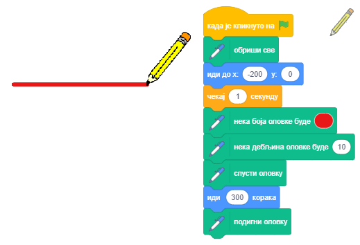
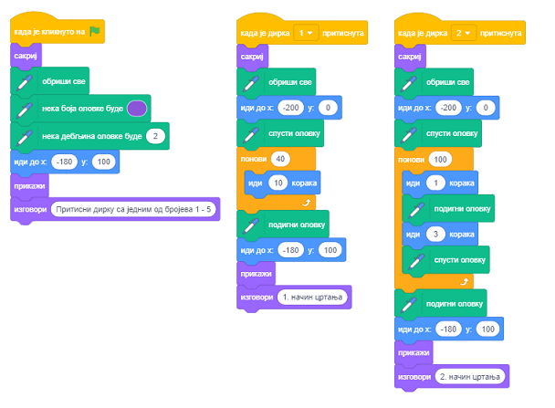

Хајде да цртамо
===============

.. include:: blokovi3.txt

.. include:: ikone3.txt

.. infonote::

 |paleta4|

У претходним лекцијама си научио како се управља кретањем лика помоћу миша и дирки тастатуре. Сада ћемо показати како лик приликом кретања оставља траг. Кроз примере пројеката упознаћеш се са функцијама блокова из групе *Оловка* који омогућавају сваком лику да оставља траг приликом кретања. Овакав начин формирања цртежа назива се корњача графика. Такође си видео како се усклађивање понашања ликова постиже уметањем блокова чекања. У овој лекцији ћемо показати ефикаснији начин - синхронизацију ликова у пројекту разменом порука.

.. topic:: Корњача графика

 Скреч је један од савремених језика програмирања у који су укључене могућности корњача графике, које су представљене први пут у језику *Лого* још пре педесетак година.

 *Лого* је омогућавао управљање уређајем корњача, врстом робота, који је био повезан са рачунаром. Корњача је могла да се креће по хоризонталној подлози напред-назад и да мења смер и правац кретања. Уколико би се поставио лист папира испод корњаче, она је могла да оставља траг, формирајући графику која је названа *корњача графика*.

 Овакав начин задавање слике као колекције фигура, заједно са њиховим подацима (параметрима) који дефинишу како ће фигура бити исцртана и где ће бити лоцирана назива се **векторска графика**.

 За разлику од ње, у **растерској графици** слика се памти као правоугаонa мрежa пиксела - битмапа. Битмапа је технички одређена ширином и висином лика у пикселима и бројем потребних битова да се упамти боја пиксела. На пример, ако имамо само 16 боја, за памћење боје је потребно су 4 бита по пикселу. Растерска графика је зависна од резолуције. Растерске слике се не могу увећавати без губитка квалитета снимка.

 У Скречу сваки лик има могућности да се понаша као Лого корњача: могу му се задати положај, смер и правац кретања и при кретању може да оставља траг. Притом величина, облик и боја самог лика немају утицаја на траг који оставља, јер ликови цртају оловком. Лик може бити и невидљив или се састојати од једне једине тачке, али то нема утицаја на његово цртање.

 
.. topic:: Функције блокова из групе *Оловка*

 Група *Оловка* чији блокови омогућавају ликовима да остављају траг при кретању, односно да подрже корњача графику налази се међу проширењима.

 Да би могао да користиш блокове из ове групе треба да:

 1. Кликнеш на икону |prosirenja| у доњем левом углу палете наредби.

 2. Изабереш проширење *Оловка* из менија који ће се отворити.

 3. Потом ће се у палети наредби појавити икона ове групе и сви блокови који се у њој налазе.
  
 .. image:: ../_images/4/sl4_1.png
     :width: 740px   
     :align: center

 У групи наредби *Оловка* налазе се следећи блокови: 
 
 .. hlist::
    :columns: 2

    * |obrisi| - брише све што је нацртано 
    * |pecat| - оставља печат лика
    * |podigni| - подиже оловку
    * |spusti| - спушта оловку
    * |neka_boja| - поставља боју оловке
    * |neka_olovka|- поставља параметре цртања
    * |promeni_olovku| - мења параметре цртања
    * |neka_debljina| - поставља дебљину оловке
    * |promeni_debljinu| - мења дебљину оловке
    
 Ако се лику придружи наредба |spusti|, он ће надаље при кретању остављати траг. Када му се придружи наредба |podigni|, лик при даљем кретњу неће остављати траг све док му се поново не зада наредба |spusti|. Какав ће траг бити задају параметри цртања. Параметри цртања су дебљина, боја, засићење, осветљеност и провидност трага који оставља оловка. 
 
 Напомена.  |obrisi| |!=| |sakrij|. Прва наредба односи се на цртеже, а друга на ликове.

.. topic:: Синхронизација коришћењем порука

 Понашање се увек покреће догађајем, што може бити акција или добијање поруке. У пројектима са више ликова које смо раније креирали, за усклађивање понашања ликова користили смо блок ``чекај``. Тако смо у пројекту „Рачунање” омогућили да девојчица и дечак синхронизовано разговарају – док девојчица говори, дечак слуша и обрнуто. 
 
 Сада ћемо показати како се акције ликова (и позорнице) могу усклађивати у зависности од тога да ли је наступио догађај разглашавања поруке.
 Примећујете да нисмо рекли да се порука **шаље** (send), него да се **разглашава** (broadcast). То је зато што се у Скречу поруке упућују свим објектима, а не само једном одређеном.  Разглашавање и примање порука у Скречу се постиже блоковима |razglasi|, |razglasi_cekaj| и |kad_primim| из групе *Догађаји*.  

|prouci| Проучи следеће примере пројеката
-----------------------------------------

Пример 1 - Пројекат „Цртање дужи” 
~~~~~~~~~~~~~~~~~~~~~~~~~~~~~~~~~

Направићемо пројекат у коме лик црта дуж дебљине 10, а дужине 300 пиксела. За лик који црта изабраћемо оловку (Pencil) из библиотеке ликова, а лик мачка ћемо избрисати. Да би траг који оловка оставља био уз њен врх, померићемо центар костима на врх. То постижемо на следећи начин. Прво отворимо картицу *Костими*. С леве стране платна за цртање биће приказани алати, у нашем случају векторски алати јер је лик векторски (1).  Алатком за избор |valat1| означимо цео лик (2), па га превучемо тако да се врх оловке налази изнад ознаке |centar| за центар екрана (3).

На почетку треба обрисати све што је претходно било нацртано наредбом |obrisi|, поставити оловку на место одакле ће почети са цртањем, поставити боју, и дебљину оловке, па наредбом ``спусти оловку`` омогућити да оловка приликом кретања оставља траг. На крају наредбом ``подигни оловку`` треба онемогућити да приликом наредних извршавања програма лик оставља траг при постављању на почетни положај. 

Постоје два начина задавања боје цртања: 

- помоћу постављања узорка боје наредбом |neka_boja| 

- задавањем броја боје наредбом |neka_olovka|. 

У овом пројекту користимо први начин.

Кликом на улазно поље блока за задавање боје отвара се падајући мени у коме се налазе клизачи са компонентама боје: број придружен боји, засићење и осветљеност и испод њих алатка пипета за узимање узорка боје (1). Жељену боју можемо поставити померањем клизача или кликом на пипету. Ако се кликне на пипету осветљава се позорница на којој се налази лупа са кружићем у центру (2). Да бисмо изабрали жељену боју, треба да поставимо центар лупе изнад дела позорнице на коме се та боја налази и кликнемо. Добићемо резултат као на слици (3). 

Напомена. О HSB моделу представљања боје, који користи атрибуте: нијанса боје, засићење и осветљеност, више детаља можеш наћи у *Додацима*.  

Резултат извршавања скрипте и сама скрипта приказани су на следећој слици.

.....

Пример 2 - Пројекат „Цртање слободном руком” 
~~~~~~~~~~~~~~~~~~~~~~~~~~~~~~~~~~~~~~~~~~~~

.. level:: 1

Овај пројекат треба да илуструје како се користе наредбе цртања и покаже да траг не зависи од величине лика, нити од тога да ли се лик види или је скривен. Цртеж формира оловка, па је свеједно који лик је држи. Овог пута смо за лик који оставља траг избрали бубамару *Ladybug 1* из библиотеке ликова. 

Скрипта која се покреће кликом на зелену заставицу задаје бубамари да све време прати показивач миша. На самом почетку ове скрипте бришу се сви трагови који су евентуално остали од претходних извршавања, и подиже се оловка. Догађају клик на дирку *стрелица доле* придружена је наредба ``спусти оловку``, а догађају клик на дирку *стрелица горе* наредба ``подигни оловку``. Тако се постиже да померање лика не оставља траг све док се не кликне на дирку *стрелица доле*. Остављање трага се прекида када се кликне на дирку *стрелица горе*. 

Скрипте придружене бубамари приказане су на следећој слици. Цртање би се обављало на исти начин и ако би се на место означено стрелицом уметнуо блок |sakrij|, али се тада лик који црта не би видео и изгледало би као да цртеж формира показивач миша. 

Разуме се, природније би било да не морамо да притискамо дирке тастатуре за спуштање и подизање оловке, већ да померање са притиснутим дугметом миша оставља траг, а ако дугме није притиснуто, померање буде без остављања трага. Такво цртање обезбеђује следећа скрипта. 

Дејство наредбе ``ако онда иначе`` показаћемо у 6. лекцији овог приручника. Засад само да кажемо да ће се извршавати или наредбе |idi_do| и ``спусти оловку`` из горњег слота, или ``подигни оловку`` из доњег слота за скрипту овог Е-блока. Које наредбе ће се извршавати зависи од тога да ли је дугме миша притиснуто или није, што се утврђује на основу вредности коју враћа блок |mis_pritisnut|. Овај блок припада групи *Осећаји* и враћа вредност тачно (true) или нетачно (false). Функцијске блокове шестоугаоног облика који враћају само вредности *true* или *false* називамо **логички блокови**.

.....

Пример 3 - Пројекат „Прати ме по трагу”
~~~~~~~~~~~~~~~~~~~~~~~~~~~~~~~~~~~~~~~

.. level:: 1

У овом пројекту кретањем бубамаре управља се коришћењем дирки са стрелицама, као у примеру 3 лекције *Координате позорнице*. Траг који бубамара оставља је изломљена линија која се састоји од хоризонталних и вертикалних дужи. На следећој слици приказане су скрипте пројекта и изглед позорнице после једног извршавања пројекта. 

.. sidebar:: Кодирање боја бројевима

  Сваком од целих бројева из интервала [0,199] одговара нека од боја. На пример, 0 је црвено, 30 жуто, 70 зелено, 130 плаво, а 170 магента. Нумерисање боја у У Скречу заснива се на редоследу боја у спектру.

  |krug_boje|

.. |krug_boje| image:: ../_images/4/sl4_8.png

**Унапређење пројекта**

Изменићемо пројекат тако да се лик који оставља траг слободније креће, као у примеру 4 лекције *Координате позорнице*. Додаћемо и промену боје и дебљине оловке сваких 5 секунди на случајан начин и траг ће бити атрактивнији. Да бисмо боју могли да задајемо на случајан начин, уместо задавања боје оловке као у претходном примеру, користићемо наредбу |neka_olovka|  у којој се боја задаје бројем. 

На следећој слици приказни су скрипта која поставља почетне вредности (активира се кликом на зелену заставицу) и изглед позорнице по једном извршавању овако измењеног пројекта. У блок ``понављај заувек`` уметнутe су наредбе које постављају боју и дебљину оловке на "случајан" начин.

.....

Пример 4 - Пројекат „Линије”
~~~~~~~~~~~~~~~~~~~~~~~~~~~~

.. level:: 2

Пројекат *Линије* показује како коришћењем наредбе понављања задати број пута, коју ћемо упознати у наредном поглављу, можемо нацртати линије за подвлачење различитих стилова.

Пројекат црта линију љубичасте боје, дужине 400 и дебљине 2 пиксела почев од тачке (-200,0) на један од 5 следећих начина. 

.. image:: ../_images/4/sl4_10.png
   :width: 150px   
   :align: center

Лик који црта притом се не види. Тек пошто нацрта линију, појављује се у горњем левом углу позорнице и саопштава на који начин је линија цртана. 
Цртање покрећу догађаји |dirka|, при чему је дирки са бројем 1 придружен први начин, дирки са бројем 2 други и тако редом. 

Кликом на зелену заставицу брише се све што је претходно било на позорници, постављају се вредности за боју и дебљину оловке и појављује се лик који даје упутства како покренути пројекат.

Свака од скрипти придружених диркама 1-5 тастатуре прво обрише све што је претходно нацртано, сакрије лик, исцртава линију на задати начин и затим у горњем левом углу прикаже лик који изговара на који је начин исцртана линија.

- Први начин је цртање непрекидне линије. Ово се може урадити тренутно, једном једином наредбом "иди 400 корака", али ми смо, да би и први начин трајао приближно као остали, цртање 400 тачака обавили тако што је лик 40 пута ишао по 10 корака. 

- Други начин - лик 100 пута понавља узорак: иде 1 корак са спуштеном оловком, па 3 корака са подигнутом.

- Трећи начин - лик 50 пута понавља узорак: иде 3 корака са спуштеном оловком, па 5 корака са подигнутом.

- Четврти начин - лик 40 пута понавља узорак: иде 6 корака са спуштеном оловком, па 4 корака са подигнутом.

- Пети начин - лик 25 пута понавља узорак: иде 6 корака са спуштеном оловком, 4 корака са подигнутом, 2 корака са спуштеном, па 4 корака са подигнутом оловком.

На следећој слици приказане су скрипте за догађаје *клик на зелену заставицу*, *клик на дирку 1* и *клик на дирку 2*.

Напомињемо да наредбе понављања не скраћују трајање извршавања програма, већ само омогућавају програмеру да прегледније и краће пише програме. 

.....

Пример 5 - Пројекат „Породица”
~~~~~~~~~~~~~~~~~~~~~~~~~~~~~~

.. level:: 2

У овом пројекту једно пиле представља своју породицу: маму кокошку, тату петла и брата и сестру. На почетку се види само пиле коме смо дали име Лиза, а сви остали ликови су скривени. Пиле прво представља маму Марџ. Када изговори њено име, мама се појави и разгласи да се појавила. Затим Лиза представља тату Хомера. И тата се појави кад "чује" своје име, па "одговори" поруком са својим именом. Слично се појаве и брат Барт и сестра Меги. Усклађивање појављивања и оглашавања ликова постиже се коришћењем порука. Кад Лиза представи неког, разгласи поруку. Ликови "ослушкују" и кад приме одговарајућу поруку, појављују се и шаљу поруку са својим именом. Кад Лиза прими ту поруку - одговор, наставља са представљањем следећег члана породице.

Следећа слика  приказује како се појављивање ликова синхронизује порукама.

.. image:: ../_images/4/sl4_12.png
   :width: 600px   
   :align: center

**Припрема ликова**

.. sidebar:: Распоред ликова на позорници
    
 .. image:: ../_images/4/sl4_13.png
   :width: 400px   
   :align: center
  
|1| За ову презентацију потребни су ти следећи ликови: Лиза, Марџ, Хомер, Барт и Меги. За Лизу, Барта и Меги користићемо лик *Chick*, за маму *Hen*, а за тату *Rooster* из библиотеке ликова. Пошто учиташ ликове, преименуј их тако да се зову као у нашем пројекту.

.. image:: ../_images/4/sl4_14.png
   :width: 400px   
   :align: center

|2| Учитај позадину *Farm* из библиотеке позадина.

|3| Лик Лизе постави на средину у горњем делу позорнице.

|4| Лик Марџ постави доле лево, а поред ње Меги, коју треба да смањиш.

|5| Лик Хомер постави доле десно и окрени га да гледа улево. Барта повећај, стави га између Меги и тате и окрени да гледа улево. 

Скрипте придружене ликовима приказане су на следећој слици.

.. image:: ../_images/4/sl4_15.png
   :width: 600px   
   :align: center

|pitaj| Одговори на следећа питања
----------------------------------

Питање 1
~~~~~~~~

.. level:: 1

.. mchoice:: корњача1
   :answer_a: да
   :answer_b: не
   :correct: b
   :feedback_a: Програмски језик Лого је увео корњача графику.
   :feedback_b: Тачно.
   
   Скреч је језик програмирања у који су по први пут укључене могућности корњача графике.

Питање 2
~~~~~~~~

.. level:: 1

.. mchoice:: корњача2
   :answer_a: да
   :answer_b: не
   :correct: b
   :feedback_a: Не, први се односи на цртеже, а други на ликове.
   :feedback_b: Тачно.

   Блок ``обриши`` из групе *Оловка* има исту функцију као блок ``сакриј`` из групе *Изглед*. 
   
   
Питање 3
~~~~~~~~

.. level:: 1

.. mchoice:: корњача3
   :answer_a: да
   :answer_b: не
   :correct: a
   :feedback_a: Тачно. 
   :feedback_b: 
   
   Ако блок ``спусти оловку`` придружите скрипти за нек лик, он ће надаље приликом кретања остављати траг.
   

Питање 4
~~~~~~~~

.. level:: 1

.. mchoice:: наредбе_оловка1
   :multiple_answers:
   :answer_a: 
   :answer_b: 
   :answer_c: 
   :answer_d: 
   :correct: c,d
   :feedback_a: 
   :feedback_b: 
   :feedback_c: 
   :feedback_d: 

   Који од блокова припада групи наредби *Оловка*?
   (Изабери све тачне одговоре)  

   .. image:: ../_images/4/pit4_4.png
      :width: 600px   
      :align: center

Питање 5
~~~~~~~~
      
.. level:: 1

.. mchoice:: наредбе_оловка2
   :multiple_answers:
   :answer_a: 
   :answer_b: 
   :answer_c: 
   :answer_d: 
   :correct: a,c
   :feedback_a: 
   :feedback_b: 
   :feedback_c: 
   :feedback_d: 

   Сваки од ових блокова нешто мења. Који од њих ће променити траг који оставља оловка при цртању?
   (Изабери све тачне одговоре)  

   .. image:: ../_images/4/pit4_5.png
      :width: 720px   
      :align: center

Питање 6
~~~~~~~~

.. level:: 1

.. mchoice:: olovka1
   :multiple_answers:
   :answer_a: није активиран блок спусти оловку
   :answer_b: активиран је блок подигни оловку
   :answer_c: лик је скривен
   :answer_d: активиран је блок обриши
   :correct: a, b
   :feedback_a: 
   :feedback_b: 
   :feedback_c: 
   :feedback_d: 

   У неком програму се лик креће, али не оставља траг. У чему је проблем?
   (Изабери све тачне одговоре) 
   
Питање 7
~~~~~~~~
   
.. level:: 1

.. dragndrop:: olovka2
    :feedback: Покушај поново
    :match_1: сакриј|||Изглед
    :match_2: обриши|||Оловка
    :match_3: питај_и чекај|||Осећаји
    :match_4: усмери се ка|||Кретање
    
    Превлачењем упари блокове са одговарајућим групама наредби.

Питање 8
~~~~~~~~
   
.. level:: 2

.. dragndrop:: olovka3
    :feedback: Покушај поново
    :match_1: црвено|||0
    :match_2: жуто|||30
    :match_3: зелено|||70
    :match_4: плаво|||130
    
    Сваком од целих бројева из интервала [0,199] одговара нека од боја. 
    Превлачењем упари боје са бројем којим се кодирају.

|pokusaj| Покушај
-----------------

Вежба 1
~~~~~~~

.. level:: 1

.. infonote::

  Шта цртају следећи програми?
 
  .. image:: ../_images/4/vezba4_1.png
     :width: 425px   
     :align: center

.. reveal:: одговор1
     :showtitle: Прикажи одговор
     :hidetitle: Сакриј одговор
 
     **Одговор:**

     .. image:: ../_images/4/odgovor4_1.png
        :width: 300px   
        :align: center

.....

Вежба 2
~~~~~~~

.. level:: 2

.. infonote::

  Напиши скрипту која ће обезбедити следеће цртање.

  Одведи лик на позицију (-50,30), спусти оловку, па напиши наредбе које омогућавају следеће релативно кретање:

  1 |desno|, 1 |dole|, 2 |desno|, 1 |gore|, 1 |desno|, 2 |dole|, 4 |levo|, 2 |gore|.

  Запис 5 |desno| значи да 5 пута треба ићи по 10 корака удесно, а запис 1 |gore| да треба једанпут ићи 10 корака горе. 
  За задавање кретања користићемо још ознаке  |levo| и  |dole|.

.....

Вежба 3
~~~~~~~

.. level:: 2

.. infonote::

  Напиши скрипту која користи само наредбe апсолутног кретања (и спуштања оловке) за цртање слике коју је цртао програм из вежбе 2.

.....

Вежба 4
~~~~~~~

.. level:: 2

.. infonote::
  
  **Графички диктат 1**

  Ово је прва од вежби типа *графички диктат*. На почетку треба мало да програмираш, а пуно података да уносиш са тастатуре. 
  Касније ће задаци овог типа захтевати више програмирања, а мање посла око уношења података. 
  
  Направи пројекат који омогућава вођење лика диркама стрелицама као у Примеру 3 овог поглавља:

  - стрелица десно води лик 10 корака удесно, 
  
  - стрелица лево води лик 10 корака улево, 
  
  - стрелица горе води лик 10 корака нагоре, 
  
  - стрелица доле води лик 10 корака надоле. 
  
  Обезбеди да је лик сакривен и позорница обрисана.

 
  Одведи лик на позицију (-50,30), то је полазна тачка, спусти оловку, па откуцај следећи низ стрелица:

  1 |desno|, 1 |dole|, 2 |desno|, 1 |gore|, 1 |desno|, 2 |dole|, 5 |desno|, 2 |gore|, 1 |levo|, 1 |gore|,

  2 |desno|, 8 |dole|, 1 |levo|, 2 |gore|, 1 |levo|, 2 |dole|, 1 |levo|, 2 |gore|, 3 |levo|, 2 |dole|,
  
  1 |levo|, 2 |gore|, 1 |levo|, 2 |dole|, 1 |levo|, 3 |gore|, 1 |levo|, 4 |gore|.

  Ако си добро пратио упутство, требало би да си се вратио у полазну тачку. 
  
  Шта си нацртао?

  .. reveal:: одговор4
     :showtitle: Прикажи одговор
     :hidetitle: Сакриј одговор
 
     **Одговор:**

     .. image:: ../_images/4/odgovor4_4.png
        :width: 130px   
        :align: center

.. |levo| unicode:: 0x2190
   
.. |gore| unicode:: 0x2191

.. |desno| unicode:: 0x2192

.. |dole| unicode:: 0x2193

.....

Вежба 5
~~~~~~~

.. level:: 2

.. infonote::
  
  **Графички диктат 2**

  Важе све поставке као за Графички диктат 1, а алгоритам цртања је следећи.

  Одведи лик на полазну тачку (-60,40), спусти оловку и цртај:

  3 |desno|, 1 |gore|, 1 |desno|, 4 |dole|, 6 |desno|, 1 |gore|, 1 |desno|, 1 |dole|, 1 |levo|, 
  
  7 |dole|, 1 |levo|, 3 |gore|, 5 |levo|, 3 |dole|, 1 |levo|, 7 |gore|, 3 |levo|, 3 |gore|.

  Ако си добро пратио упутство, требало би да си се вратио у полазну тачку. 
  
  Шта си нацртао?

  .. reveal:: одговор5
     :showtitle: Прикажи одговор
     :hidetitle: Сакриј одговор
 
     **Одговор:**

     .. image:: ../_images/4/odgovor4_5.png
        :width: 135px   
        :align: center

|bug| Исправи грешке
--------------------

Грешка 1
~~~~~~~~

.. level:: 1

:Питање:
   Ученик је написао програм који треба да нацрта линију укупне дужине 300 пиксела такву да је првих 100 црвене боје, следећих 100 зелене, а последњих 100 плаве боје. 
   Када је покренуо скрипту ништа се није десило. У чему је проблем?

.. reveal:: сакривање21
   :showtitle: Прикажи одговор
   :hidetitle: Сакриј одговор
 
   **Одговор:**
     
   Нема наредбе |spusti|.

Грешка 2
~~~~~~~~

.. level:: 1

:Питање:
   Ученик је написао програм који треба да нацрта линију плаве боје укупне дужине 300 пиксела такву да је првих 100 дебљине 10, 
   следећих 100 дебљине 20, а последњих 100 дебљине 30 пиксела. Када је први пут покренуо програм све је радило како треба, али при сваком следећем
   стартовању линија коју је програм цртао целом дужином је била дебела 30 пиксела. У чему је проблем?

.. reveal:: сакривање22
   :showtitle: Прикажи одговор
   :hidetitle: Сакриј одговор
 
   **Одговор:**
     
   На крају првог извршавања програма дебљина оловке је постављена на 30, оловка се налази на крају линије на позицији (200,0) и није подигнута. 
   Зато се у следећем извршавању враћа на полазну позицију остављајући траг дебео 30 пиксела, па цртање преко тог трага са мањом дебљином исте боје не може да се види.
   Грешка се исправља тако што се пре постављања на почетну позицију оловка подигне.

Грешка 3
~~~~~~~~

.. level:: 2

:Питање:
   Ученик је написао програм који треба да нацрта линију плаве боје укупне дужине 300 пиксела такву да је првих 100 дебљине 10, 
   следећих 100 дебљине 20, а последњих 100 дебљине 30 пиксела. При сваком покретању програма добијао се исти траг, али не са захтеваним повећањем дебљине, 
   него много већим. У чему је проблем?

.. reveal:: сакривање23
   :showtitle: Прикажи одговор
   :hidetitle: Сакриј одговор
 
   **Одговор:**
    
   Није требало користити наредбу |promeni_debljinu| са параметрима 20 и 30, већ са повећањем дебљине за 10, или уместо те наредбе 
   поставити блок |neka_debljina| са параметрима 20 и 30.

  
|knjiga| Шта смо научили
------------------------

Графика којом смо се бавили у овој лекцији назива се корњача графика и представља пример векторске графике. У Скречу сваки лик има виртуелну оловку којом може да црта приликом свог кретања по позорници. Виртуелна оловка има облик округле четкице за коју се могу задати дебљина, боја, засићење, осветљеност и провидност. Кроз примере пројеката и вежбе показали смо како повезивањем блокова из група *Кретање* и *Оловка* можемо да креирамо различите цртеже. Показали смо и како се коришћењем наредби понављања могу креирати краће и ефикасније скрипте. Наредбама понављања детаљније ћемо се бавити у следећем поглављу. У последњем примеру смо објаснили како се усклађивање понашања ликова може остварити разменом порука. Механизам размене порука може се искористити и за реализацију процедура, што ћемо показати у наредној лекцији.

**Примери пројеката**: 4Studio_

.. _4Studio: https://scratch.mit.edu/studios/24055098/

**Појмови**:  корњача графика, векторска и растерска графика, кодирање боја, разглашавање и примање порука

**Наредбе**: |olovka| - |obrisi|, |podigni|, |spusti|, |neka_boja|, |promeni_olovku|, |neka_olovka|, |promeni_debljinu|, |neka_debljina|; |osecaji| - |*| |mis_pritisnut|; 

|izgled| - |sakrij|, |prikazi|; |dogadjaji| - |kad_primim|, |razglasi|, |razglasi_cekaj|;

|upravljanje| - |*| |ako_onda_inace|, |*| |ponavljaj|.

|project| Уради неки од следећих пројеката
------------------------------------------

Пројекат 1 - „Муња”
~~~~~~~~~~~~~~~~~~~

Направи пројекат у коме ће лик *муња* (Lightning) цртати својим врхом. Пошто преузмеш лик из библиотеке ликова, преименуј га у *муња* и подеси да му центар костима буде на врху. Придружи му скрипте које дефинишу начин кретања и параметре цртања.

Пројекат 2 - „Црно-бели свет”
~~~~~~~~~~~~~~~~~~~~~~~~~~~~~

Направи пројекат по узору на пример „Цртање слободном руком”. Позорница треба да има црну позадину. Црну позадину можеш да направиш тако што алатком |ralat6| у растерском режиму едитора слика сипаш на подразумевану позадину црну боју. Лик који црта не треба да се види, а боја цртања треба да буде бела.

Пројекат 3 - „Моја породица”
~~~~~~~~~~~~~~~~~~~~~~~~~~~~

.. level:: 2

Започни нови пројекат који ћеш назвати *Моја породица*. То треба да буде анимација у којој представљаш чланове своје породице. За ову презентацију потребни су следећи ликови: водитељ (ти), мама, тата, брат, сестра (зависно од тога ко чини твоју породицу). Употреби фотографије или изабери слике ликова који ће играти улоге чланова твоје породице и прилагоди их пројекту (увећај, умањи, по потреби окрени и распореди на позорници). Сваки од ликова, после клика на зелену заставицу, треба да се сакрије и чека док га водитељ не представи, а онда се појављује на позорници на месту које си унапред одредио. Синхронизацију појављивања ликова изврши коришћењем порука као у примеру „Породица”. Водитељ је једини лик који све време треба да буде на позорници. Он се представља, а затим представља чланове своје породице.

