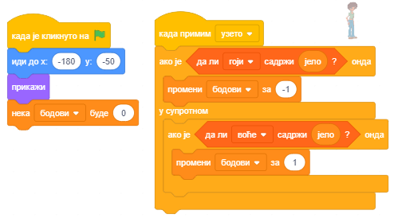

Листе
=====

.. include:: blokovi3.txt

.. include:: ikone3.txt

.. infonote::

 |paleta9|

У програмима које смо креирали у претходним лекцијама користили смо само просте типове података – свака променљива чувала је вредност једног податка. Међутим , често је потребно под једним именом чувати читав низ података, на пример, низ бројева. Ако желимо да чувамо бројеве телефона својих 10 пријатеља, требало би да направимо 10 променљивих што није баш лако одржавати, па користимо сложени тип података који се у Скречу назива **листа**.

.. infonote::

 **Шта је листа?**

 Листа је сложена променљива која се састоји од више елемената – више променљивих. То могу бити различити типови података, у овом примеру то су стрингови.
 Креира се слично ономе како се креирају обичне променљиве.
   
 (1) У групи *Подаци* кликне се на дугме *Направи листу*. 

 (2) У дијалошки прозор који се потом појави упише се име листе и потврди кликом на дугме *У реду*. 

 .. image:: ../_images/9/sl9_1.png
     :width: 575px   
     :align: center

 (3) На позорници ће се појавити празан монитор листе на чијем дну пише да листа тренутно има дужину 0. 
   
 (4) Кликом на знак „+“, који се налази у доњем левом углу, отвара се поље за упис првог елемента, а дужина листе се повећава за 1. 

 (5) У празно поље треба уписати први елемент листе.

 .. image:: ../_images/9/sl9_2.png
     :width: 370px   
     :align: center
   
 Понављањем овог поступка може се уписати жељени број елемената листе.

 Истовремено се у палети блокова појављује блок придружен листи и још 11 блокова који омогућавају коришћење листе и њених елемената у програму.

 .. image:: ../_images/9/sl9_3.png
     :width: 420px   
     :align: center

|prouci| Проучи следеће примере пројеката
-----------------------------------------

У пројекту "Kвиз" постоје листа питања и листа тачних одговора. Питања и одговори могу се 
ручно унети унапред или се читају из текстуалне датотеке.
Кориснику се на случајан начин постављају питања и проверава се да ли је дао тачан одговор. 
Ако јесте, добија поен, ако не - саопштава му се тачан одговор.
На крају се, на основу броја тачних одговора, може дати оцена.

Пример 1 - Пројекат „Квиз знања”
~~~~~~~~~~~~~~~~~~~~~~~~~~~~~~~~~

.. level:: 1

У овом примеру илустроваћемо како се може направити квиз из математике. Квизом се проверава да ли учесници умеју да одреде највећи заједнички делилац за два или три броја. Питања се налазе у листи *бројеви*, а одговори у листи *нзд* (највећи заједнички делилац). Да би се могло пролазити кроз листе користимо променљиву **к** чија вредност се мења од 1 до 8 (број елемената листе), а број тачних одговора памтимо у променљивој **б**.

.. image:: ../_images/9/sl9_4.png
     :width: 440px   
     :align: center

На следећој слици приказана је скрипта овог пројекта.

.. image:: ../_images/9/sl9_5.png
     :width: 550px   
     :align: center

.....

Следећи пројекат илуструје како се на случајан начин могу бирати елементи листе.
Ми ћемо користити репортер који враћа вредност оног елемента листе чији се редни број 
упише у поље за редни број. Тако, ако на случајан начин генеришемо променљиву број, 
његовим постављањем у поље за редни број добићемо онај елемент листе који се налази на
тој позицији. 
У пројекту је такође показано како се бројеви генерисани на случајан начин могу 
искористити за разглашавање различитих порука.

Пример 2 - Пројекат „Глад”
~~~~~~~~~~~~~~~~~~~~~~~~~~

.. level:: 2

У пројекту учествује 10 ликова - гладни мачак и 9 врста хране о којој мачак машта.

.. image:: ../_images/9/sl9_6.png
     :width: 460px   
     :align: center

Мачак шета лево -десно и "замишља" по 3 секунде једну од 11 реченицa које се на случајан начин бирају из листе реченица под називом *храна*. 

.. image:: ../_images/9/sl9_7.png
     :width: 220px   
     :align: center

У време док се види облачак |zamisli_sec| у белом облаку на средини позорнице појављује се храна коју мачак замишља.

Усклађивање појављивања хране и мачковог замишљања обавља се разменом порука.

Наиме, променљива *број* која се генерише на случајан начин, користи се како за бирање реченице из листе *храна*, тако и за генерисање поруке 1 до 11. На поруке 1 и 11 нико не одговара, а на поруке од 2 до 9 реагују ликови чија су имена ти бројеви. 

На пример, миш који је лик "2" реагује на поруку 2, птица која је лик "3" реагује на поруку 3 и тако редом.

.. image:: ../_images/9/sl9_9.png
     :width: 660px   
     :align: center

Реакција сваког лика је иста: покажу се 2 секунде док се види облачак са мачковим размишљањем и онда поново сакрију. Сви ликови (осим мачка) по клику на зелену заставицу иду на позицију (0,110) у средини белог облака и сакривају се.   

Све скрипте придружене главном лику овог пројекта приказане су на следећој слици.

.. image:: ../_images/9/sl9_10.png
     :width: 415px   
     :align: center

.....

Следећи пројекат илуструје како све објекте можемо поделити у групе пожељних, непожељних
и неутралних. Списак пожељних чува се у једној листи, а непожељних у другој. Када се 
изабере објекат, проверава се какав је: ако је пожељан добијају се позитивни бодови, ако је
непожељан негативни, а ако је неутралан не мења број бодова. На пример, ако правите игру 
за малишана у којој он треба да сакупи што више корисних ствари, али да избегава опасне 
предмете, ово би могла да буде стратегија (види пројектне задатке). 

Пример 3 - Пројекат „Храна”
~~~~~~~~~~~~~~~~~~~~~~~~~~~~

.. level:: 2

**Сценарио пројекта**

Главни лик овог пројекта, девојчица Зара, за време школског одмора може да поједе нешто од хране, попије воду или узме поклон.
Ти бираш за Зару шта ће да узме кликом на ствари које се појаве на позорници. Ако изабереш храну која гоји - сендвич, смоки или крофну, добијаш негативне бодове. 
Ако пак изабереш воће - наранџу, банану или јабуку, добијаш позитивне бодове.
Узимање воде или поклона не доноси никакве бодове. 

.. image:: ../_images/9/sl9_11.png
     :width: 400px   
     :align: center

Називи предмета који доносе позитивне бодове налазе се у једној листи (код нас "воће"), а оних који доносе негативне у другој (код нас "гоји"). 

**Понашање ликова**

Сви предмети имају исто понашање. По клику на зелену заставицу појављују се на случајној позицији на десној страни позорнице. Када се кликне на њих додељују променљивој
*јело* своје име, разглашавају поруку *узето* и сакривају се.

.. image:: ../_images/9/sl9_12.png
     :width: 815px   
     :align: center

Скрипте придружене Зари омогућавају израчунавање броја бодова у зависности од тога која је храна изабрана.

.....

Пример 4 - Пројекат „Чаробњак Збуњенко”
~~~~~~~~~~~~~~~~~~~~~~~~~~~~~~~~~~~~~~~

.. level:: 3

Главни лик ове игре је чаробњак Збуњенко. Он својим чаробним штапићем уме да направи више примерака исте ствари,
али често се збуни и заборави колико је тачно обећао па направи неку ствар мање или више.

Ту је и његова помоћница која пажљиво прати шта је Збуњенко обећао и колико је примерака направио, па га опомиње ако погреши.

.. image:: ../_images/9/sl9_14.png
     :width: 600px   
     :align: center

**Како чаробњак обећава различите ствари**

Да би чаробњак могао да обећава ствари креира се лик чији костими су различити предмети. Осим тога направи се листа са називима тих предмета. 
У нашем пројекту креирали смо лик који смо назвали *Створење* које може да се појави у 5 различитих костима.

.. image:: ../_images/9/sl9_15.png
     :width: 630px   
     :align: center

Да би чаробњак могао да изговара називе костима увели смо листу којој смо дали име *ствари* и у њу уписали 5 назива костима (у множини и падежу).
На случајан начин генерише се број између 1 и 5 и онда чаробњак изговара реченицу у којој се повезују текст „Сада ћу да створим“ и одговарајући елемент ове листе. 
На пример, ако се генерише број 2 чаробњак ће да каже „Сада ћу да створим јабуке“, а ако се генерише број 4 каже „Сада ћу да створим лептире“.

На следећој слици приказана је скрипта која описује понашање чаробњака Збуњенка када се кликне на њега. Прво генерише вредност променљиве *број* као случајан број 
из интервала [1,5]. Затим у реченици коју потом изговара каже да ће створити неки од костима лика *створење* и то онај који се у листи налази под редним бројем једнаким генерисаном броју. 
Затим разглашава поруку *хвалим се* на коју реагује мала чаробница тако што током 2 секунде пита колико ће примерака створења Збуњенко створити. 
Зато је у скрипту Збуњенка уметнуто чекање од 2 секунде. После ове паузе Збуњенко генерише вредност променљиве *колико* из интервала [1,10]. 
Како су димензије костима лика *створење* подешене на око 50х50 пиксела за максималан број примерака створења које ће „створити“ Збуњенко изабрали смо број 10 да би се сви примерци видели на екрану. 
Збуњенко изговара колико ће примерака створити и разглашава поруку *стварам*.

На следећој слици приказанае су скрипте које описују понашање мале чаробнице. Чаробница реагује на обе поруке Збуњенка, а такође и сама 
разглашава поруку *сакриј* 4 секунде пошто је примила поруку *стварам*. Порука *сакриј* је сигнал створењу да уклони своје клонове и себе самог са позорнице. 

На следећој слици приказане су скрипте које описују понашање лика *створење*. Овај лик реагује на 4 догађаја: клик на зелену заставицу, разглашавање порука стварам и сакриј и догађај клонирања.
По клику на зелену заставицу створење се сакрива, а по пријему поруке *сакриј* мења вредност променљиве *следећи*. Ова променљива, за разлику од глобалних променљивих број и колико које могу да користе сви ликови, креирана је само за лик створење, дакле то је локална променљива. Карактеристика локалних променљивих је да њихову вредност може да мења само лик за који су креирани. Други ликови могу да виде њихове вредности, али не могу да их мењају. Променљива следећи користи се као окидач. Када се њена вредност промени из 0, на колико је постављена на почетку рекације на поруку стварам, у 1 почиње уништавање клонова и сакрива се. 

**Како чаробњак приказује различит број примерака лика**

Остаје још да објаснимо како чаробњак може да прикаже више примерака неког лика (односно костима лика створење). За ову сврху користи  **клонирање** (умножавање)ликова. Већ смо показали да се лик (и све скрипте које су му придружене) може умножити ако се из приручног менија који се добије десним кликом на лик у листи ликова изабере опција умножи у време креирања програма.
У Скречу постоји и могућност да се лик умножава и за време извршавања програма. (Слично као што у листе могу да се уписују елементи и у време креирања и за време извршавања програма.) За клонирање лика и управљање понашањем клона користе се инструкције |napravi_umnozak| и |kad_umnozak| из групе *Управљање*.
У срипти која описију понашање створења када прими чаробњакову поруку *стварам* на левом рубу екрана приказује се лик, а затим се праве и приказују његови клонови – умножци. Сваки клон се приказује на растојању 50 корака од претходног тако да стоје један поред другог у низу. Ово се реализује у петљи која се понавља (колико-1) пута чиме се скупа са оригиналним ликом добије обећанброј примерака лика. 
Како је променљива *следећи* локална за лик који се клонира, сваки од његових клонова има сопствену вредност ове променљиве и сваки од њих се види на позорници све док променљива следећи не добије вредност 1 (када лик добије поруку сакриј). Тада сваки клон брише самог себе, а изворни лик се сакрива.

**Надоградња пројекта Чаробњак Збуњенко2**

Идеја је да чаробњак не створи онолико предмета колико је обећао, већ нешто више или нешто мање. Корисник треба да каже колико више или колико мање
предмета је чаробњак створио, односно дете треба да научи да сабира и одузима бројеве до 10. Ово постижемо тако што генеришемо променљиву *грешка*
чије вредности могу да буду цели бројеви из интервала [-3,3]. Разуме се, ако буде генерисана грешка 0, чаробњак ће створити тачно онолико предмета
колико је обећао, али у осталим случајевима треба утврдити колико је направио више или мање предмета. На следећој слици приказани су неки од случајева
„збуњивања“ чаробњака. 

.. image:: ../_images/9/sl9_20.png
     :width: 610px   
     :align: center

Понашање створења описује следећа скрипта.

Следи скрипта која описује понашање мале Чаробнице.

Упамтите овако измењен пројекат под називом *Чаробњак Збуњенко 2*. 

Напомена. Ако се пројекат користи за увежбавање сабирања и одузимања бројева до 10 корисно је уметнути „празно“ питање |pitaj_cekaj|  у скрипту мале чаробнице 
уместо задршке блоком |cekaj| . Тек када дете да одговор притиснућемо дирку *Enter* и проверити одговор. 

|pitaj| Одговори на следећа питања
----------------------------------

За сва питања која следе подразумева се да листа на почетку има следеће елементе

.. image:: ../_images/9/pitanje9_1.png
     :width: 125px   
     :align: center

Питање 1
~~~~~~~~

.. level:: 1

.. mchoice:: lista1
   :multiple_answers:
   :answer_a: листа ће имати један елемент мање
   :answer_b: на првом месту налазиће се елемент наранџа
   :answer_c: елемент се пребацује на крај листе
   :answer_d: избацује се последњи елемент листе
   :correct: a, b
   :feedback_a: 
   :feedback_b: 
   :feedback_c: 
   :feedback_d: 

   Шта је резултат извршавања наредбе |l1|? (Изабери све тачне одговоре) 

  
Питање 2
~~~~~~~~

.. level:: 1

.. mchoice:: lista2
   :answer_a: елемент ће бити додат на почетак листе 
   :answer_b: елемент ће бити додат на крај листе
   :answer_c: елемент ће бити додат под условом да претходно није био у листи
   :correct: b
   :feedback_a: Ова наредба додаје на крај листе.
   :feedback_b: Тачно.
   :feedback_c: Не врши се никаква провера.
   
   Шта је резултат извршавања наредбе  |l2|?

Питање 3
~~~~~~~~

.. level:: 1

.. mchoice:: lista3
   :answer_a: ниједном
   :answer_b: једном
   :answer_c: 2 пута
   :answer_d: 3 пута
   :correct: d
   :feedback_a: Листа има 3 елемента. 
   :feedback_b: Листа има 3 елемента.
   :feedback_c: Листа има 3 елемента.
   :feedback_d: Тачно.

   Колико пута ће лик изговорити "Волим воће"?

   .. image:: ../_images/9/pitanje9_3.png
      :width: 270px   
      :align: center

Питање 4
~~~~~~~~

.. level:: 2

.. mchoice:: lista4
   :multiple_answers:
   :answer_a: 
   :answer_b: 
   :answer_c: 
   :correct: b, c
   :feedback_a: 
   :feedback_b: 
   :feedback_c: 
   
   Које наредбе ће у листу *воће* поставити елемент *јагода* на позицију 2? (Изабери све тачне одговоре) 

   .. image:: ../_images/9/pitanje9_4.png
      :width: 650px   
      :align: center

Питање 5
~~~~~~~~

.. level:: 2

.. mchoice:: lista5
   :multiple_answers:
   :answer_a: 
   :answer_b: 
   :answer_c: 
   :correct: a, b
   :feedback_a: 
   :feedback_b: 
   :feedback_c: 
   
   После извршења којих наредби ће се повећати број елемената листе? (Изабери све тачне одговоре) 

   .. image:: ../_images/9/pitanje9_4.png
      :width: 650px   
      :align: center

Питање 6
~~~~~~~~

.. level:: 2

.. mchoice:: lista6
   :answer_a: Ако је листа имала елемент јагода, њена величина се неће променити, а ако није, додаје јагоду на крај листе.
   :answer_b: Без обзира да ли је у листи постојао елемент јагода, додаће га на крај листе.
   :answer_c: Ако је листа имала елемент јагода, њена величина се неће променити, а ако није, додаје јагоду на почетак листе.
   :correct: a
   :feedback_a: Тачно.
   :feedback_b: Упис у листу остварује се ако листа претходно није имaла елемент јагода.
   :feedback_c: Ако се додаје, додаје се на крај листе.
   
   Шта је резултат извршавања следећих наредби?

   .. image:: ../_images/9/pitanje9_6.png
      :width: 300px   
      :align: center

|pokusaj| Покушај
-----------------

У прве 3 вежбе претпоставља се да  имамо листу **оригинал** чији су елементи редом бројеви од 1 до 10.

Вежба 1
~~~~~~~

.. level:: 2

.. infonote::

  Напиши скрипту која креира  листу **дупликат** и у њу уписује све елементе постојеће листе **оригинал**.

.....

Вежба 2
~~~~~~~
.. level:: 2

.. infonote::

  Напиши скрипту која креира  листу **уназад** и у њу уписује све елементе постојеће листе **оригинал** обрнутим редоследом,
  тј. први елемент листе *уназад* треба да буде последњи елемент листе *оригинал*, други - претпоследњи из *оригинал* и 
  тако све до првог елемента листе *оригинал* који треба да буде последњи у листи *уназад*. 

.....

Вежба 3
~~~~~~~
.. level:: 2

.. infonote::

  Напиши скрипту која креира  листу **парни** и у њу уписује сваки други елемент постојеће листе **оригинал**.

.....

Вежба 4
~~~~~~~
.. level:: 2

.. infonote::

  Напиши скрипту која креира  листу **случајни1** и у њу уписује 10 бројева из интервала [1,100] 
  генерисаних операцијом случајан број.

.....

Вежба 5
~~~~~~~
.. level:: 3

.. infonote::

  Напиши скрипту која креира листу **случајни2** и у њу уписује 10 РАЗЛИЧИТИХ бројева из интервала [1,100] 
  генерисаних операцијом случајан број.

|bug| Исправи грешке
--------------------

Грешка 1
~~~~~~~~

.. level:: 2

.. infonote::

 Ученик је желео да промени пример 3 овог поглавља тако да се у нову листу *поједено* уписују називи хране које Зара изабере. Зари је придружио
 скрипте за кретање помоћу дирки стрелица  и скрипту која је приказана на следећој слици. На слици су и скрипте придружене осталим ликовима пројекта.
 Већина догађаја се извршавала онако како је ученик желео, али јабуку и наранџу никако није успевао да упише у листу. У чему је грешка?

 .. image:: ../_images/9/greska9_1.png
   :width: 805px   
   :align: center

 .. reveal:: сакривање24
   :showtitle: Прикажи одговор
   :hidetitle: Сакриј одговор
 
   **Одговор:**
     
   У скриптама јабуке и наранџе у наредби "чекај док не" није добро постављен лик са којим треба да се додирну.
      
|knjiga| Шта смо научили
------------------------

У овој лекцији  поглављу научили смо како се у Скречу користе листе – тип података сложене структуре који омогућава чување више вредности истовремено. Видели смо да елементи листе могу бити различити типови података и да се, поред осталог, могу искористити за бирање једног од костима неког лика или за бирање једног од ликова из листе ликова. Кроз примере пројеката смо илустровали и сложене синхронизације понашања више ликова коришћењем порука. Такође смо показали како се програмским путем могу умножавати ликови и како се клонови могу понашати на различите начине ако лик који их је створио има своје локалне променљиве.

**Примери пројеката**: 9Studio_

.. _9Studio: https://scratch.mit.edu/studios/25117375/

**Појмови**:  листа, елемент листе, умножак (клон).

**Наредбе**: |promenljive| - |dodaj|,  |izbaci|, |izbaci_sve|, |ubaci|,  |zameni|, |pokazi_listu|, |sakrij_listu|, |element|,  |duzina_liste|, |index_elementa|, |sadrzi|; 

|upravljanje| - |kad_umnozak|, |napravi_umnozak|, |obrisi_umnozak|. 

**Функцијски блокови**: .

|project| Уради неки од следећих пројеката
------------------------------------------

Пројекат 1 - „Квиз из историје”
~~~~~~~~~~~~~~~~~~~~~~~~~~~~~~~

.. level:: 2

Учитај листу питања из текстуалног фајла.

1. Коришћењем програма Notepad испиши листу питања из историје, свако у засебном реду.
2. Упамти текст као текстуални фајл под именом *Историја.txt*.

3. У Скречу направи листу под називом *питања*. 
4. Десним кликом на монитор листе отвори падајући мени и изабери операцију *увези*.

.. image:: ../_images/9/projekat9_1b.png
     :width: 230px   
     :align: center

5. У поље за име фајла упиши *Историја*.
6. У твојој листи појавиће се листа питања која си претходно саставио у Notepad-у.

Формирај затим листу тачних одговора, па онда  скрипту која на случајан начин бира питање из листе питања,
тражи од корисника одговор и пореди га са тачним одговором. Ако је корисник тачно одговорио, повећај му број поена.

Пројекат 2 - „Телефонски именик”
~~~~~~~~~~~~~~~~~~~~~~~~~~~~~~~~

.. level:: 2

Направи три листе  у којима се налазе имена, датуми рођења и бројеви телефона твојих другара.
Напиши скрипту која проверава да ли се име које се уноси са улаза налази у листи имена. 
Ако је име у листи, треба да се приказује датум рођења и телефон особе  чије је име унето, 
а ако није треба да се прикаже одговарајућа порука.

Пројекат 3 - „Близанци”
~~~~~~~~~~~~~~~~~~~~~~~

.. level:: 3

Направи процедуре које треба повезати у пројекат Близанци.

Процедура **Провера** треба да проверава да ли је број који се задаје као параметар прост.

Процедура **Формирај** треба да формира листу *Прости* у коју ће уписати све просте бројеве из интервала [2,1000].

Главни програм треба да приказује све бројеве близанце (просте бројеве који се разликују за 2) из интервала [2,1000].

Пројекат 4 - Игра „Опасни предмети”
~~~~~~~~~~~~~~~~~~~~~~~~~~~~~~~~~~~

.. level:: 3

Креирај игру у којој корисник (мало дете) из групе предмета треба да издвоји неколико који нису опасни.
Називи (или редни бројеви костима, као у примеру 4 овог поглавља)  опасних предмета са позорнице треба да буду уписани у листу *опасан*.
Предмети се бирају кликом на њих. Затим се проверава да ли је тај предмет у листи опасних. 
За избор предмета који није опасан добија се позитиван, а за избор опасних негативан поен. Циљ је сакупити бар 3 (рецимо од 5 могућих) поена.
Тада се игра завршава или се прелази на следећи ниво.

Игра може да има више нивоа, на пример опасности у кухињи (нож, посуда са врелом водом, ватра,...), 
опасности у дворишту, опасности у природи и слично.