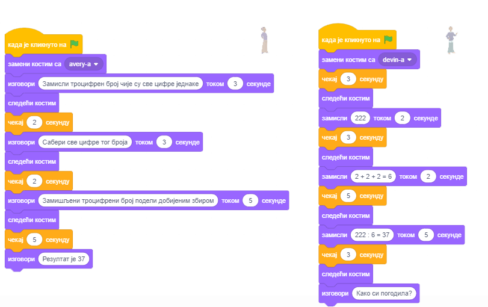
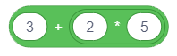

Низање корака
=============

.. include:: blokovi3.txt

.. include:: ikone3.txt

.. infonote::

 |paleta3|

  
У претходној лекцији си упознао  наредбe кретања, а сада ћеш се бавити дејством неких наредби из група *Изглед* и *Догађаји*. Показаћемо како  повезивањем наредби у скрипте задајемо понашање ликова. Пројекти у овој лекцији састоје се од скрипти у којима се кораци нижу један за другим. За такве скрипте кажемо да имају **просту линијску структуру**.

.. topic:: Речник и визуелна граматика језика Скреч

 Ликови могу да извршавају више од 100 наредби. Блокови који одговарају наредбама чине речник језика Скреч, а правила по којима се повезују у целину одговарају граматици језика. Блокови се чувају у палети блокова и распоређени су у 10 група различитих боја: 

 .. hlist::
    :columns: 5

    * |kretanje| Кретање,
    * |izgled| Изглед, 
    * |zvuk| Звук, 
    * |dogadjaji| Догађаји,
    * |upravljanje| Управљање, 
    * |osecaji| Осећаји,
    * |operatori| Оператори,
    * |promenljive| Променљиве, 
    * |moji_blokovi| Моји блокови и 
    * |prosirenja| Проширења.  

 Блокови су издељени у групе да би се програмери лакше сналазили приликом креирања скрипти. Ма колико сложено било понашање ликова, скрипта која га описује састоји се од скупа елементарних операција ових 10 типова. Ако знаш коју врсту акције треба да уради лик, онда лако можеш да изабереш одговарајућу групу и из ње издвојиш потребан блок. 

 Постоје самостални и функцијски блокови. 

 **Самостални** блокови одговарају наредбама језика, односно корацима алгоритма. Неки од њих имају поља у која се може поставити вредност. 

 **Функцијски** блокови враћају вредности. Они не могу да стоје сами у скрипти, већ се умећу у поља блокова који примају вредности и прецизирају њихове акције. 

 Блокови су обликовани тако да могу да се повежу само они који могу да формирају исправне конструкције језика, односно Скреч има визуелну граматику која не дозвољава да се праве синтаксне грешке.

 .. image:: ../_images/3/sl3_1.png
   :width: 300px   
   :align: center

 **Самостални блокови**

 Блокове који одговарају корацима обраде зваћемо надаље **стек блокови**. Сваки стек блок одговара једној акцији, односно одговара на питање ШТА треба урадити. На пример, блок |idi_koraka| наређује лику да се помери задати број корака у смеру у коме је тренутно постављен. Облик овог блока подсећа на Lego коцку, а цела скрипта на коцке склопљене у стек. 

 Задати број корака уписује се у бели кружић - **улазно поље** блока. 

 У блоку |izgovori_sec| једно улазно поље има облик заобљеног правоугаоника, а друго круга. Правоугаони улази прихватају и текстуалне и бројне, а кружни само бројне вредности.

 Блок |klizi_xy| има чак три улаза.

 Неки блокови имају шестоугаона улазна поља, на пример управљачки блок |cekaj_dok_ne|. Они прихватају логичке вредности (тачно или нетачно).

 У групи *Управљање* постоје блокови С-облика, које називамо **С-блокови**. Слот унутар С-блока је специјална врста улаза који прима скрипту као улаз. Блок  |ponavljaj| има 2 улаза: један за број и један за скрипту. 

 Постоји и један управљачки блок Е-облика који има три улаза, један за услов (логичку вредност) и два за скрипте. Од та два улаза за скрипте, први задаје шта треба урадити ако је услов испуњен, а други задаје шта треба урадити ако услов није испуњен.

 **Почетни блокови** одговарају почетном алгоритамском кораку. Они одговарају на питање КАДА треба покренути скрипту. Овај тип блокова има заобљен врх и поставља се на врх стека, а повезује се са наредним блоковима преко испупчења на дну. Почетни блокови дефинишу који догађај треба да наступи да би се извршио стек блокова испод њих. Тај догађај може да буде, на пример, клик на дугме зелена заставица или притисак на неку дирку тастатуре. 

 **Завршни блокови** одговарају завршном алгоритамском кораку. Они имају удубљење на врху, али немају испупчење на дну. Како у Скречу једном објекту може бити придружено више скрипти које се могу паралелно извршавати, завршни блок може прекинути извршавање свих покренутих скрипти.

 **Функцијски блокови**

 Функцијски блокови чувају податке за друге блокове. Често се називају **репортери** зато што обавештавају колика је текућа вредност неке променљиве. Блокове репортере који чувају текуће координате и усмерење лика упознали смо у претходном поглављу. Неки блокови репортери и сами имају улазна поља кружног или правоугаоног облика, на пример   |plus| и |povezi|.

 **Логички блокови** чувају логичке вредности (тачно или нетачно). Они имају облик шестоугла и могу да се поставе само у улазна поља одговарајућег облика (шестоугаоног или правоуглог). Такав је на пример, блок |jednako|. У Скречу лако могу да се конструишу сложени логички услови тако што се логички блокови умећу у улазна поља других логичких блокова.

.. sidebar:: Програмирање вођено догађајима
    
  Праћење извршавања неких програма подсећа на гледање цртаних филмова. То су програми који се увек извршавају на исти начин,  односно ток извршавања не зависи од корисника. Међутим, постоје и програми чије извршавање зависи од догађаја које могу да прозведу корисник или објекти пројекта – ликови и позорница. Корисник, на пример,  може да кликне мишем или притисне неку дирку тастатуре, а ликови и позорница могу да шаљу и примају поруке. Блокови који покрећу скрипте придружене таквим **акцијама** и **порукама** налазе се у групи *Догађаји*. 

.. topic:: Функције блокова из групе *Изглед* и *Догађаји*

 Блокови из групе *кретање* које смо упознали у претходној лекцији могли су да се примене само на ликове. За разлику од њих, блокове групе *Изглед* можеш да употребиш и за контролу изгледа ликова и за контролу позадина, односно изгледа позорнице. Али то не важи за све блокове ове групе. Межу њима има оних који се односе само на ликове и оних који се односе само на позорницу. Блокови из групе *Догађаји* покрећу извршавање скрипти. Преглед свих блокова ових група дати су у *Додацима* који се налазе у 11. лекцији овог практикума. 
 
 У претходним лекцијама већ смо упознали дејство неких блокова *Изгледа* и *Догађаја*, на пример, ``изговори`` и ``клик на дирку``. У овој лекцији ћемо детаљније упознати блокове који омогућавају једноставну анимацију применама уграђених графичких ефеката и проширити речник Скреча коришћењем нових наредби. 

|prouci| Проучи следеће примере пројеката
-----------------------------------------

Друштво можемо да забавимо причањем вицева, али и математичким триковима. Следећи пројекат илуструје један од њих. Има само једну скрипту простe линијскe структурe.

Пример 1 - Пројекат „Математичар”
~~~~~~~~~~~~~~~~~~~~~~~~~~~~~~~~~

.. level:: 1

- Корак 1: Замисли један троцифрени број чије су све цифре једнаке, нпр. 111, 222.

- Корак 2: Сабери све цифре тог броја.

- Корак 3: Замишљени троцифрени број подели добијеним збиром.

- Корак 4: Резултат је број 37.

Сценарио овог пројекта је сасвим једноставан. Лик наредбама |izgovori_sec| задаје кориснику прва три захтева, а наредбом |izgovori| саопштава резултат.

Користићемо лик девојчице Avery из библиотеке ликова који има два костима (Кликни на картицу *Костими* да их видиш) и између свака два захтева задати промену костима наредбом |sledeci_kostim|.

Да би корисник имао времена да израчуна шта се од њега тражи у прве две наредбе ставићемо да се текст који лик изговара види 3 секунде, а у трећој 5 секунди.
Наредба |izgovori| последњи текст оставља на екрану све док не прекинемо извршавање програма кликом на знак *стоп* - црвени осмоугао изнад горњег десног угла позорнице.

Скрипта овог пројекта приказана је на следећој слици.

.. image:: ../_images/3/sl3_2.png
   :width: 450px   
   :align: center

.....
  
Пример 2 - Пројекат „Разговор”
~~~~~~~~~~~~~~~~~~~~~~~~~~~~~~

.. level:: 2

Овај пројекат представља надоградњу пројекта „Математичар”. У њему девојчица Avery и дечак Devin исти математички трик представљају  кроз разговор у коме Devin „замишља” број 222 и врши тражена рачунања, а на крају пита: „Како си погодила?”. Понашање оба лика задају скрипте просте линијске структуре. Да би изгледало као да заиста разговарају, у скрипту девојчице треба додати наредбе чекања у време док дечак размишља, а у скрипту дечака чекања у време док девојчица поставља питања.   

Следећа слика приказује сценарио пројекта.

**Израда пројекта**

|1| Отвори пројекат *Математичар*.

|2| Упамти овај пројекат под новим именом *Разговор*. 

**Савет. Када правиш нову верзију неког пројекта, на самом почетку је упамти под промењеним именом. Тако нећеш изгубити стару верзију.**
 
|3| Из библиотеке ликова изабери лик дечака *Devin*.

|4| Постави дечака уз десни руб позорнице и у информацијама о лику промени његово усмерење на -90, тако да гледа према девојчици.

|5| Ликовима придружи следеће скрипте.

у пројекту *Математичар* девојчица изговара 4 реченице, а 3 пута мења костим (има 2 костима).  То значи да се у два узастопна извршавања пројекта девојчица неће на почетку појавити у истом костиму. Да би при сваком извршавању пројекта девојчица била приказана на исти начин (да се појави у првом костиму), на почетак скрипте смо додали одговарајућу наредбу. 

**Савет. На почетак пројекта стави наредбе које иницијализују ликове (задају где и у ком костиму треба да се појаве), нарочито ако се при извршавању пројекта ликови крећу.**

Усклађивање понашања ликова постигли смо уметањем наредби чекања у скрипте оба лика. 

|6| Упамти овако измењен програм.

Ако те интересује одговор на дечаково питање „Како си погодила?”, кликни на дугме *Прикажи упутство*.

.. reveal:: упутство
     :showtitle: Прикажи упутство
     :hidetitle: Сакриј упутство
 
     **Упутство:**

     Девојчица је тражила да се замисли троцифрен број са истим цифрама. Означимо цифру која се понавља са *х*. Тада је замишљен број једнак 111*х, а збир цифара је 3*х. Резултат операције дељења броја збиром његових цифара једнак је 111/3=37, независно од броја који је замишљен.

.....

Пример 3 - Пројекат „Рачунање”
~~~~~~~~~~~~~~~~~~~~~~~~~~~~~~

.. level:: 3

.. sidebar:: Aритметички изрази у Скречу

 У групи *Оператори* налазе се блокови који омогућавају извршавање аритметичких операција. На пример, блок |plus| омогућава сабирање. Ако у улазна поља овог блока упишеш бројеве, блок ће израчунати њихов збир. Оператори не могу сами да стоје у скрипти, треба да их уложиш у улазно поље неког самосталног блока. На пример, ако их поставиш у улазно поље блока ``изговори`` или ``замисли``, биће приказана вредност коју израчунавају.

И наредни пројекат је надоградња претходног. У њему дечак уместо фиксног броја 222 замишља произвољан троцифрен број са све три једнаке цифре и над њим врши тражене операције. Ово можемо да испрограмирамо захваљујући могућности да се генерише **случајан број** из задатог интервала. 

**Генерисање случајних бројева** 

У групи блокова *Оператори* налази се наредба |slucajan_broj|. Генерисати случајан број значи на случајан начин одабрати број из неког интервала. Најмањи и највећи број тог интервала задаје се у пољима овог репортера. Значи, ако су то бројеви 1 и 10 биће изабран ма који број из интервала [1,10], а да су, на пример, то -100 и 100, био би генерисан неки број из интервала [-100,100]. 

У нашем примеру, у прво поље треба уписати број 1, а у друго број 9.

У овом пројекту су коришћене **променљиве** са којима ћемо се упознати тек у осмој лекцији. Зато је означен као тежак. Можеш га можеш прескочити, па се на њега врати касније. 

Ако пак волиш изазове, да кажемо нешто мало унапред. Под променљивом подразумевамо област меморије рачунара у којој програм чува текуће вредности података са којима ради. **Име променљиве** је име те области, а **вредност променљиве** је оно што се чува у тој области.

**Израда пројекта**

.. sidebar:: Део скрипте придружене дечаку

 |Devin|
 

|1| Отвори пројекат *Разговор* и упамти га под новим именом *Рачунање*. 

|2| Направи променљиву *x* која одговара цифрама троцифреног броја и као почетну вредност јој додели случајан број из интервала [1,9].

|3| Направи променљиву *broj* и као почетну вредност јој додели вредност израза 111*x.

|4| У првом блоку ``замисли`` дечакове скрипте постави репортер променљиве *broj* уместо броја 222.

|n1| |!=| |n2|

|5| Направи променљиву *zbir* и као почетну вредност јој додели вредност израза *x+x+x*. Како блок за сабирање има само 2 улазна поља, Уложићемо један блок за сабирање у улазно поље другог блока за сабирање. (Разуме се, исто смо могли постићи и једним блоком за множење јер је *х+х+х=3х*)

.. image:: ../_images/3/sl3_7.png
   :width: 350px   
   :align: center

|6| У другом блоку ``замисли`` дечакове скрипте постави репортер променљиве *zbir* уместо текста *2+2+2*.

|7| Направи променљиву *rezultat* и као почетну вредност јој додели вредност израза *broj/zbir*.

|8| У трећем блоку ``замисли`` дечакове скрипте постави репортер променљиве *rezultat* уместо броја 37.

|9| Изврши пројекат више пута како би проверио да ли генерише различите троцифрене бројеве.

|10| Упамти тако измењен пројекат.

.....

Пример 4 - Пројекат „Ефекти на лик”
~~~~~~~~~~~~~~~~~~~~~~~~~~~~~~~~~~~

.. level:: 1

Следећи пројекат илуструје како наредба |promeni_efekat| из групе *Изглед* може да утиче на приказ ликова. Такође показује и како догађај *клик на лик* може да покрене извршавање скрипте.

**Сценарио пројекта**

На позорници се налази 7 примерака истог лика. Кликом на неки од њих лик се мења коришћењем једног од седам графичких ефеката. То омогућава наредба |promeni_efekat|. Лик такође изговара о којем се ефекту ради. 

.. sidebar:: Графички ефекти
    
    Кликом на бели троуглић у пољу избора
    отвара се падајућа листа са следећих
    7 графичких ефеката.

    |efekti|

  
**Израда пројекта**

|1| Започни нови пројекат.

|2| Обриши лик мачка и из библиотеке ликова изабери *Singer1*.

|3| Лику придружи следећу скрипту.

|4| Сада десним кликом на лик у листи ликова отвори приручни мени и изабери опцију *умножи*. У листи ликова појавиће се лик *Singer2* коме ће бити придружена иста скрипта као лику од кога је настао.

|5| Промени ефекат у наредби |promeni_efekat| на *рибље око*, а у наредби |izgovori_sec| преправи текст у *рибље око*.

|6| Понови ову операцију још 5 пута и сваки пут измени ефекат и поруку коју лик саопштава када се кликне на њега.

|7| Равномерно распореди ликове на позорници и тестирај да ли пројекат ради то што је замишљено кликом на сваки од ликова. 

|8| При сваком новом клику на исти лик одговарајући ефекат ће се појачавати.

|9| Зато треба додати скрипту позорници која ће по клику на зелену заставицу поништавати промене наредбом |ukloni_efekte|.

На следећој слици приказан је изглед ликова после једне или више примена одговарајућег ефекта.

.....
 
Пример 5 - Пројекат „Ефекти на позадину”
~~~~~~~~~~~~~~~~~~~~~~~~~~~~~~~~~~~~~~~~

.. level:: 1

За разлику од блокова из групе *Кретање*, блокови из групе *Изглед* могу се применити и на позорницу. Све скрипте у овом пројекту придружене су позорници. Сврха пројекта је да илуструје како наредба |promeni_efekat| може да утиче на изглед позадине и да ти да идеје како би сам могао да је користиш у својим пројектима. Да би се све вратило у нормалу, догађају *клик на зелену заставицу* придружено је брисање свих графичких ефеката. 

**Сценарио пројекта**

Мачак се налази усред пустиње. Корисник може да промени изглед позадине притискањем неке од дирки са бројевима од 1 до 3. Сваки од ових догађаја одговара неком од графичких ефеката на позадини. На следећој слици приказано је како изгледа позорница на почетку (0) и после неколико притисака на дирку: 1 - ефекат *боја*, 2 - ефекат *рибље око*, 3 - ефекат *вртлог* и 4 - ефекат *позрнати*. 

.. image:: ../_images/3/sl3_11.png
   :width: 735px   
   :align: center 

|pitaj| Одговори на следећа питања
----------------------------------

Питање 1
~~~~~~~~

.. level:: 1

.. mchoice:: наредбе_изглед
   :multiple_answers:
   :answer_a: 
   :answer_b: 
   :answer_c: 
   :answer_d: 
   :correct: b,d
   :feedback_a:  
   :feedback_b: 
   :feedback_c: 
   :feedback_d: 

   Који од блокова припада групи наредби *Изглед*? 
   (Изабери све тачне одговоре)

   .. image:: ../_images/3/pitanje3_1.png
     :width: 625px   
     :align: center

Питање 2
~~~~~~~~

.. level:: 1

.. mchoice:: наредбе_догађаји
   :multiple_answers:
   :answer_a: 
   :answer_b: 
   :answer_c: 
   :answer_d:
   :correct: a,b
   :feedback_a: 
   :feedback_b: 
   :feedback_c: 
   :feedback_d: 
  
   Које од наредби припадају групи наредби *Догађаји*?
   (Изабери све тачне одговоре)

   .. image:: ../_images/3/pitanje3_2.png
      :width: 625px   
      :align: center

Питање 3
~~~~~~~~

.. level:: 1

.. mchoice:: наредбе_управљање
   :multiple_answers:
   :answer_a: 
   :answer_b: 
   :answer_c: 
   :answer_d: 
   :correct: a,c
   :feedback_a:  
   :feedback_b: 
   :feedback_c: 
   :feedback_d: 

   Који од блокова припада групи наредби *Управљање*?
   (Изабери све тачне одговоре)  

   .. image:: ../_images/3/pitanje3_3.png
      :width: 625px   
      :align: center

Питање 4
~~~~~~~~

.. level:: 1

.. mchoice:: блокови2
   :answer_a: да
   :answer_b: не
   :correct: b
   :feedback_a: Погрешно. 
   :feedback_b: Тачно.
   
   Да ли једна скрипта може имати више почетних блокова?

Питање 5
~~~~~~~~

.. level:: 1

.. mchoice:: блокови3
   :answer_a: блокови репортери
   :answer_b: стек блокови
   :answer_c: почетни блокови
   :answer_d: завршни блокови
   :correct: b
   :feedback_a:  
   :feedback_b: Тачно.
   :feedback_c: 
   :feedback_d: 
   
   Којој врсти припадају блокови који имају удубљење на горњој и испупчење на доњој страни.
   

Питање 6
~~~~~~~~

.. level:: 1

.. mchoice:: блокови4
   :answer_a: блокови репортери
   :answer_b: стек блокови
   :answer_c: почетни блокови
   :answer_d: С-блокови
   :correct: a
   :feedback_a: Тачно. 
   :feedback_b: 
   :feedback_c: 
   :feedback_d: 
   
   Којој врсти припадају блокови који чувају вредности и не могу да стоје самостално у скрипти, већ се умећу у улазна поља других блокова. 

Питање 7
~~~~~~~~

.. level:: 1

.. dragndrop:: групе_наредби
    :feedback: Покушај поново
    :match_1: почетни|||задају КАДА треба покренути скрипту
    :match_2: репортери|||чувају вредности
    :match_3: С-блокови|||примају скрипту као улаз
    :match_4: стек блокови|||дефинишу ШТА треба урадити
            
    Превлачењем упари облик блокова са њиховом улогом у Скречу.

Питање 8
~~~~~~~~

.. level:: 1

      
.. |pitanje3_8b| image:: ../_images/3/pitanje3_8b.png

.. mchoice:: аi01
   :answer_a: да
   :answer_b: не
   :correct: b
   :feedback_a:  
   :feedback_b: Тачно.
   
   Да ли изрази |pitanje3_8a| и |pitanje3_8b| имају исту вредност?    
  
Питање 9
~~~~~~~~

.. level:: 1

.. mchoice:: аi02
   :answer_a: ниједан
   :answer_b: први
   :answer_c: други
   :answer_d: оба
   :correct: c
   :feedback_a: Нетачно. Други има вредност 10/(-1)=-10 
   :feedback_b: Нетачно. Први има вредност 5-3=2
   :feedback_c: Тачно.
   :feedback_d: Нетачно. Први има вредност 2.

   Који од израза |pitanje3_9a| и |pitanje3_9b| има негативну вредност?
   
.. |pitanje3_9a| image:: ../_images/3/pitanje3_9a.png

.. |pitanje3_9b| image:: ../_images/3/pitanje3_9b.png
  

Питање 10
~~~~~~~~~

.. level:: 2

.. |pitanje3_10| image:: ../_images/3/pitanje3_10.png

.. fillintheblank:: ai03

      Колика је вредност израза |pitanje3_10| |blank|

      -   :19: Тачно.
          :x: Нетачно. (7+(8*2))-4 = (7+16)-4 = 23-4 = 19

    

Питање 11
~~~~~~~~~

.. level:: 2

.. mchoice:: ai04
   :answer_a: 45
   :answer_b: 11
   :answer_c: 15
   :correct: b
   :feedback_a: Нетачно. 5+(2*(7-4)) = 5+2*3 = 5+6 = 11 
   :feedback_b: Тачно.
   :feedback_c: Нетачно. 5+(2*(7-4)) = 5+2*3 = 5+6 = 11
  
   Колика је вредност израза  |pitanje3_11|?

.. |pitanje3_11| image:: ../_images/3/pitanje3_11.png
      

Питање 12
~~~~~~~~~

.. level:: 2

.. mchoice:: ai05
   :answer_a: 3
   :answer_b: 11
   :answer_c: 6
   :correct: c
   :feedback_a: Нетачно. ((2+1)*(9-5))/2 = 3*4/2 = 6 
   :feedback_b: Нетачно. ((2+1)*(9-5))/2 = 3*4/2 = 6
   :feedback_c: Тачно.
   
   Колика је вредност израза |pitanje3_12|?

.. |pitanje3_12| image:: ../_images/3/pitanje3_12.png
            

|pokusaj| Покушај
-----------------

Вежба 1 - Увећање
~~~~~~~~~~~~~~~~~

.. level:: 1

.. infonote::

  Креирај пројекат који омогућава да се лик на позорници увећава и смањује. Увећавање треба да покреће клик на дирку *стрелица горе*, а смањивање клик на дирку *стрелица доле*.  Обезбеди да се кликом на зелену заставицу лик врати на своју природну величину.

.. reveal:: вежба 3_1
   :showtitle: Прикажи упутство
   :hidetitle: Сакриј упутство
 
   **Упутство:**

   Лику треба придружити следеће скрипте: |vezba3_1| 

.............................................................................................................................................

Вежба 2 - Окретање
~~~~~~~~~~~~~~~~~~

.. level:: 1

.. infonote::

  Уз лик мачка учитај још два лика из библиотеке ликова: девојчицу *Avery* и дечака *Devin*. Постави девојчицу лево, а дечака десно од мачка. Креирај пројекат који омогућава да се мачак на позорници окреће налево ка девојчици и надесно ка дечаку. Окретање налево треба да покреће клик на дирку *стрелица лево*, а окретање надесно клик на дирку *стрелица десно*. Обезбеди да се мачак приликом окретања налево не окреће наглавачке.

.. reveal:: вежба 3_2
   :showtitle: Прикажи упутство
   :hidetitle: Сакриј упутство
 
   **Упутство:**

   Лику мачак треба придружити следеће скрипте: |vezba3_2| 

.............................................................................................................................................

Вежба 3 - Промена боје позадине
~~~~~~~~~~~~~~~~~~~~~~~~~~~~~~~

.. level:: 1

.. infonote::

  Креирај пројекат који омогућава да, после сваког клика на позорницу, позадина мења боју. Користи ефекат *боја* и обезбеди да се кликом на зелену заставицу уклоне графички ефекти.

.. reveal:: вежба 3_3
   :showtitle: Прикажи упутство
   :hidetitle: Сакриј упутство
 
   **Упутство:**

   Позорници треба придружити следеће скрипте: |vezba3_3| 

  
.............................................................................................................................................

Вежба 4 - Кодирање аритметичког израза са заградама (1)
~~~~~~~~~~~~~~~~~~~~~~~~~~~~~~~~~~~~~~~~~~~~~~~~~~~~~~~

.. level:: 2

.. infonote::

  Формирај аритметички израз у Скречу који одговара следећем математичком изразу: (5*(5+4))-(2*(2+3)). Постављањем одговарајућег репортера у улазно поље наредбе ``изговори`` провери да ли добијаш његову тачну вредност: (5*(5+4))-(2*(2+3)) = 5*9-2*5 = 45-10 = 35

.. reveal:: вежба 3_4
   :showtitle: Прикажи одговор
   :hidetitle: Сакриј одговор
 
   **Одговор:**

   |vezba3_4|
   
.. |vezba3_4| image:: ../_images/3/vezba3_4.png

.............................................................................................................................................

Вежба 5 - Кодирање аритметичког израза са заградама (2)
~~~~~~~~~~~~~~~~~~~~~~~~~~~~~~~~~~~~~~~~~~~~~~~~~~~~~~~

.. level:: 2

.. infonote::

  Формирај аритметички израз у Скречу који одговара следећем математичком изразу:  (8/(4-2))*(8-(6/2))  Постављањем одговарајућег репортера у улазно поље наредбе ``изговори`` провери да ли добијаш његову тачну вредност:  (8/(4-2))*(8-(6/2)) = 8/2*(8-3) = 4*5 = 20.

.. reveal:: вежба 3_5
   :showtitle: Прикажи одговор
   :hidetitle: Сакриј одговор
 
   **Одговор:**

   |vezba3_5|

.. |vezba3_5| image:: ../_images/3/vezba3_5.png

|bug| Исправи грешке
--------------------

Грешка 1
~~~~~~~~

.. level:: 1

:Питање:
   Да ли је следећи разговор добро синхронизован?

.. image:: ../_images/3/greska3_1.png
   :width: 750px   
   :align: center

.. reveal:: грешка3_1
   :showtitle: Прикажи одговор
   :hidetitle: Сакриј одговор
 
   **Одговор:**
     
   Није добро постављено време. Инструкције ``чекај`` и ``изговори`` треба да имају исто време да би разговор био добро синхронизован.

Грешка 2
~~~~~~~~

.. level:: 2

:Питање:	
   Ученик воли да све ради по правилима и зато жели да сваком програму дода и наредбу за заустављање програма. Тако је и на крај скрипте за математичара поставио наредбу |zaustavi|. Међутим, текст последње наредбе |izgovori| уопште се није видео. 
   Како да ученик ово исправи, а да на крају ипак остане наредба која га зауставља?

.. image:: ../_images/3/greska3_2.png
   :width: 500px   
   :align: center

.. reveal:: грешка3_2
   :showtitle: Прикажи одговор
   :hidetitle: Сакриј одговор
 
   **Одговор:**
    
   Наредба ``изговори Резултат је 37`` се тренутно извршава и одмах затим се извршава наредба ``заустави све``, па ми практично и не успевамо да видимо дејство наредбе ``изговори``. Зато ову наредбу треба заменити наредбом ``изговори__током__секунде`` и поставити да се приказ види, на пример, током 5 секунди.

Грешка 3
~~~~~~~~

.. level:: 2

:Питање:	
   Ученик жели да његов лик ротира када притисне тастер размак. Али лик се не покреће. У чему је грешка?

.. image:: ../_images/3/greska3_3.png
   :width: 250px   
   :align: center

.. reveal:: грешка3_3
   :showtitle: Прикажи одговор
   :hidetitle: Сакриј одговор
 
   **Одговор:**
     
   Лик се окреће, али сувише брзо, брзином којом рачунар извршава наредбе, па људско око то не може да испрати. Да би се окретање лика видело треба између наредби ``окрет удесно`` ставити наредбе чекања, рецимо за десети део секунде. Тако ћемо успети да испратимо окретање лика.

|knjiga| Шта смо научили
------------------------

У овој лекцији упознали смо се са групама и облицима блокова из палете блокова којима се задају наредбе програмског језика Скреч. Визуелни речник Скреча садржи више од 100 блокова подељених у 10 група. Визуелна граматика Скречa реализована је кроз облик блокова: не дозвољава да се повежу блокови чије функције нису одговарајуће. Самостални блокови повезују се у скрипте које задају понашње објеката, а функцијски им постављају потребне вредности.

**Примери пројеката**: 3Studio_

.. _3Studio: https://scratch.mit.edu/studios/24051841/

**Појмови**:  догађаји, акције, аритметички оператори, случајни бројеви, линијска структура скрипте.

**Наредбе**: |dogadjaji| - |klik_lik|, |klik_pozornica|; |upravljanje| - |cekaj|, |zaustavi|; 

|izgled| - |zamisli_sec|, |sledeci_kostim|, |promeni_efekat|, |ukloni_efekte|, |neka_velicina|, |promeni_velicinu|; |operatori|: |plus|, |minus|, |puta|, |podeli|, |slucajan_broj|; 

|promenljive| - |*| |neka_var|.

Напомена. Наредбе означене знаком  |*| биће обрађене у наредним лекцијама.

|project| Уради неки од следећих пројеката
------------------------------------------

Пројекат 1 - „Геније”
~~~~~~~~~~~~~~~~~~~~~

.. level:: 1

Овај пројекат направи по узору на пример *Математичар*.

Започни нови пројекат који ћеш назвати *Геније*. Изабери главни лик из библиотеке ликова и позадину из библиотека позадина.
Лик треба да поставља следеће задатке.

1. "Замисли било који троцифрени број."

2. "Поређај његове цифре од већих ка мањим - то је први број."

3. "Поређај његове цифре одмањих ка већим - то је други број."

4. "Одузми други број од првог."

5. "Запамти резултат, а затим обрни његове цифре."

6. "Тај број додај резултату који си запамтио."

7. "Добио си број 1089."

Пројекат 2 - „Чококолач”
~~~~~~~~~~~~~~~~~~~~~~~~

.. level:: 2

Започни нови пројекат који ћеш назвати *Чоко колач*. То треба да буде анимација у којој кувар објашњава рецепт (алгоритам) за прављење чоколадних колача. 

За ову анимацију биће ти потребни следећи ликови: кувар, јаја, брашно, шећер, чоколада, чинија, миксер, шпорет, колачи. 
Пронађи одговарајуће слике на свом рачунару или на интернету и прилагоди их пројекту (очисти од позадине, увећај, умањи...). 

Води рачуна о синхронизацији скрипти за сваки лик  убацивањем команде ``чекај`` потребне дужине. 
Једини лик који све време треба да буде на позорници је кувар. Он чита рецепт (алгоритам) и одређује појављивање и нестајање осталих ликова.

1.	Кувар је сам на позорници. Изговара: "Ево АЛГОРИТМА за прављење колача!" (2 секунде)

2.	Кувар изговара следеће: "Узмите јаја, брашно, шећер и чоколаду." У том тренутку на позорници се појављују јаја, брашно, шећер и чоколада. Сцена траје 2 секунде.

3.	Кувар изговара следеће: "Све ставите у чинију и измешајте миксером." У том тренутку са позорнице нестају јаја, брашно, шећер и чоколада, а појављују се чинија и миксер. Сцена траје 2 секунде.

4.	Кувар изговара следеће: "Ставите чинију у врућу рерну." У том тренутку са позорнице нестају чинија и миксер, а појављује се шпорет. Сцена траје 2 секунде.

5.	Кувар изговара следеће: "Пеците колач пола сата." На позорници се ништа не мења. Сцена траје 2 секунде.

6.	Кувар изговара следеће: "Послужите колаче." У том тренутку са позорнице нестаје шпорет, а појављују се колачи. Сцена траје 2 секунде.

