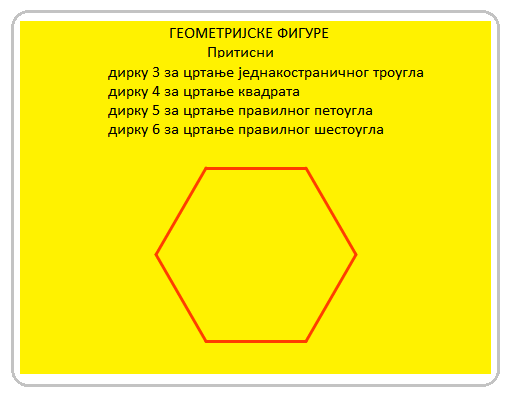

Понављање корака
================

.. include:: blokovi3.txt

.. include:: ikone3.txt

.. infonote::

 |paleta5|

У претходној лекцији већ смо користили наредбе понављања у примерима за цртање линија, како бисмо са мање писања постигли да ликови који се крећу са спуштеном оловком нацртају оно што смо желели.
На пример, уместо да испишемо 400 наредби којима бисмо нацртали тачкасту линију дужине 400 пиксела, ми смо исписали свега пет: четири које понављају узорак и пету која каже колико пута треба поновити узорак.

У овој лекцији наредбе понављања ћемо повезати са наредбама кретања и изгледа како бисмо направили различите анимације. Уз то ћемо упознати наредбу која омогућава уношење улазних података и блокове који чувају вредности логичких израза.

.. topic:: Блокови који омогућавају понављање

 Најједноставнији пример наредби понављања је наредба за опис тзв. "бесконачног циклуса". Наредбе које се понављају чине **тело циклуса**. Њихово извршавање може се зауставити само прекидањем програма. 

 .. image:: ../_images/5/sl5_1.png
   :width: 350px   
   :align: center

 На пример, ако желимо да постигнемо илузију да мачак хода, балерина игра или лептир лети, довољно је да им придружите скрипту у којој се у бесконачном циклусу понављају наредбе |sledeci_kostim| и |cekaj|. 

 Разуме се, лик треба да има бар два костима и чекање треба да буде кратко, на пример 2 десета дела секунде (0.2). Наредба чекања између приказа различитих костима лика неопходна је да бисмо приметили промене у изгледу.
 Наиме, људско око није у стању да региструје тако брзе промене као оне које компјутер обавља. Зато наредбама чекања "кочимо" приказ следећег изгледа, док наше око не прихвати претходну слику.

 У примерима цртања из претходног поглавља користили смо тзв. "бројачке циклусе". То су понављања код којих се унапред зна колико пута ће се извршити тело циклуса. 

 .. image:: ../_images/5/sl5_2.png
   :width: 380px   
   :align: center

 У Скречу постоји и наредба за опис циклуса чији број понављања није унапред познат, већ зависи од тога да ли је испуњен услов за излазак из циклуса. 

 .. image:: ../_images/5/sl5_3.png
   :width: 390px   
   :align: center

 Услов да ли ће се прескочити наредбе тела циклуса (услов за излазак) проверава се на почетку циклуса, па се може десити да се циклус не изврши ни  једанпут ако је тај услов испуњен при првој провери. 
 Такође се може десити да се циклус извршава бесконачно, ако се услов за излазак из циклуса никада не испуни.

|prouci| Проучи следеће примере пројеката
-----------------------------------------

Видели смо да је позорница 480 тачака широка и 360 тачака висока и да се свакој од тачака позорнице може приступити помоћу њених координата. У наредним примерима прaвићемо слике остављањем печата ликова на задатим позицијама. Разуме се, можемо да нацртамо лик који нам одговара коришћењем графичког едитора – на пример црвени круг или плави квадрат, али пошто желимо да слике буду атрактивније, у нашим примерима ћемо користити лик *Star* – жуту звезду из библиотеке ликова. 

.. sidebar:: Димензије лика
 
  |star|

.. |star| image:: ../_images/5/sl5_4.png

Да бисмо прецизније могли да подешавамо слике, мало ћемо изменити звезду која изворно има величину 47х48 пиксела, што можемо видети ако пређемо у картицу *Костими*. 

Нама одговара да лик буде величине 40х40, јер тада у једном реду од левог до десног руба позорнице може да стане тачно 12 звезда (480:40), а између горњег и доњег руба екрана може да их стане тачно 9 (360:40). Даље, више нам одговара да лик нема контуру и да је цео равномерно попуњен једном бојом.

.. sidebar:: Едитовање лика
 
  |promena|

**Како мењамо лик**

|1| Алатком |valat1| селектујемо цео лик

|2| Уклонимо контуру (поставимо њену дебљину на 0)

|3| Изаберемо унутрашњу звезду и обришемо је

|4| Изаберемо цео лик и доведемо га на величину 40х40.
    
  
Овако измењена звезда биће једини лик у наредним задацима.

Следећи пример илуструје како се слагањем више циклуса могу констуисати сложени циклуси. Такође показује како се коришћењем алата уграђеног едитора слика у векторском режиму могу изменити постојећи ликови. Сам пројекат састоји се од више једноставних задатка.

Пример 1 - Пројекат „Звездице” 
~~~~~~~~~~~~~~~~~~~~~~~~~~~~~~

.. level:: 1

.. sidebar:: Слика 1

  |slika1|

.. |slika1| image:: ../_images/5/sl5_6.png

.. topic::  Задатак 1

 Напиши програм који ће нацртати 4 звезде различитих боја величине 120 пиксела једну поред друге од левог до десног руба екрана. Цртање реализовати коришћењем наредбе |pecat|. 
   
 Резултат извршавања треба да буде као на слици 1.

 До решења можемо доћи следећим корацима:

 .. hlist::
    :columns: 2

    * |1|	повећамо димензије лика 300% тако да сада звезда има димензије 120х120,
    * |2|	пошаљемо лик тако да његов леви крај буде уз леви руб позорнице: х=-180,
    * |3|	оставимо печат,
    * |4|	померимо лик удесно за његову ширину (120 корака),
    * |5|	променимо боју лика (наредбом за мењање ефекта боја),
    * |6|	оставимо печат,
    * |7|	померимо лик удесно за његову ширину (120 корака),
    * |8|	променимо боју лика (наредбом за мењање ефекта боја),
    * |9|	оставимо печат,
    * |10|	померимо лик удесно за његову ширину (120 корака),
    * |11|	променимо боју лика (наредбом за мењање ефекта боја),
    * |12|	оставимо печат.

 Примећујемо да смо кораке 4-6 поновили 3 пута. Могли смо исто постићи и са мање писања, што илуструје следећа слика.

 .. image:: ../_images/5/sl5_7.png
   :width: 540px   
   :align: center

 Блок |ponavljaj| из групе *Управљање* омогућава да само једном напишемо групу наредби и задамо колико пута их треба поновити. 

 Он је пример такозваних **С-блокова** који својим изгледом подсећају на слово С. Слот унутар С-блока  прима скрипту као улаз. Дакле, овај блок  има 2 улаза: један за број понављања и један за скрипту.  

.. sidebar:: Слика 2

  |slika2|

.. |slika2| image:: ../_images/5/sl5_8.png

.. topic::  Задатак 2

 Напиши програм који ће нацртати 12 звезда величине 40х40 једну поред друге од левог до десног руба екрана као на слици 2.

 Овај задатак је сличан претходном, само нема потребе да повећавамо димензије лика. Прво бисмо га послали на место х=-220, у=0, па оставили печат. Затим би 11 пута требало поновити кораке 4-6 претходног програма, при чему бисмо лик померали 40 уместо 120 корака. Али колико времена би било потребно да направимо овај једноставан програм без коришћења наредбе понављања?

 Решење задатка приказано је на следећој слици.

 .. image:: ../_images/5/sl5_9.png
   :width: 265px   
   :align: center

.. sidebar:: Слика 3

  |slika3|

.. |slika3| image:: ../_images/5/sl5_10.png

.. topic::  Задатак 3

 Напиши програм који ће нацртати 15 звезда различитих боја једну преко друге у центру екрана при чему прва треба да буде величине 320х320 (800% изворне величине), а свака следећа за 50 мања као на слици 3.

 Кад кажемо за 50 мања мислимо 750%, 700%, ... изворне величине (не 50 пиксела мања, нити 50% од 800%). Да се слика не би мешала са евентуалним остацима слике из претходних извршавања програма, на почетку ћемо ставити наредбу за брисање.
 
 Решење задатка приказано је на следећој слици.

 .. image:: ../_images/5/sl5_11.png
   :width: 265px   
   :align: center

.. sidebar:: Слика 4

  |slika4|

.. |slika4| image:: ../_images/5/sl5_12.png

.. topic::  Задатак 4

 Напиши програм који ће нацртати оквир око позорнице састављен од звезда различите боје као на слици 4.

 Решавање овог задатка можемо остварити повезивањем решења 4 једноставнија проблема.

 1. Цртање звездица на горњем рубу позорнице с лева на десно.
 2. Цртање звездица на десном рубу позорнице од горе на доле.
 3. Цртање звездица на доњем рубу позорнице с десна на лево.
 4. Цртање звездица на левом рубу позорнице од доле на горе.

 Први проблем смо већ решили у задатку 2. Потребно је само променити вредност за у почетне позиције звезде, уместо у=0 треба ставити у=160.
 Други проблем најједноставније је решити ако се промени оријентација лика, уместо да се креће удесно треба да иде надоле. Блокове померања промене боје, и остављања печата треба поновити 8 пута.
 Трећи и четврти проблем решавују се на сличан начин, само се претходно промени оријентација лика и израчуна колико пута треба да остави печат. Умањено комплетно решење и делови који решавају други и трећи проблем приказани су на следећој слици.

 .. image:: ../_images/5/sl5_13.png
   :width: 475px
   :align: center

 Структура решења овог задатка, у коме  се ниже петља за петљом, назива се **линијска композиција циклуса**.

.. sidebar:: Слика 5

  |slika5|

.. |slika5| image:: ../_images/5/sl5_14.png

.. topic::  Задатак 5

 Напиши програм који ће нацртати 4 звезде величине 120 пиксела једну поред друге од левог до десног руба екрана Свака од ове 4 звезде треба да буде формирана од више звезда различите величине и боје попут звезде из задатка 3.

 Резултат извршавања треба да буде као на слици 5.

 Решење овог задатка такође има сложену структуру, али у њему је потребно угњездити петљу која печатира мање звезде преко већих као у задатку 3, у петљу која се извршава 4 пута и црта велике звезде једну поред друге као у задатку 1. Комплетно решење приказано је на следећој слици.

 .. image:: ../_images/5/sl5_15.png
   :width: 300px   
   :align: center

 Структура решења овог задатка, у коме  се улаже петља у петљу, назива се **концентрична композиција циклуса**.

.....

Пример 2 - Пројекат „Геометријске фигуре” 
~~~~~~~~~~~~~~~~~~~~~~~~~~~~~~~~~~~~~~~~~~

.. level:: 2

У овом пројекту показаћемо како се могу нацртати правилне геометријске фигуре троугао, квадрат, петоугао и шестоугао. 

Правилни многоуглови имају све странице једнаке и све углове једнаке. Цртаћемо наведене многоуглове почев од темена у центру екрана, са страницама дужине 100 пиксела. 

Кренимо од цртања квадрата. Послаћемо оловку у центар екрана, тачку (0,0), спустити је и поновити 4 пута пар наредби: иди 100 корака, окрени се 90 степени.

Ако знамо да је збир спољашњих углова сваког многоугла једнак 360 :sup:`о` (види слику) онда лако можемо направити и блокове наредби које цртају троугао, петоугао и шестоугао.

Делови скрипти који цртају наведене многоуглове приказани су на следећој слици.

**Напомена**. Можеш да користиш и окрет улево и да покушаш да нацрташ квадрат и шестоугао у положају у коме су приказани на горњој слици.

Као и у претходном примеру, кликом на зелену заставицу брише се све што је претходно било на позорници, постављају се вредности за боју и дебљину оловке и даје упутство како користити пројекат.

Да би упутство било све време на позорници, направићемо позадину на којој је исписано коришћењем уграђеног едитора слика. Изглед позорнице по извршеној скрипти за цртање шестоугла приказан је на следећој слици.

Свака од скрипти придружених диркама 3-6 тастатуре прво обрише све што је претходно нацртано, сакрије лик па онда исцртава одговарајући многоугао.
На следећој слици приказане су скрипте за покретање програма и исцртавање троугла и квадрата.

.. image:: ../_images/5/sl5_19.png
   :width: 680px   
   :align: center

**Надоградња пројекта**

Унапредићемо пројекат тако да црта геометријску фигуру коју зада  корисник улазним податком. И у овој верзији пројекта се постављају праметри цртања по клику на зелену заставицу. Затим се од корисника тражи да унесе број страница многугла који ће се цртати.

Наредба за уношење податка |pitaj_cekaj| налази се у групи *Осећаји*.

По извршењу ове наредбе Скреч памти шта је корисник унео у простору који се зове |odgovor|.

Очекује се да корисник унесе број између 3 и 6, али ако корисник унесе број изван овог опсега, програм неће радити како треба, па то треба спречити. 

Један од начина да се контролишу улазни подаци је да се понавља захтев кориснику све док не унесе број из задатог интервала.

Пошто се добије коректан улазни податак, он се користи за израчунавање броја понављања и угла окретања, тако да сва четири многоугла можемо да цртамо истим наредбама.

.. image:: ../_images/5/sl5_21.png
   :width: 470px   
   :align: center

И за следећи пројекат користићемо делове претходног пројекта. У њему ћемо показати како концентричном композицијом бројачких циклуса можемо да цртамо ефектне слике које се добијају понављањем узорка. Узорак можемо понављати после извесног броја корака - тако добијамо тзв. бордуре - украсне ивице. Узорке можемо понављати и после заокрета за неки угао или после комбинације оба померања.

.....

Пример 3 - Пројекат „Орнаменти”
~~~~~~~~~~~~~~~~~~~~~~~~~~~~~~~

.. level:: 3

Ако бројачки циклус, који црта правилан петоугао из претходног примера, поновимо више пута, добићемо орнамент - сложенију слику састављену од петоуглова. На пример, ако нацртамо 20 оваквих петоуглова крећући се од левог до десног руба позорнице, добићемо следећу бордуру.

.. image:: ../_images/5/sl5_22.png
   :width: 720px   
   :align: center

Цртање петоугла омогућава циклус (2) који је уложен у спољашњи циклус (1). Спољашњи циклус се понавља 20 пута. При сваком извршавању спољашњег циклуса, црта се један петоугао на текућој позицији оловке, после чега се лик који црта помера удесно са подигнутом оловком (3). Лик се помера само за пола дужина странице петоугла, тако да се петоуглови преклапају.

Ако пак понављамо цртање петоуглова мењајући усмерење лика пред цртање сваког од њих, тако да он обрне цео круг, добићемо следећи орнамент.

.. image:: ../_images/5/sl5_23.png
   :width: 415px   
   :align: center

Како пун круг има 360 степени, а лик се после цртања једног петоугла (2) окреће 15 степени са подигнутом оловком (3), потребно је да се поступак понови 24 пута, па се спољашњи циклус (1) извршава 24 пута. 

Ако између свака два цртања лик и промени угао и иде по 10 корака, добијамо нешто измењен орнамент.

.. image:: ../_images/5/sl5_24.png
   :width: 370px   
   :align: center

Ако пак поновимо други орнамент 4 пута, идићи од левог ка десном рубу екрана, добијамо следећу слику.

.. image:: ../_images/5/sl5_25.png
   :width: 770px   
   :align: center

Дакле,  цртање последње бордуре остварује се концентричном композицијом 3 циклуса: унутрашњи црта један петоугао (3), средњи (2) понавља цртање петоугла и окретање лика са подигнутом оловком 24 пута, а спољашњи (1) понавља цртање кружног орнамента и померање лика са подигнутом оловком (4) за пречник орнамента.   

Пројекат омогућава да се црта сваки од приказаних орнамената тако што се кликне на једну од дирки 1 - 4 тастатуре. Осим ове 4 скрипте  постоји и скрипта коју покреће клик на зелену заставицу и скрипта која се покреће поруком *упутство*. Поруку *упутство* разглашава свака скрипта на крају свог рада. Кад лик прими ову поруку, приказује се при врху екрана и даје упутство како се покреће цртање орнамената.

.. image:: ../_images/5/sl5_26.png
   :width: 490px   
   :align: center

|pitaj| Одговори на следећа питања
----------------------------------

Питање 1
~~~~~~~~

.. level:: 1

.. mchoice:: ciklus01
   :answer_a: да
   :answer_b: не
   :correct: b
   :feedback_a:  
   :feedback_b: Тачно. 
   
    Да ли се услов за излазак из циклуса назива тело циклуса?

Питање 2
~~~~~~~~

.. level:: 1

.. mchoice:: ciklus02
   :answer_a: да
   :answer_b: не
   :correct: a
   :feedback_a: Тачно. 
   :feedback_b: 
   
    Да ли се извршавање наредбе бесконачног циклуса може зауставити једино прекидањем програма?

Питање 3
~~~~~~~~

.. level:: 1

.. mchoice:: ciklus03
   :answer_a: да
   :answer_b: не
   :correct: b
   :feedback_a:  
   :feedback_b: Тачно.
   
    Да ли се за наредбу ``понављај до`` унапред зна колико ће се пута извршити тело циклуса?

Питање 4
~~~~~~~~

.. level:: 1

.. mchoice:: ciklus04
   :multiple_answers:
   :answer_a: 
   :answer_b: 
   :answer_c: 
   :answer_d: 
   :correct: a, c
   :feedback_a:   
   :feedback_b: 
   :feedback_c: 
   :feedback_d: 

   Извршавањем којег од бесконачних циклуса се постиже да лик иде лево-десно и гледа удесно, 
   ако су претходно извршене наредбе |idi_xy|, |usmeri_ka| и |nacin_okretanja|? (Изабери све тачне одговоре).

   .. image:: ../_images/5/pit5_4.png
      :width: 700px   
      :align: center

Питање 5
~~~~~~~~

.. level:: 1

.. mchoice:: ciklus05
   :multiple_answers:
   :answer_a: 
   :answer_b: 
   :answer_c: 
   :answer_d: 
   :correct: b, d
   :feedback_a: 
   :feedback_b: 
   :feedback_c: 
   :feedback_d: 

   Којим од следећих бесконачних циклуса се постиже да лик стално смењује два положаја: ногама надоле и ногама нагоре, 
   ако су претходно извршене наредбе |idi_xy|, |usmeri_ka| и |nacin_okretanja2|? (Изабери све тачне одговоре).

   .. |nacin_okretanja2| image:: ../_images/5/nacin_okretanja2.png

   .. image:: ../_images/5/pit5_5.png
      :width: 700px   
      :align: center

Питање 6
~~~~~~~~

.. level:: 2

.. mchoice:: for01
   :multiple_answers:
   :answer_a: 
   :answer_b: 
   :answer_c: 
   :answer_d: 
   :correct: a, b, d
   :feedback_a: 
   :feedback_b: 
   :feedback_c: 
   :feedback_d: 
  
   Којим од бројачких циклуса се постиже да лик направи 80 корака? (Изабери све тачне одговоре).

   .. image:: ../_images/5/pit5_6.png
      :width: 500px   
      :align: center

Питање 7
~~~~~~~~

.. level:: 2

.. mchoice:: for02
   :multiple_answers:
   :answer_a: 
   :answer_b: 
   :answer_c: 
   :answer_d: 
   :correct: b, c
   :feedback_a: 
   :feedback_b: 
   :feedback_c: 
   :feedback_d: 
   
   Којим од бројачких циклуса се постиже да лик направи 80 корака? (Изабери све тачне одговоре).

   .. image:: ../_images/5/pit5_7.png
      :width: 500px   
      :align: center

Питање 8
~~~~~~~~

.. level:: 2

.. image:: ../_images/5/pit5_8.png
      :width: 300px   
      :align: center

.. mchoice:: repeat1
   :answer_a: Здраво КРАЈ
   :answer_b: Како се зовеш
   :answer_c: Довиђења
   :correct: c
   :feedback_a: Скреч у провери не разликује велика и мала слова, па је услов за излазак из циклуса испуњен.
   :feedback_b: То је улазна, а не излазна порука.
   :feedback_c: Тачно.

   Шта ће изговорити лик ако на питање *Како се зовеш* корисник одговори *КРАЈ*? 
      
Питање 9
~~~~~~~~

.. level:: 3

.. mchoice:: repeat2
   :answer_a: A 
   :answer_b: B
   :answer_c: оба 
   :answer_d: ниједног
   :correct: a
   :feedback_a: Тачно. 
   :feedback_b: То је услов да се у овом низу наредби уђе у циклус.
   :feedback_c: Оно што је услов за излазак из циклуса у (А) је услов за улазак у понављање у (В).
   :feedback_d: Низ (А) омогућава да лик изговори Здраво под наведеним условима.

   Извршењем којег од низова наредби ће  лик изговорити *Здраво* ако корисник унесе вредност 0? 
   
   .. image:: ../_images/5/pit5_9.png
      :width: 570px   
      :align: center
      

.. mchoice:: repeat2b
   :answer_a: ниједном 
   :answer_b: 2 пута
   :answer_c: 3 пута
   :answer_d: 4 пута
   :correct: c
   :feedback_a: За прва 3 одговора није испуњен услов за излазак из циклуса. 
   :feedback_b: И за број 3 није испуњен услов за излазак из циклуса.
   :feedback_c: Тачно.
   :feedback_d: Када се оствари услов за излазак из циклуса не извршавају се наредбе тела циклуса.

   Колико пута ће се извршити тело циклуса (А), ако корисник на питања уноси одговоре следећим редом: 1, 2, 3, 0.
   
Питање 10
~~~~~~~~~

.. level:: 3

.. mchoice:: repeat5
   :answer_a: 
   :answer_b: 
   :answer_c: 
   :correct: a
   :feedback_a: Тачно.
   :feedback_b: Нпр. прихватиће 7 као коректан улаз.
   :feedback_c: Нпр. неће прихватити 3 као коректан улаз.
      
   Којим словом је обележен услов који ће омогућити да улазна провера податка буде коректна?

|pokusaj| Покушај
-----------------

Вежба 1
~~~~~~~

.. infonote::

  **Отворена огрлица**. Креирај пројекат који приказује низ кругова различите боје и величине почев од левог краја позорнице. 
  
  .. image:: ../_images/5/vezba5_1.png
      :width: 240px   
      :align: center

  .. reveal:: упутство2
     :showtitle: Прикажи упутство
     :hidetitle: Сакриј упутство
 
     **Упутство:**
   
     Слика се добија спуштањем оловке различитих боја, дебљине 80, коју држи сакривен лик који се на почетку налази на позицији (-200,0). 
     У циклусу који се понавља 5 пута лик треба да иде 80 корака са подигнутом оловком, повећава број боје оловке за 30, па је спусти. 
     Почетна вредност за боју је 0. Обезбеди да се кликом на зелену заставицу обрише претходни цртеж.     

.....

Вежба 2
~~~~~~~

.. infonote::

  **Затворена огрлица**. Креирај пројекат који црта затворен низ од 12 кругова различите боје дебљине 50.
   
  .. image:: ../_images/5/vezba5_2.png
      :width: 200px   
      :align: center
      
  .. reveal:: упутство3
     :showtitle: Прикажи упутство
     :hidetitle: Сакриј упутство
 
     **Упутство:**
   
     Слика се добија спуштањем оловке различитих боја, дебљине 50, коју држи сакривен лик који се на почетку налази на позицији (-50,50). 
     У циклусу који се понавља 12 пута лик треба да иде 50 корака са подигнутом оловком, окрене се за 30 степени и повећава број боје оловке за 15, 
     којом затим остави траг. Почетна вредност за боју је 0. Обезбеди да се кликом на зелену заставицу обрише претходни цртеж.

.....

Вежба 3
~~~~~~~

.. infonote::

  **Низ кругова**. Креирај пројекат који приказује низ кругова различите боје и величине почев од левог краја позорнице.
    
  .. image:: ../_images/5/vezba5_3.png
      :width: 240px   
      :align: center
      
  .. reveal:: упутство4
     :showtitle: Прикажи упутство
     :hidetitle: Сакриј упутство
 
     **Упутство:**
  
     Слика се добија спуштањем оловке различитих дебљина и различитих боја коју држи сакривен лик који се на почетку налази на позицији (-200,0).
     Почетне вредности за боју су 0, а за дебљину 80. У циклусу који се понавља 5 пута треба повећавати број боје оловке за 30 и смањивати њену дебљину за 10.
     Лик треба да иде по 80 корака удесно, разуме се са подигнутом оловком. У петљи треба да се налази и наредба *чекај* да боље испратиш шта се дешава.
     Обезбеди да се кликом на зелену заставицу обрише претходни цртеж.

.....

Вежба 4
~~~~~~~

.. infonote::

  **Концентрични кругови**. Креирај пројекат који приказује низ концентричних кругова различите боје у центру позорнице.
    
  .. image:: ../_images/5/vezba5_4.png
      :width: 200px   
      :align: center
      
  .. reveal:: упутство5
     :showtitle: Прикажи упутство
     :hidetitle: Сакриј упутство
 
     **Упутство:**
     
     Слика се добија спуштањем оловке различитих дебљина и различитих боја коју држи сакривен лик који се налази у центру екрана. 
     У циклусу који се понавља 8 пута треба повећавати број боје оловке за 25 и смањивати њену дебљину за 30. Почетне вредности за боју су 0 (црвена), а за дебљину 240 (најдебља).
     У петљи треба да се налази и наредба *чекај* да боље испратиш шта се дешава. После сваке промене вредности атрибута оловке треба је спустити.
     Обезбеди да се кликом на зелену заставицу обрише претходни цртеж.

 
|bug| Исправи грешке
--------------------

Грешка 1
~~~~~~~~

Ученик је желео да се његов лик корача између леве и десне ивице позорнице. 
Зато је у бесконачан циклус унео стално мењање костима и корачање по 10 корака док не дође до руба, када се окреће.
Међутим, није му се свидело што лик ка левој ивици позорнице корача наглавачке. Шта треба да уради да поправи ову грешку?
   
.. image:: ../_images/5/greska5_1.png
   :width: 170px   
   :align: center   
   
.. reveal:: сакривање10
   :showtitle: Прикажи одговор
   :hidetitle: Сакриј одговор
 
   **Одговор:**
   
   То може да поправити укључивањем наредбе |nacin_okretanja| у скрипту лика.

Грешка 2
~~~~~~~~

Ученик је желео да његов лик лептир, који има два костима - са подигнутим и спуштеним крилима, стално клизи машући крилима  између тачака чије се координате бирају на случајан начин.
Али његов програм то није омогућио. Лептир је од једне до друге тачке клизио или са спуштеним или са подигнутим крилима. У чему је грешка?
   
.. image:: ../_images/5/greska5_2.png
   :width: 285px   
   :align: center
   
     
.. reveal:: сакривање8
   :showtitle: Прикажи одговор
   :hidetitle: Сакриј одговор
 
   **Одговор:**
     
   Требало је направити две скрипте које се извршавају паралелно.

   .. image:: ../_images/5/resenje5_2.png
      :width: 400px   
      :align: center   

|knjiga| Шта смо научили
------------------------

У овоj лекцији бавили смо се наредбама понављања. Кроз примере пројеката илустровали смо како се користи сваки од три типа циклуса: бесконачни, бројачки - код кога се унапред зна број понављања тела циклуса и циклус са предусловом - код кога број понављања зависи од испуњености неког услова. Показали смо да се два и више циклуса могу комбиновати тако да се извршавају један за другим (редна композиција) или да се улажу један у други (концентрична композиција). Такође смо научили како се користи наредба за уношење података.

**Примери пројеката**: 5Studio_

.. _5Studio: https://scratch.mit.edu/studios/24292278/

**Појмови**: понављање корака, циклус, тело циклуса, услов за излазак из циклуса, бесконачни циклус, бројачки циклус, циклус са предусловом, линијска композиција циклуса, концентрична композиција циклуса, улазна наредба, улазни податак, контрола улазних података.

**Наредбе**: |upravljanje| - |zauvek|, |ponavljaj|, |ponavljaj_do|; |olovka| - |pecat|; |osecaji| - |pitaj_cekaj|, |odgovor|; |operatori| - |manje|, |vece|, |and|.

|project| Уради неки од следећих пројеката
------------------------------------------

Пројекат 1 - „Шестоугао”
~~~~~~~~~~~~~~~~~~~~~~~~

.. level:: 1

Састави програм који црта шестоугао чија се дужина странице генерише као случајан број из интервала [100,200].

Пројекат 2 - „Квадрати”
~~~~~~~~~~~~~~~~~~~~~~~

.. level:: 1

Напиши пројекат који нуди цртање квадрата чије су странице паралелне координатним осама или са координатним осама заклапају угао од 45 :sup:`о`.
Избор треба да се врши кликом на дирку 1 или 2 тастатуре. Упутство за коришћење програма треба да буде исписано на позадини позорнице као у Примеру 2. 
Дужина странице нека буде 100 пиксела.

 
Пројекат 3 - „Троуглови”
~~~~~~~~~~~~~~~~~~~~~~~~

.. level:: 2

Напиши пројекат који нуди цртање троугла који је: 

а) једнакостраничан,  
б) једнакокрак,  
в) правоугли,  
г) оштроугли,  
д) тупоугли.

Пројект треба да има упутство које каже која дирка тастатуре покреће цртање које врсте троугла. 

Испланирај у којим тачкама се налазе координате сваког од ових троуглова, па цртање страница троугла реализуј наредбом ``клизи``.

Пројекат 4 - „Четвороуглови”
~~~~~~~~~~~~~~~~~~~~~~~~~~~~

.. level:: 3

Напиши пројекат који нуди цртање четвороугла који је: 

а) квадрат,	
б) правоугаоник,	
в) ромб,	
г) паралелограм, 
д) трапез.

Цртање испланирај тако да на крају на позорници буду нацртане све побројане врсте четвороуглова.

Када се кликне на зелену заставицу треба да се појави упутство за коришћење програма. 

Догађаји који покрећу цртање појединих врста четвороуглова треба да буду придружени диркама тастатуре по твом избору. 

Напомена. Тема *Четвороугао* обрађује се у математици за шести разред.

