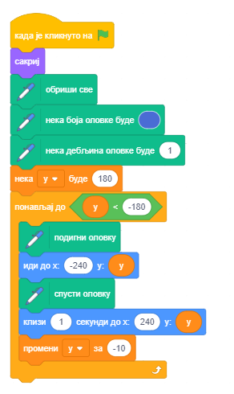
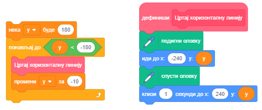
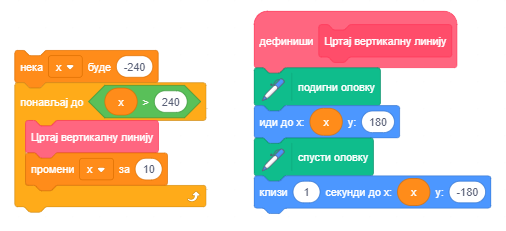
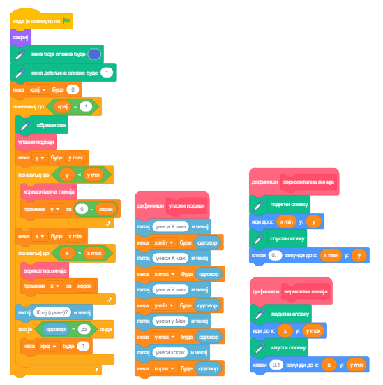
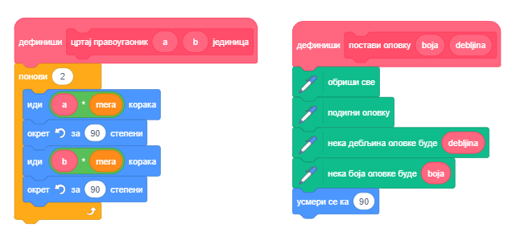
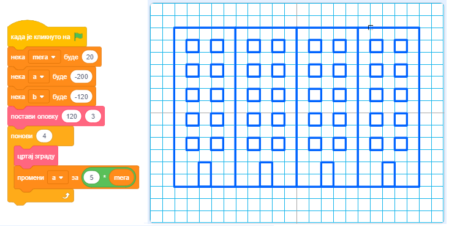
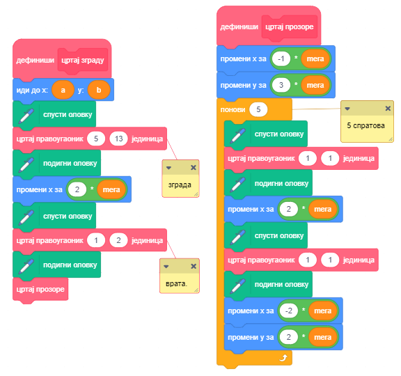
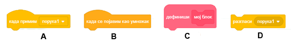
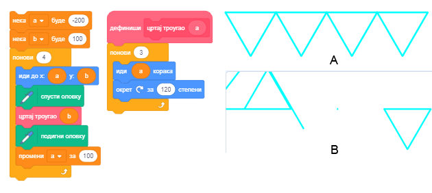
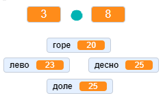

Процедуре
=========

.. include:: blokovi3.txt

.. include:: ikone3.txt

.. infonote::

 |paleta8|

Пројекти које ћемо проучавати имају сложену структуру. 
Да бисмо се лакше изборили са том сложеношћу, користићемо приступ познат као **структурирано програмирање** развијен 60-тих година прошлог века. Овакав приступ поједноставио је процес писања, разумевања и одржавања комплексних програма. Уместо да се пишу сложени програми у којима је тешко открити грешке и који се тешко преправљају ако се за то укаже потреба приликом употребе (што називамо одржавањем), растављају се у мале делове од којих сваки решава један део укупног проблема.

Да бисмо брже и лакше направили пројекте сложене структуре разделићемо велике скрипте у логичке делове од којих сваки обавља једну функцију. Такве делове називамо **процедуре**. Свака од процедура извршава одређену функцију, а једна скрипта, главни програм, их позива и повезује у јединствену целину.

.. topic:: Реализација процедура у Скречу

 Један од начина да се у Скречу реализују процедуре и тако сложени алгоритми изделе на више једноставних је коришћење порука, исти механизам који смо већ упознали када смо синхронизовали акције ликова. Други начин за реализацију процедура је увођење сопствених наредби. 

 **Како се праве нови блокови**

 Да би направио нови блок изабери групу *Моји блокови* (1), па кликни на дугме *Направи блок* (2). Појавиће се дијалошки прозор који омогућава креирање нових блокова. У пољу за назив блока упиши име (3), на пример *Цртај троугао* и потврди кликом на дугме *У реду* (4).
 
 .. image:: ../_images/8/sl8_1.png
    :width: 575px   
    :align: center

 У палети блокова појавиће се нови блок ``Цртај троугао`` (1), а у области скрипти нови почетни блок ``дефиниши`` (2), којем треба придружити низ блокова за цртање троугла (3).
 
 .. image:: ../_images/8/sl8_2.png
    :width: 560px   
    :align: center

 Нови блок може да има и улазна поља. Захваљујући томе можемо постићи да истим блоком цртамо троуглове са различитим дужинама страница.  Да бисмо то постигли, потребно је да из приручног менија који добијемо десним кликом на нови блок (1) изаберемо опцију *Уреди*. Поново ће се отворити дијалошки прозор *Направи блок*. Од три могућности које су понуђене за додавање нових поља блоку изабраћемо *Додај улаз број или текст* (2) и на нашем блоку ће се појавити одговарајуће улазно поље (3) у које ћемо уписати *а* - име променљиве за дужину странице троугла.

 .. image:: ../_images/8/sl8_3.png
    :width: 920px   
    :align: center
 
 Да смо изабрали *Додај унос булов израз*, улазно поље би било шестоугоног облика и могло би да прима само логичке блокове, а избор могућности *Додај натпис* обезбедио би да се текст на блоку испише иза улазних поља. 
 
 *Упамтите.* На свако место где се користи променљива *а* у блоковима дефиниције треба превући репортер ове променљиве из заглавља дефиниције блока (4). Дакле, не слово а, нити репортер *а* из палете блокова, већ репортер из заглавља дефиниције! |nije_isto|

 .. |nije_isto| image:: ../_images/8/sl8_4.png  
 
 Име *a* који смо унели у заглавље дефиниције процедуре *Цртај троугао* назива се **параметар**. Процедуре могу имати и више параметара. На пример, можемо направити једну процедуру *Цртај многоугао* која црта правилне многоуглове са различитим бројем страница, различитих дужина. Уместо да дефинишемо засебне блокове за цртање троугла, четвороугла и других многоуглова, са задатом дужином странице, Дефинисаћемо само један блок са параметрима *број страница* и *дужине страница*. Конкретне вредности параметара ћемо задати као **аргумент** новоуведене наредбе. Тај аргумент ће заменити свако појављивање параметра број страница у процедури. Можемо да кажемо да је параметар именовани чувар места за аргумент. 
 
 
|prouci| Проучи следеће примере пројеката
-----------------------------------------

Пример 1 - Пројекат „Мрежа квадрата”
~~~~~~~~~~~~~~~~~~~~~~~~~~~~~~~~~~~~

.. level:: 3

**Цртање хоризонталних линија**

Да бисмо нацртали хоризонталну линију (паралелну х оси) потребно је да повежемо све тачке које имају исту вредност координате у. 
На пример, ако је у=0 нацртаћемо саму х осу. На почетку поставимо оловку на леви руб екрана у тачку (-240,0), спустимо је да би остављала траг и пошаљемо да клизи до тачке (240,0).
Тамо је подигнемо и можемо да пређемо на цртање следеће линије.

Ако желимо да нацртамо све хоризонталне линије чија је у координата број који се завршава цифром 0 (дељив са 8) понављаћемо претходно описани поступак за у=180, 170, ...,-180. 

          

Да би сам поступак био прегледнији, издвојићемо инструкције за цртање једне хоризонталне линије у засебну целину – **процедуру**, коју ћемо, по потреби, позивати. 

**Цртање вертикалних линија**

Слично цртању хоризонталне линије, да бисмо нацртали вертикалну линију потребно је да повежемо све тачке које имају исту вредност координате х. 
На почетку поставимо оловку на горњи руб екрана, на пример у тачку (0,180), спустимо је да би остављала траг и пошаљемо да клизи до тачке (0,-180). 
Тамо је подигнемо и можемо да пређемо на цртање следеће линије.

Ако желимо да нацртамо све вертикалне линије чија је х координата број дељив са 10, понављаћемо претходно описани поступак за х=-240, -230, ... ,240. 

Да бисмо упамтили слику мреже квадрата добијених цртањем хоризонталних и вертикалних линија на овај начин потребно је да на урадимо десни клик на позорницу. Појавиће се опција *Save image as* која омогућава да се слика позорнице упамти као позадина. (Засад се ова могућност може користити само у онлајн едитору)

Упамтите цео појекат под називом *Мрежа квадрата*.

.....

Пример 2 - Пројекат „Разне мреже”
~~~~~~~~~~~~~~~~~~~~~~~~~~~~~~~~~

.. level:: 3

Желимо да уопштимо претходни програм и користимо га за цртање мреже већих или мањих квадрата, као и за цртање мреже која не мора да почиње 
у горњем левом углу екрана и завршава се у доњем десном углу. Увешћемо променљиве *х min*, *х max*, *у мин*, *з max* и корак. 
Оне ће дефинисати горње лево теме мреже (Х min, У max), доње десно теме мреже (Х max, У min) и величину квадрата у мрежи. 
Полазне вредности ћемо задавати са улаза.

Тако можемо изменити пројекат *Мрежа квадрата*, који црта само једну мрежу у општији пројекат *Разне мреже*, који може да црта различите мреже у зависности од улазних података. Осим побројаних променљивих, увели смо и променљиву *крај* која је иницијално постављена на 0, а мења се у случају да корисник више не жели да користи програм. Било који одговор осим „да” оставља њену вредност непромењеном. 

Када корисник на  *Крај (да/не)?* одговори са „да”, променљива мења своју вредност у 1 што је услов за излазак из циклуса и програм се прекида.

.....

Пример 3 - Пројекат „Зграде”
~~~~~~~~~~~~~~~~~~~~~~~~~~~~~

.. level:: 3

У овом пројекту формираћемо сложене цртеже коришћењем само једне процедуре са параметрима. То је процедура *цртај правоугаоник* са параметрима *a* и *b* за дужине страница. Да би главни програм био прегледнији издвојили смо и иницијализацију оловке у посебну процедуру *постави оловку*, која дефинише дефинише боју и дебљину оловке којом ће се цртати. На следећој слици приказане су скрипте којима се дефинишу ове две процедуре. Променљива *mera* дефинисана је у главном програму и омогућава да се цртају пропорционални правоугаоници различитих димензија.

    
**Креирање пројекта**

Учитај позадину *Xy-grid-20px* из библиотеке позадина. То је мрежа која се састоји од 24х18 квадрата чије странице имају димензије 20х20 пиксела. (Ову позадину могао си и сам направити коришћењем претходног пројекта). Таква позадина нам одговара јер се добро виде пропорције цртежа које ћемо креирати.

Коришћењем уграђеног едитора слика у векторском режиму нацртај квадрат димензија 8х8 пиксела. Користи алатку |valat5|, изабери цртање без попуњавања и дебљину контуре 2. Подеси да центар костима буде у средини квадрата.

Било који лик би могао да обавља цртање, али овај је згодан јер показује како се формирају цртежи, а не морамо га сакривати пошто је довољно мали да не заклања цртеж.

Цео цртеж састојаће се од 4 зграде ширине 5 и висине 13 квадрата позадине, дакле димензија 100х260 пиксела. У нашој скрипти променљива *мера* једнака је дужини странице једног квадрата позадине. Променљиве *а* и *b* програма чувају координате тачке од које ће почети цртање зграде. 

Напомена. Иста имена имају и локалне променљиве процедуре *Цртај правоугаоник*, али оне се виде само у оквиру процедуре - то су **локалне променљиве**. За разлику од њих, променљиве *а* и *b* главног програма су **глобалне променљиве***, виде се свуда у пројекту.

У главном програму на почетку се врши се иницијализација променљивих, а затим се 4 пута позива процедура за цртање зграде, сваки пут са различитим координатама тачке од које почиње цртање. Зграде се цртају једна до друге јер се х координата почетне тачке цртања повећава за ширину зграде. На следећој слици приказана је скрипта главног програма и слика која која се добија његовим извршавањем.

Процедура *цртај зграду* прво два пута позива процедуру *цртај правоугаоник*, а затим процедуру *цртај прозоре*. Ппроцедура *цртај правоугаоник* при првом позиву добија параметре за цртање контура зграде, а при другом за цртање врата. Следећа слика приказује скрипте процедура *цртај зграду* и *цртај прозоре*.

Да смо за меру поставили 10, добили бисмо двоструко мањи цртеж. На следећој слици је приказан резултат рада програма са параметрима као у претходном објашњењу (А) и када су  вредности променљивих измењене на следећи начин: мера=10, промена а у главном програму а=а+10хмера, промена висине правугаоника са 13хмера на  23хмера и броја понављања у процедури *цртај прозоре* са 5 на 10.

.. image:: ../_images/8/sl8_13.png
    :width: 970px   
    :align: center

|pitaj| Одговори на следећа питања
----------------------------------

Питање 1
~~~~~~~~

.. level:: 1

.. mchoice:: procedure1
   :answer_a: да
   :answer_b: не
   :correct: a
   :feedback_a: Тачно. 
   :feedback_b: 
   
   Да ли је главни програм надређен процедурама?

Питање 2
~~~~~~~~

.. level:: 1

.. mchoice:: procedure2
   :answer_a: да
   :answer_b: не
   :correct: b
   :feedback_a:  
   :feedback_b: Тачно.
   
   Да ли се у Скречу процедуре могу реализовати на само један начин?

Питање 3
~~~~~~~~

.. level:: 1

.. mchoice:: procedure3
   :answer_a: да
   :answer_b: не
   :correct: a
   :feedback_a: Тачно. 
   :feedback_b: 
   
   Да ли нови блок може да има и улазна поља?

Питање 4
~~~~~~~~

.. level:: 1

.. mchoice:: procedure4
   :answer_a: да
   :answer_b: не
   :correct: b
   :feedback_a: Не, то су аргументи. 
   :feedback_b: Тачно.

   Да ли се вредности које нови блок предаје процедури називају параметри?

Питање 5
~~~~~~~~

      
.. mchoice:: procedure5
   :answer_a: 
   :answer_b: 
   :answer_c: 
   :answer_d: 
   :correct: a, b, d
   :feedback_a:  
   :feedback_b: 
   :feedback_c: 
   :feedback_d: 
   
   Који од блокова припада групи *Догађаји*? (Изаберите све тачне одговоре)

Питање 6
~~~~~~~~

      
.. mchoice:: procedure6
   :answer_a: 
   :answer_b: 
   :answer_c: 
   :answer_d: 
   :correct: а, b, c
   :feedback_a:  
   :feedback_b: 
   :feedback_c: 
   :feedback_d: 
   
   Који од блокова припада групи *Управљање*? (Изаберите све тачне одговоре)

|pokusaj| Покушај
-----------------

Вежба 1
~~~~~~~

.. level:: 3

.. infonote::

 Направи процедуру *Квадрат1* са параметрима: координате **х** и **у** горњег левог темена и дужина странице **а**.
 Процедура треба да црта квадрат са страницама паралелним х и у оси. 
 Затим креирај скрипту који позива више пута ову процедуру и црта концентричне квадрате као на следећој слици.

 .. image:: ../_images/8/vezba8_1.png
         :width: 210px   
         :align: center 
        
.....

Вежба 2
~~~~~~~

.. level:: 2

.. infonote::

 Направи процедуру *Квадрат2* са параметрима: координате **х** и **у** горњег левог темена, дужина странице **a** и правац прве странице **угао** коју исцртава процедура. 
 Затим креирај скрипту који позива више пута ову процедуру и црта 10 квадрата са заједничким горњим левим теменом, истих страница тако да је правац сваке следеће прве странице 
 заротиран 36 стeпени у односу на правац прве странице претходног квадрата.

 .. image:: ../_images/8/vezba8_2.png
         :width: 290px   
         :align: center 
         
.....

Вежба 3
~~~~~~~

.. level:: 3

.. infonote::

 Направи процедуру **Правоугаоник** са параметрима: координате **х** и **у** горњег левог темена и дужинама страница **а** и **b**. 
 Процедура треба да црта правоугаоник са страницама дужине **а** паралелним х оси, а страницама дужине **b** паралелним у оси. 
 Затим креирај скрипту који позива више пута ову процедуру и црта правоугаонике са аргументима који се задају на случајан начин, слично као на следећој слици.

 .. image:: ../_images/8/vezba8_3.png
         :width: 235px   
         :align: center 
         

|bug| Исправи грешке
--------------------

Грешка 1
~~~~~~~~
.. level:: 1

:Питање:
   Ученик је желео да направи скрипту која црта бордуру од троуглова као на слици А. Направио је одговарајућу скрипту и издвојио процедуру која црта троугао (на слици лево од бордура), али добио је резултат као на слици В. Где је грешка?

.. reveal:: сакривање8_1
   :showtitle: Прикажи одговор
   :hidetitle: Сакриј одговор
 
   **Одговор:**
     
   У процедури је у блоку ``иди корака`` уместо репортера параметра *а* поставио репортер променљиве *а* из главног програма.

|knjiga| Шта смо научили
------------------------

У овој лекцији показали смо како се у Скречу могу реализовати процедуре увођењем нових наредби. Показали смо како се могу направити нови блокови са и без улазних поља. Нови блокови са улазним пољима омогућавају да се аргументи који се у њих упишу проследе дефиницији блока и тамо поставе уместо одговарајућих параметра. На тај начин, један исти блок може да реализује више различитих акција у зависности вредности аргумената.  

**Примери пројеката**: 8Studio_

.. _8Studio: https://scratch.mit.edu/studios/25117374/

**Појмови**: Процедура, уведене наредбе, параметар.

**Наредбе**: |moji_blokovi| - |nova_naredba|, |definicija| 

|project| Уради неки од следећих пројеката
------------------------------------------

Пројекат 1 - „Геометријске фигуре”
~~~~~~~~~~~~~~~~~~~~~~~~~~~~~~~~~~

.. level:: 1

Креирај верзију пројекта „Геометријске фигуре” из 5. лекције коришћењем процедура. Процедуре реализуј коришћењем уведених наредби.

Пројекат 2 - „Градска улица”
~~~~~~~~~~~~~~~~~~~~~~~~~~~~

.. level:: 2

Направи процедуре за цртање:

- зграда и врата облика правоугаоника различитих величина, 

- прозора различитих облика (квадрата, правоугаоника, кругова) и различитих величина,

- кровова облика трапеза са различитим величинама основицама и висина.

Повежи ове процедуре у пројекат „Градска улица” који приказује низ различитих зграда.

Пројекат 3 - „Аритметика”
~~~~~~~~~~~~~~~~~~~~~~~~~

.. level:: 3

Направи процедуре које треба повезати у пројекат „Аритметика”. Процедуре треба да тестирају познавање сабирања, одузимања, множења и дељења. Пројекат треба да има интерфејс као на следећој слици.

У горња два монитора, између којих се налази знак аритметичке операције, треба уписати бројеве генерисане на случајан начин, 
а у доња четири бројеве који који би могли бити резултат, при чему је само један од њих тачан. Знаци аритметичких операција треба да буду костими лика *знак*, као у примеру „Мали математичар” из претходне лекције. 

Играч бира одговор за који мисли да је тачан помоћу дирке са одговарајућом стрелицом. Ако је одговор тачан, добија одговарајућу поруку и увећава му се број поена за 1. Ако је одговор нетачан, добија одговарајућу поруку и умањује му се број поена за 1. Тестирање се завршава када одговори на 20 питања уз поруку на колико је процената питања тачно одговорио. 

Пројекат се формира на следећи начин:

1) У процедури **Сабирање** на случајан начин треба генерисати два броја, збир c из интервала [10,20] и први сабирак a из интервала [1,15]. 
На основу њих формирати други сабирак b = c - a и три погрешна резултата из интервала [c-3,c+3]. 

2) У процедури **Одузимање** на случајан начин треба генерисати два броја, Умањеник a из интервала [10,20] и умањилац b из интервла [1,a-2]. 
На основу њих формирати разлику c = a - b и три погрешна резултата из интервала [c-2,c+2]. 

3) У процедури **Множење** на случајан начин треба генерисати два фактора из интервала [2,9]. На основу њих формирати производ c = a * b и три погрешна 
резултата из интервала [c-10,c+10]. Побринути се да погрешни резултати буду већи од оба фактора (нпр. ако се за факторе 2 и 3 генерише погрешан одговор 2, поновити генерисање).

4) У процедури **Дељење** на случајан начин треба генерисати два броја, количник c из интервала [2,9] и делилац b из интервала [2,9]. На основу њих формирати 
дељеник a = b * c и три погрешна резултата из интервала [c-3,c+3]. 

5) У главном програму треба променљивим *поени* и *покушаји* поставити вредност 0. Затим у петљи, која ће се понављати све док број поена не буде 20, генерисати аритметичку операцију, позвати одговарајућу процедуру и добијене операнде поставити у одговарајуће мониторе уз рачунску операцију, а тачан и 3 погрешна одговора распоредити на случајан начин у мониторе за одговоре. (Можете и распоређивање одговора решити у засебној процедури.) 

Затим програм треба да прихвати одговор корисника и, у зависности од тога да ли је тачан или, прикаже одговарајућу поруку и промени променљиве *поени* и *покушаји*. По изласку из петље, програм треба да саопшти на колико је процената постављених задатака корисник тачно одговорио. 

