Променљиве
==========

.. include:: blokovi3.txt

.. include:: ikone3.txt

.. infonote::

 |paleta7|

Променљиве су један од најважнијих концепата у програмирању. У овој лекцији упознаћемо различите типове променљивих и показати како се на позорници могу пратити промене њихових вредности. Кроз примере пројеката чије скрипте имају сложену структуру показаћемо како се могу креирати такмичарске игре у којима се прати резултат играча и како се формирају сложени изрази за рачунање вредности променљивих. 

.. topic:: Шта је променљива

 Променљива (варијабла) је именована област меморије рачунара. Можемо да кажемо да је променљива попут именоване кутије у којој програм привремено чува податке са којима ради.  

 .. image:: ../_images/7/sl7_1.png
         :width: 250px   
         :align: center

 Променљива на слици  има име *Х*, а њена текућа вредност је 15. 

 Променљиве могу чувати једну вредност, на пример број или слово. То су **просте променљиве**. 
 Међутим, постоје и **сложене променљиве** које чувају више вредности, на пример низ слова (*стринг*) низ бројева, низ речи, ... У Скречу се овакав низ назива *листа*. 

 Ми смо у претходним пројектима користили неименоване вредности. Текст „Здраво свете“ и сви остали које смо уносили у блокове *Изговори* и *Замисли* су подаци – стрингови (низови знакова). 

 Бројеви које смо уносили као аргументе у наредбе кретања (иди, усмери се, промени за) су вредности које се могу сместити у променљиве. 

 Услов понављања и услов гранања  може да има две вредности – тачно и нетачно, дакле и то је вредност, **логичка** вредност. 

 За сложеније програме које будемо писали биће нам потребно да именујемо неке вредности, то јест да уведемо **променљиве**. 

.. topic:: Како се креирају променљиве

  У групи наредби *Променљиве* на почетку постоји само променљива нема блокова (сл. А). Потребно је прво креирати променљиву кликом на дугме *Направи променљиву*.
 
  .. image:: ../_images/7/sl7_2.png
         :width: 680px   
         :align: center

  Кликом на ово дугме отвара се дијалог за креирање нове променљиве (B).

  Променљива може бити **локална**, само за скрипте придружене активном објекту (лику или позорници) или **глобална**. 
 
  Глобалне променљиве могу да користе сви објекти пројекта. Уписом имена променљиве и кликом на дугме *У реду*
  у палети блокова појављују се блокови за 4 наредбе и репортер са именом променљиве уз који стоји дугме за потврду (C). 

  Блокови који представљају променљиве називају се *репортери* зато што обавештавају колика је текућа вредност променљиве. 
  Репортери се појављују у два облика и могу да се поставе само у отворе истог облика на блоковима наредби. 

  Репортери са заобљеним крајевима (елипсе) садрже бројеве или стрингове и могу да се поставе у блокове који имају заобљену белину. 

  Репортери шестоугаоног облика садрже логичке податке (тачно или нетачно) и могу да се поставе у блокове са одговарајућим отвором.

  Неки репортерски блокови имају и поље за потврду. Ако се кликне на поље за потврду, на позорници се појављује монитор у коме се приказује текућа вредност променљиве. 

.. topic:: Како се користе монитори за праћење вредности променљивих

 Монитор који приказује вредности променљивих може да се појави на позорници у више различитих формата: 

 - нормалан приказ вредности са именом променљиве,

 - велики приказ вредности без припадајућег имена, 

 - са клизачем који омогућава промену вредности променљиве.
  
 Промена формата монитора постиже се двокликом на монитор или избором из падајуће листе која се отвара десним кликом (део 1 на слици).  

 .. image:: ../_images/7/sl7_3.png
         :width: 610px   
         :align: center

 Формат са клизачем може се користити једино за променљиве које је креирао корисник. Десним кликом на клизач (2) отвара се дијалошки прозор у коме се постављају минимална и максимална вредност. Надаље ће клизач можи да постави само вредности из задатог интервала (3).

.. topic:: Шта омогућава репортер ``параметри`` - |parametar_lika|

 У групи *Осећаји* налази се 18 блокова који омогућавају да пројекат прихвата улазне податке са различитих уређаја, слично као што човек чулима прикупља информације из свог окружења.  Захваљујући подацима које чувају репортери ове групе, ликови се могу понашати на различите начине. На пример, ако је притиснуто дугме миша, могу да спусте оловку и остављају траг при кретању, што смо искористили у примеру „Цртање слободном руком” из четврте лекције. Репортер ``параметри`` пружа објектима пројекта могућност да "сазнају" много ствари о другим објектима - ликовима или позорници. На пример, о лику се, између осталог, може сазнати где се тренутно налази (које су му координате), како је усмерен, у ком је костиму, а о позорници коју позадину тренутно користи.

 Следећа слика приказује како објекти програма могу да сазнају тренутно усмерење лика *Математичар* из блока |parametar_lika|.
 
 .. image:: ../_images/7/sl7_29.png
         :width: 615px   
         :align: center

|prouci| Проучи следеће примере пројеката
-----------------------------------------

Пример 1 - Пројекат „Лов”
~~~~~~~~~~~~~~~~~~~~~~~~~

.. level:: 1

Овај пројекат је игра за два играча. Сваки од њих диркама са тастатуре води свог мачка у лов на миша који се појављује на случајном месту на екрану. 
Играч чији мачак први додирне миша добија поен. Када нека од мачака додирне миша он нестаје и појављује се на неком другом месту. 
Први играч води жуту мачку диркама са стрелицама, а други играч сиву мачку диркама W A S D.

Уводимо сложене услове и логичке операције.

**Креирање позадине и ликова**

У овом пројекту имамо три лика - *Мачка 1*, *Мачка 2* и *Миш* и једну позадину. Позадину смо направили малом модификацијом позадине *Hay field* из Скречове 
библиотеке. 

.. image:: ../_images/7/sl7_4.png
   :width: 480px   
   :align: center

Лик *Мачка 1* настао је од лика *Cat 2* из библиотеке ликова додавањем још једног костима, а лик *Мачка 2* је настао умножавањем лика *Мачка 1* којем смо затим променили боју. 
Трећи лик је преузет са интернета и има само један костим пошто у пројекту нема потребе да се анимира његово кретање.

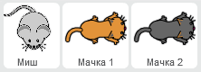

**Понашање лика Мачка 1**

Прво смо написали скрипте придружене лику *Мачка 1* и тестирали их, а затим умножили овај лик и минимално изменили придружене скрипте.

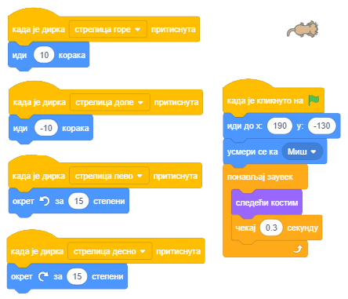

На самом почетку лик се усмерава према мишу и довољно је да га играч води дирком ↑ до освајања првог поена. У даљем току игре неопходно је да сам усмерава мачка према мишу коришћењем дирки ← и → које окрећу лик за по 15 степени лево и десно. Евентуално може да користи и дирку ↓ за враћање лика уназад.
За лик *Мачкa 2* скрипте за вођење су исте, једино су дирке измењене. W води лик напред, S назад, а A и D окрећу лик улево и удесно по 15 степени. И скрипта за почетак рада је скоро иста, једина разлика је што други лик иде у леви доњи угао, односно шаље се у тачку са координатама (-190,-130).

**Понашање лика Миш**

На следећој слици  приказана је скрипта придружена мишу. На самом почетку се миш поставља на случајно изабрану локацију.
Затим се улази у бесконачно понављање следећих акција.

1. Чека се да једна од мачака додирне миша

2. Миш се сакрива и појављује на другој случајно изабраној локацији

(у оквиру петље миш може да се појави и при горњој и доњој ивици екрана јер је интервал за вредност координате *у* сада [-150, 150])

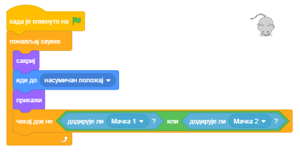

**Формирање сложеног услова**

Услов у наредби |cekaj_dok_ne| је сложен од два услова: мачак 1 додирује миша или мачак 2 додирује миша. 

Сложени услов се формира на следећи начин.

1. Из групе операција бирамо одговарајућу операцију – у нашем случају логичку операцију *или* |or|. 

2. У празне шестоугле постављамо одговарајуће услове, 

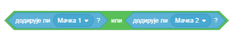

3. На крају овај сложени услов постављамо у блок "чекај док не". 

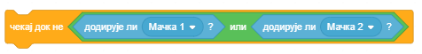

**Надоградња пројекта**

Надоградићемо овај пројекат тако што ћемо увести 2 променљиве: Играч 1 и Играч 2 које ће 
чувати број поена играча. Сваки додир миша рачунаће ће се играчу који води мачку која га је дотакла као поен. То ће се евидентирати у скрипти за миша.
Број поена оба играча моћи ће да се прати на екрану.
Такође ћемо увести тајмер који прекида игру по истеку задатог времена. Победник је играч који по истеку времена има више поена.

Дакле, да би се могли пратити поени играча, обе променљиве *Играч 1* и *Играч 2* треба да буду чекиране и да њихови монитори буду приказани у првом формату.

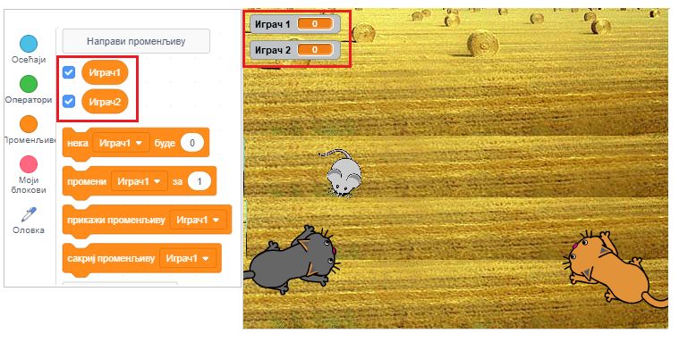

На почетку скрипте за миша треба поставити њихове почетне вредности на 0. Приликом сваког додира мачке треба повећати број поена.
Тако сада скрипта за миша има следећи изглед. 

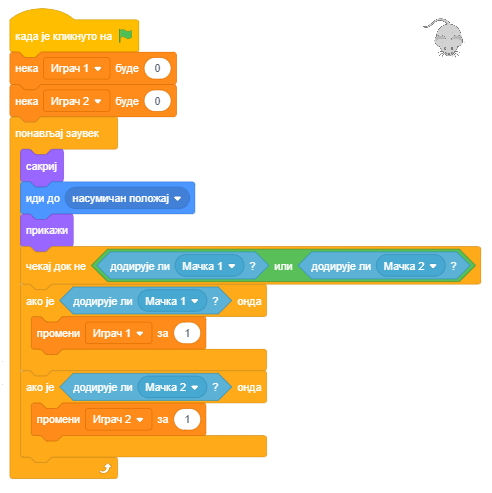

Остаје још да додамо ограничење времена за игру. То ћемо учинити тако што ћемо у скрипти која се покреће кликом на зелену заставицу поставити вредност проенљиве
*Време* на жељено трајање игре, на пример 120 секунди. Затим ћемо у циклусу који се понавља 120 пута извршавати наредбу |cekaj| и смањивати вредност променљиве за 1.
По изласку из циклуса поставићемо наредбу |zaustavi|. И ову скрипту придружићемо мишу.

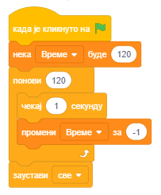

.....

Пример 2 - Игра  „Лавиринт”
~~~~~~~~~~~~~~~~~~~~~~~~~~~

.. level:: 2

У пројекту *Лавиринт* задатак је да се лик *Mouse 1* проведе кроз компликован лавиринт. Излаз из лавиринта налази се на врху позорнице, па је услов да се игра успешно заврши
да координата у лика буде већа од 180. Лик се води диркама са стрелицама. Ако удари у неки од зидова лавиринта који су црне боје, враћа се на полазну позицију.

У нашем ремиксу кретање миша ће се прецизније контролисати. Један притисак на дирку стрелица води га само 3 корака (а не 10 као у изворном пројекту).
Ударац у зид лавиринта неће се кажњавати враћањем на почетак, већ само одбијањем од зида као у *maze starter* пројекту (иде -2 корака). Пошто је миш врло често 
при окретању репом ударао о зидове, одсекли смо му реп (у едитору слика прво се реп селектује алатком *преобликуј*, па се избрише кликом на дирку *Del*).

Овако измењене скрипте за миша приказане су на следећој слици.

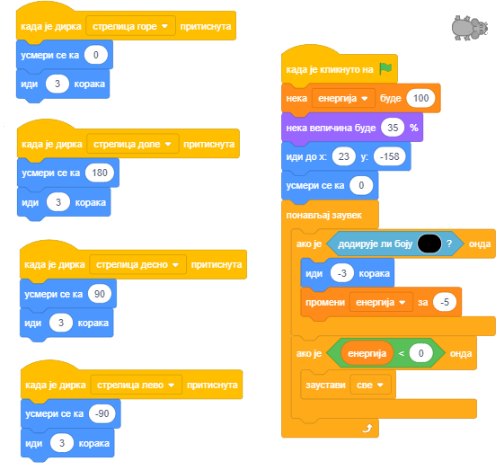

Међутим, игра није лакша, јер миш мора да избегава непријатеље: 2 отровне лоптице и духа лавиринта. 

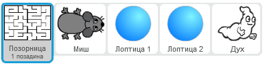

Лоптице се, као и миш, одбијају од зидова лавиринта, док дух може да пролази кроз зидове. 

Миш на почетку има 100 јединица енергије која се сваким ударом о зид лавиринта смањује за 5,
а додир непријатеља је још опаснији. Судар са лоптицом одузима 10 јединица енергије, а судар са духом 50.

Игра се успешно завршава ако миш стигне до излаза из лавиринта, а неуспешно ако у лавиринту остане без енергије.

**Понашање лоптице**

Лоптица је на почетку игре сакривена. Појављује се после 1 до 5 секунди од почетка игре, *Лоптица 1* на позицији (-120,0), а *Лоптица 2* на (165,55).

|   Док не додирне миша стално понавља следеће кретање: 
|          усмери се на случајан начин  и иде по 3 корака док не додирне зид лавиринта;
|                                       када додирне зид иде -3 корака и промени костим;
|   Кад додирне миша смањи му енергију за 10, сакрије се, чека 3 секунде и онда све поново.

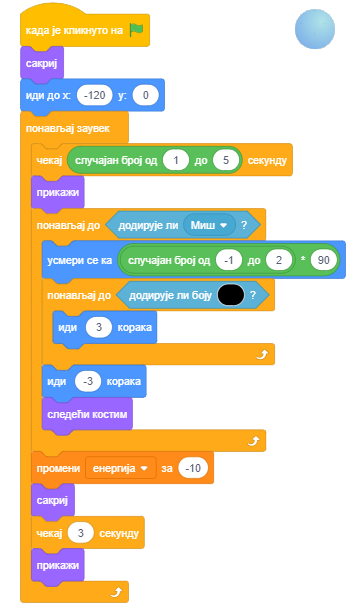

**Понашање духа**

Дух је на почетку игре такође сакривен. Појављује се после 5 до 10 секунди. Све док не додирне миша клизи по 5 секунди до случајно изабране позиције у горњој половини лавиринта.
Ако додирне миша одузима му 50 поена енергије, сакрива се и после чекања 5 до 10 секунди појављује се и понавља претходно описано кретање.

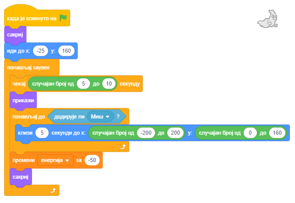

.....

Пројекат 3 - „Погоди мој број”
~~~~~~~~~~~~~~~~~~~~~~~~~~~~~~

.. level:: 2

Краљ у краљевству Осмица имао је 8 кћери. Када је дошло време да се његова мезимица, најмлађа принцеза уда упитао је каквог би младића желела за мужа. 

Принцеза је одлучила да ће за будућег мужа изабрати паметног младића који успе да реши све загонетке које пред њега постави. 

Прва од њих је била да са што мање питања погоди који број од 1 до 100 је замислила. 

На питање које би поставио кандидат одговарала је са: *Мој број је мањи*, *Мој број је већи* или *Браво, погодио си*.

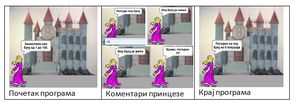

.. image:: ../_images/7/sl7_18.png
         :width: 370px   
         :align: center

**Надоградња у пројекат Погоди мој број2**

Принцези је учитељ математике рекао да паметним постављањем питања мора да се дође до одговора у највише 7 покушаја, 
па је принцеза одлучила да у ужи избор уђу само кандидати који из највише 7 покушаја погоде који број је замислила.

Да бисмо направили пројекат у коме принцеза поред провере да ли је њен број погођен броји и из колико покушаја је то урађено, 
направићемо још једну променљиву *покушај*. Њену вредност ћемо повећавати за 1 приликом сваког преузимања одговора корисника. 

Тако ћемо по изласку из циклуса тражења одговора имати евиденцију после колико питања је корисник успео да погоди замишљен број.
Принцеза ће, пошто каже из колико је покушаја број погођен, рећи и *То значи да си мудро играо* ако је број покушаја мањи од 8, 
односно *То значи да ниси решавао на најбољи начин* ако је број покушаја 8 или већи. 

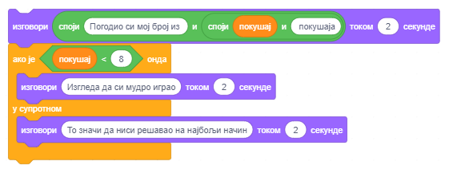

Следи пример пројекта који може да се користи као образовни програм за предшколце и
ученике нижих разреда основне школе који уз игре на рачунару уче да рачунају. Погодан је зато што мало старији ђаци кроз његово пројектовање и надоградње могу да добију идеје како да решавају сложеније математичке проблеме.

.....

Пример 3 - Пројекат „Мали математичар”
~~~~~~~~~~~~~~~~~~~~~~~~~~~~~~~~~~~~~~

.. level:: 3

У чаробној земљи живе мали чаробњак *Математичар*, *Број1*, *Број2* и *Знак* аритметичке операције. 
Сваки *Број* има 3 костима у облику бројева распоређених у строгом поретку: 1, 2, 3.
*Знак* има 2 костима у облику знакова аритметичких операција: * и +.

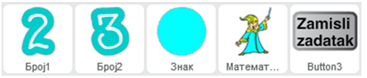

*Бројеви* и *Знак* воле да играју игру *Примери*: при сваком клику на дугме *Постави задатак* они на случајан начин, као кад неко баца новчић, 
бирају свој костим. Како год да се мењају *Бројеви* и *Знак* у примерима, *Математичар* их без грешке сабира и множи. 

Не зна се тачно који чаробњак га је томе научио, али прича се да *Математичар* трага за мајстором који би га научио да дели и одузима. 
Тајна *Математичара* састоји се у томе да сваки костим има не само име и слику него и редни број. То је обичан број, с којим се могу извршавати математичке операције.
*Математичару* је довољно да сазна који је редни број костима изабран у примеру за сваки *Број* и *Знак*.
Пошто смо већ видели да репортери знају све, *Математичару* је довољно да узме потребне репортере из групе *Осећаји*, блок потпуног гранања ``aко онда`` 
из групе *Управљање*, логички оператор једнакости и математичке операторе множења и сабирања из групе *Операције*.

У првој верзији пројекта корисник кликом на дугме *замисли* поставља задатак, а мали чаробњак га решава.

**Креирање ликова**

За лик математичара изабрали смо дечака чаробњака *Wizard Boy*, а за лик *Број1* цифру *1-Glow* из библиотеке ликова. 
Потом смо у картици *Костими* увели још два костима за *Број1* и то прво цифру *2-Glow*, а затим цифру *3- Glow*. 
Лик *Број2* направили смо као умножак лика *Број1*. Оба костима за лик *Знак* нацртана су у едитору слика (круг за множење и знак + за сабирање). 
Дугме *Замисли задатак* направили смо од дугмета *button-3* коме на првом костиму треба да дописати текст „Zamisli zadatak“.

.. sidebar:: Мали математичар сабира
    
   |matematicar2|

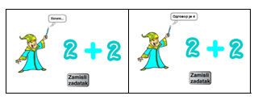
 
**Сценарио и скрипте за ликове**

На екрану лево стоји мали чаробњак, а десно један поред другог *Број1*, *Знак* и *Број2*. Дугме *Замисли задатак* налази се на дну екрана. 
Програм се покреће кликом на дугме *Замисли задатак* које тада шаље поруку "задатак". На поруку задатак реагују сви остали ликови: математачар тако што замишља „Хммм...“, 
а бројеви и знак тако што се показују у случајно изабраном костиму. Кликом на математичара појављује се стрип облачак са резултатом задате операције.
Ликови *Број1*, *Број2* и *Знак* имају само по једну скрипту – реакцију на догађај *Кад примим поруку задатак* са једном једином наредбом – *Замени костим са случајан број од 1 до 3* (1 до 2 за Знак).
Лик *дугме* реагује само када се кликне на њега. Тада мења костим (да се зна да је на њега кликнуто), шаље поруку, чека пола секунде и враћа се у првобитни изглед. 
Скрипте придружене бројевима и дугмету приказане су на следећој слици.

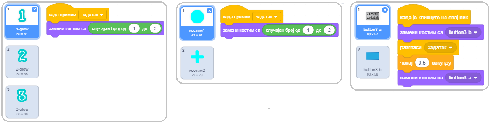

Скрипте које описују понашање математичара када прими поруку "задатак" и када се кликне на њега приказане су на следећој слици.

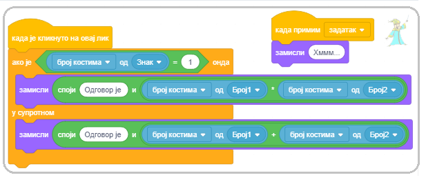

Задржимо се на другој скрипти математичара. Када се кликне на њега, он замишља резултат, а ево како долази до њега.
Као што смо рекли *Знак* се може појавити у два костима: Први костим – костим са редним бројем 1 одговара множењу, па ако је случајно генерисан број 1 математичар треба да помножи бројеве. 
Ако за знак није генерисан број 1, онда математичар треба да сабере бројеве. Слично, редни бројеви костима за *Број1* и *Број2* одговарају самим бројевима са којима математичар треба да изврши назначену операцију.
У тексту који се појављује у стрип облачцима користили смо операцију *повежи.*
Операција |povezi| је једна од операција која се може извршити над подацима типа стринг (ниска знакова). 
Она од две ниске знакова прави јединствену која садржи све знакове прве ниске на коју се надовезују сви знакови друге ниске. 

**Како се функцијски блокови умећу у функцијске блокове**

У нашој скрипти придруженој математичару поставили смо у поље за аргумент наредбе *замисли* операцију *повежи*. 
У прво поље операције повежи уписали смо текст "Одговор је ", а у друго поље операцију * (помножи), односно + (сабери). 
Затим смо у прво поље аритметичке операције унели број костима лика *Број1*, а у друго број костима лика *Број2*. Да ли је ово објашњење јасно?

Ако нисте сигурни како да ово урадите, погледајте детаљније објашњење 
 
.. reveal:: објашњење
   :showtitle: Прикажи објашњење
   :hidetitle: Сакриј објашњење
 
   У лекцији *Низање корака* направили смо класификацију блокова који се користе у Скречу и указали да се *Функцијски блокови* умећу у тзв. *Командне блокове*. 
   Како правимо сложеније пројекте, тако користимо и све сложеније функцијске блокове који се образују од више других функцијских блокова, као у примеру који управо описујемо. 
   Зато ћемо овом приликом сликом показати корак по корак како се формира сложени аргумент наредбе *замисли*. При том идемо уназад, с краја на почетак.
   
   Треба да добијемо: |izraz1|

   .. |izraz1| image:: ../_images/7/sl7_25.png
 
   1. **Како да добијемо** |izraz2| и |izraz3| 

   .. |izraz2| image:: ../_images/7/sl7_26.png

   .. |izraz3| image:: ../_images/7/sl7_27.png

   а) Узмемо блок  |parametar_lika| из групе блокова *Осећаји*. 

   б) Из листе ликова, коју добијемо кликом на троуглић у другом пољу, изаберемо *Број1* (односно *Број2*).

   в) Из листе параметара придружених овом лику, коју добијемо када кликнемо на троуглић у првом пољу, изаберемо *број костима*.

   2. **Како да добијемо**  |izraz6|

   .. |izraz6| image:: ../_images/7/sl7_30.png

   а) Узмемо блок |minus| из групе блокова *Операције*.

   б) Поставимо први репортер који смо добили по опису 1 у прво поље  |izraz7|.

   .. |izraz7| image:: ../_images/7/sl7_31.png

   в) Поставимо други репортер који смо добили по опису 1 у друго поље.

   3. **Како да добијемо** |izraz8|

   .. |izraz8| image:: ../_images/7/sl7_32.png

   а) Узмемо блок |povezi|  из групе блокова *Операције*.

   б) Упишемо текст "Одговор је " у прво поље |izraz9|. 

   .. |izraz9| image:: ../_images/7/sl7_33.png

   в) Поставимо аргумент који смо формирали по опису 2 у друго поље.

   Коначно, овако формиран аргумент поставимо у поље блока |zamisli|.

 
**Прва надоградња**

Ако желимо да се у пројекту ради са бројевима од 1 до 9, потребно је ликовима *Број1* и *Број2* додати костиме са редним бројевима 4 до 9 (редом цифре од *4-Glow* до *9-Glow*) и у њиховим скриптама у наредби ``замени костим`` са случајан број уместо „од 1 до 3“ поставити од „1 до 9“. 

**Друга надоградња**

Можемо надоградити пројекат тако да мали чаробњак на поруку *задатак* поставља одговарајуће питање кориснику, а потом саопштава да ли је одговор тачан или није. У овој верзији пројекта није потребно обрађивати догађај *клик на лик* математичара. 

Треба додати и објашњење како се програм користи. То можемо регулисати увођењем још једног дугмета на коме пише *Упутство*. Када се кликне на ово дугме шаље се порука *упутство* на коју реагују позадина и математичар. Позадина се мења у *Позадина2*, на којој је  исписано упутство за употребу програма, а математичар се смањује на 30% своје величине како не би заклањао упутство. 

.. image:: ../_images/7/sl7_34.png
         :width: 625px   
         :align: center

**Трећа надоградња**  

.. level:: 3

Ако осим сабирања и множења желимо да се ради и са операцијама одузимање и дељење, пројекат постаје значајно сложенији. За надоградњу је потребно лику *Знак* додати још 2 костима ``–`` за одузимање и ``:`` за дељење. Треба изменити и скрипту која описује понашање математичара када се кликне на њега. 
 	 	 
.. image:: ../_images/7/sl7_35.png
         :width: 625px   
         :align: center    

Подразумева се да корисник зна шта су негативни бројеви. Код дељења треба обезбедити да резултат буде цео број и избећи дељење нулом. 
Зато ћемо разгласити поруку *подели* ако се приликом генерисања операције открије да је то дељење, а у свим осталим случајевима ћемо радити као у претходним верзијама пројекта.

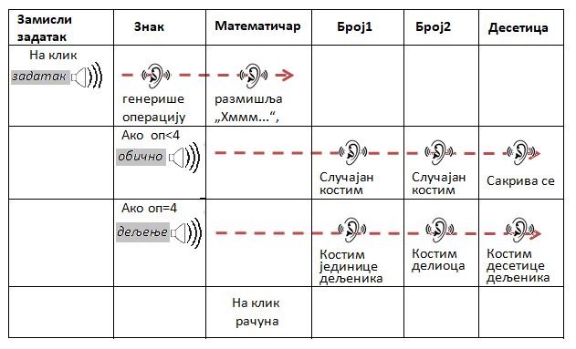

Дакле, када се кликне на дугме *Замисли задатак* оно шаље поруку "задатак" на коју реагују *Математичар* и *Знак*. 
*Математичар* размишља „Хммм...“, а *Знак* генерише случајан број од 1 до 4 и приказује се у одговарајућем костиму (1 – множење, 2 – сабирање, 3 – одузимање, 4 – дељење). 

За све операције осим дељења *Знак* шаље поруку "обично". Ако се ради о дељењу, разглашава поруку "подели" која покреће скрипту за израчунавање количника два броја и завршава се слањем поруке "дељењe". 
На поруке које шаље *Знак* реагују *Број1* и *Број2* . 

Ликови *Број1* и *Број2* на поруку "обично" реагују као у претходним верзијама пројекта, односно приказују се у једном од случајно изабраних костима од 1 до 9. 
Међутим, ако се ради о дељењу, начин постављања задатка је сасвим другачији, иде се од резултата ка бројевима који га образују. 
Наиме, у процедури *Дели* генеришу се два случајна броја из интервала [1,9]. Први од њих додељује се променљивој *количник*, а други променљивој *делилац*. Резултат њиховог множења је променљива *дељеник*. 

Вредност променљиве *дељеник* додељује се лику *Број1*, а вредност променљиве *делилац* лику *Број2*. 
Тако математичар дељењем дељеника са делиоцем сигурно добија целобројну вредност количника из интервала [1,9]. 

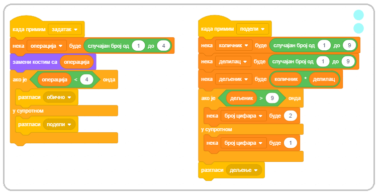
         
Овакав начин генерисања задатака - од резултата ка операндима, користићемо и у другим пројектима. Тако можемо да обезбедимо да корисник добије задатак који уме да реши, на пример, да при одузимању не добије негативан резултат или да резултат множења буде до 50, а да фактори могу да буду и већи бројеви и слично.

Нови проблем у оваквом решењу задатка је то што ће дељеник вероватно бити двоцифрен број, а може се завршавати и цифром 0, која у претходним пројектима није била укључена у костиме за *Број1*. 
Проблем решавамо тако што уводимо још један лик, умножак лика *Број1*, који смо назвали (цифра) *Десетица*, а лику *Број1* додајемо нулу као 10. костим. Подразумева се да се лик *Дестица* не види, појављује се једино када *Знак* пошаље поруку *дељење*, а претходно израчунати дељеник је двоцифрен број (што детектује променљива број цифара). 
Тада лик *Број1* добија вредност цифре јединица дељеника, а лик *Десетица* се појављује лево од лика *Број1*. 

За издвајање цифара дељеника користимо операцију |slovo| која издваја знак са наведеним редним бројем из стринга. 

Како Скреч врши аутоматску конверзију података из нумеричких у стринг и обратно, цифре вишецифрених бројева се сасвим једноставно издвајају овом операцијом и засад није неопходно објашњавати шта је целобројно дељење ни која операција враћа остатак при целобројној деоби.

На следећим сликама приказане су скрипте придружене ликовима *Број1*, *Број2* и *Знак*.

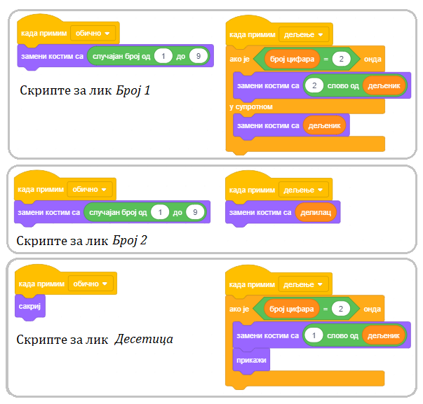

|pitaj| Одговори на следећа питања
----------------------------------

Питање 1
~~~~~~~~~
.. level:: 1

.. fillintheblank:: ai11
		    
      .. image:: ../_images/7/pit7_1.png
        :width: 150px   
        :align: center 
        
      Колика је вредност променљиве *а* по извршењу наредби: |blank|

      -   :4: Тачно
          :x: Наредба доделе вредности 5 променљивој а се извршава без обзира да ли је услов гранања испуњен или не.
  

Питање 2
~~~~~~~~~

.. level:: 1

.. fillintheblank:: ai13
		    
      .. image:: ../_images/7/pit7_2.png
        :width: 180px   
        :align: center      

      Колика је вредност променљиве а по извршењу наредби: |blank|

      -   :0: Тачно
          :x: Наредба доделе вредности 5 променљивој а се извршава без обзира да ли је услов гранања испуњен или не.

Питање 3
~~~~~~~~~

.. level:: 1

.. fillintheblank:: ai14
		
      .. image:: ../_images/7/pit7_3.png
        :width: 190px   
        :align: center   
        
      Колика је вредност променљиве y по извршењу наредби: |blank|

      -   :-2: Тачно
          :x:  Наредба доделе вредности 5 променљивој а се извршава без обзира да ли је услов гранања испуњен или не.

Питање 4
~~~~~~~~~

.. level:: 1

.. fillintheblank:: ai15
		            
      .. image:: ../_images/7/pit7_4.png
         :width: 190px   
         :align: center      

      Колика је вредност променљиве y по извршењу наредби: |blank|

      -   :180: Тачно
          :x:  Наредба доделе вредности 5 променљивој а се извршава без обзира да ли је услов гранања испуњен или не.

Питање 5
~~~~~~~~~

.. level:: 2

.. mchoice:: ai16
   :multiple_answers:
   :answer_a: 
   :answer_b: 
   :answer_c:
   :correct: a
   :feedback_a: 
   :feedback_b: 
   :feedback_c: 
   

   Који од следећих низова наредби размењује вредности променљивих а и b? (Изабери све тачне одговоре)
   
   .. image:: ../_images/7/pit7_5.png
         :width: 500px   
         :align: center      
   
Питање 6
~~~~~~~~~

.. level:: 2

.. mchoice:: for10a
   :answer_a: 6 и 6
   :answer_b: 3 и 3
   :answer_c: 6 и 3
   :answer_d: 3 и 6
   :correct: c
   :feedback_a:  
   :feedback_b: 
   :feedback_c: Тачно.
   :feedback_d: 

   Шта изговара лик по извршењу низа a) а шта по извршењу низа b) наредби?

   .. image:: ../_images/7/pit7_6.png
     :width: 450px   
     :align: center

Питање 7
~~~~~~~~~

.. level:: 2

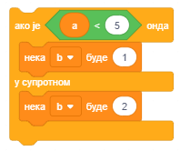
   
.. mchoice:: if08a
   :multiple_answers:
   :answer_a: a=5
   :answer_b: a=0
   :answer_c: a=10
   :answer_d: a=4
   :correct: b, d
   :feedback_a: 
   :feedback_b: 
   :feedback_c: 
   :feedback_d: 

   За које вредности променљиве *а* ће променљива *b* добити вредност 1? (Изабери све тачне одговоре).

Питање 8
~~~~~~~~~

.. level:: 2

.. mchoice:: if09a
   :multiple_answers:
   :answer_a: a=5 b=10
   :answer_b: a=0 b=-1
   :answer_c: a=10 b=5
   :answer_d: a=4 b=4
   :correct: a
   :feedback_a:  
   :feedback_b: 
   :feedback_c: 
   :feedback_d: 

   За које вредности променљивих *а* и *b* ће променљива *min* добити вредност променљиве *a*? (Изабери све тачне одговоре).

   .. image:: ../_images/7/pit7_8.png
      :width: 200px   
      :align: center

Питање 9
~~~~~~~~~

.. level:: 2
   
.. fillintheblank:: if11a

      .. image:: ../_images/7/pit7_9.png
        :width: 200px   
        :align: center
          
      Коју вредност ће имати променљива *a* после извршења наредбе условног преласка ако су претходно вредности променљивих *а* и *b* биле: a=4 и b=2? |blank|

      -   :да: Тачно
          :x: Наредба доделе вредности 5 променљивој а се извршава без обзира да ли је услов гранања испуњен или не.

Питање 10
~~~~~~~~~

.. level:: 2

.. mchoice:: if12
   :answer_a: да
   :answer_b: не
   :correct: b
   :feedback_a: За а=0 прва променљивој b додељује вредност 5, а друга вредност 2. 
   :feedback_b: Тачно.
        
   Да ли ове две наредбе условног гранања увек обављају исти посао?
   
   .. image:: ../_images/7/pit7_10.png
      :width: 400px   
      :align: center
   
Питање 11
~~~~~~~~~

.. level:: 2

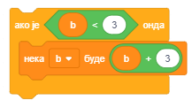

.. mchoice:: if13a
   :answer_a: b=5
   :answer_b: b=2
   :answer_c: b=6
   :answer_d: b=3
   :correct: a
   :feedback_a: Тачно. 
   :feedback_b: 
   :feedback_c: 
   :feedback_d: 

   Коју вредност ће имати променљива *b* после извршења наредбе условног преласка ако је претходно вредност променљиве *b* била b=2?  

.. mchoice:: if13b
   :answer_a: b=5
   :answer_b: b=2
   :answer_c: b=6
   :answer_d: b=3
   :correct: d
   :feedback_a:  
   :feedback_b: 
   :feedback_c: 
   :feedback_d: Тачно. 

   Коју вредност ће имати променљива *b* после извршења наредбе условног преласка ако је претходно вредност променљиве *b* била b=3?  

Питање 12
~~~~~~~~~

.. level:: 3

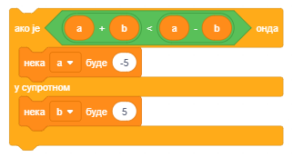

.. dragndrop:: if16
    :feedback: Покушај поново
    :match_1: a=2 b=1|||a=2 b=5
    :match_2: a=2 b=-2|||a=-5 b=-2
    :match_3: a=-2 b=1|||a=-2 b=5
    :match_4: a=-2 b=-1|||a=-5 b=-1
        
    Превлачењем упари почетне вредности променљивих са вредностима по извршењу наредбе условног преласка.

|pokusaj| Покушај
-----------------

Вежба 1
~~~~~~~

.. level:: 1

.. infonote::

  Напиши низ наредби који:

  1. размењује вредности две променљиве;

  2. одређује који је број већи од два броја која се уносе са улаза;

  3. одређује минимум три броја који се уносе са улаза.
  
.....

Вежба 2
~~~~~~~

.. level:: 1

.. infonote::

  Провери у Скречу да ли следећи низови наредби размењују вредности променљивих **х** и **у** без обзира које су њихове почетне вредности. 

  .. image:: ../_images/7/vezba7_2.png
         :width: 400px   
         :align: center 

  Шта се дешава ако је х=0 или у=0?

.....

Вежба 3
~~~~~~~

.. level:: 2

.. infonote::

  Напиши програм у коме се понавља следећи низ корака:
  
  - лик тражи од корисника да унесе природан број и затим изговара
  - који број је претходник, 
  - који број је следбеник, 
  - који број је двоструко већи и
  - који број је двоструко мањи од унетог броја.

  Понављање прекинути када корисник унесе број 0.
   
.....

Вежба 4
~~~~~~~

.. level:: 2

.. infonote::

  Напиши програм у коме се понавља следећи низ корака:
  
  - лик тражи од корисника да унесе два цела броја **х** и **у** различита од нуле и затим изговара
  - збир бројева "х" и "у" је "х+у", 
  - разлика бројева "х" и "у" је "х-у", 
  - производ бројева "х" и "у" је "х*у" и
  - количник бројева "х" и "у" је "х/у".

  при чему уместо променљивих наведених под знацима навода треба да стави њихове вредности.

  Понављање прекинути када корисник унесе број 0 било као вредност **х**, било као вредност **у**.
   
.....

Вежба 5
~~~~~~~

.. level:: 3

.. infonote::

  1. Дат је израз  **16 : 8 : 4 : 2**. Колика је његова вредност? Запиши га у Скречу и провери.

  2. Дописивањем два пара заграда на различите начине, добијају се изрази са различитм вредностима. Одреди све могуће вредности које се на тај начин могу добити.
  
  3. За сваки од начина запиши израз у Скречу и провери да ли си добро израчунао његову вредност.

  **Помоћ.** Дописивањем заграда добијају се следећи изрази:  ``((16 : 8) : 4) : 2``

  ``(16 : (8 : 4)) : 2``  ``(16 : 8) : (4 : 2)``  ``16 :((8 : 4) : 2)``  ``16 : (8 : (4 : 2))``
 

|bug| Исправи грешке
--------------------
   
Грешка 1
~~~~~~~~

.. level:: 1

:Питање:
   Ученик је желео да измени понашање мачка када дотакне миша у пројекту *Лов* тако да мачак пошто дотакне миша почене да иде у круг (360 пута иде 1 корак и окрене се за један степен).
   Мачку је придружио скрипте приказане на следећој слици, али када је тестирао пројекат видео је да се мачак после додира миша не окреће. У чему је грешка?

.. image:: ../_images/7/greska7_1.png
   :width: 500px   
   :align: center

.. reveal:: сакривање15
   :showtitle: Прикажи одговор
   :hidetitle: Сакриј одговор
 
   **Одговор:**
     
   Услов се проверава само непосредно по клику на зелену заставицу. Потребно је да се проверава стално, значи условну наредбу треба поставити у бесконачан циклус.

Грешка 2
~~~~~~~~
.. level:: 2

:Питање:
   Ученик је желео да направи једноставнију верзију пројекта лавиринт без променљивих, па је у случају додира зида лавиринта (црне боје) миша враћао на полазну позицију (23,-158).
   Међутим, миш је ударао у зидове лавиринта и када то ученик није очекивао. У чему је грешка?
   
.. image:: ../_images/7/greska7_2.png
   :width: 300px   
   :align: center

.. reveal:: сакривање1
   :showtitle: Прикажи одговор
   :hidetitle: Сакриј одговор
 
   **Одговор:**

   Лик се креће пре но што се усмери где треба, па прави кораке у смеру који је постављен претходно извршеном наредбом усмеравања. 

Грешка 3
~~~~~~~~
.. level:: 2

:Питање:
   И овај програм требало је да враћа миша на почетак увек када би дотако зидове лавиринта. Међутим, то се некад дешавало, а некада није. У чему је грешка?
   
.. image:: ../_images/7/greska7_3.png
   :width: 270px   
   :align: center

.. reveal:: сакривање2

   :showtitle: Прикажи одговор
   :hidetitle: Сакриј одговор
 
   **Одговор:**

   Блок *ако онда* унутар кога се проверава да ли лик додирује лавиринт налази се унутар блока који проверава да ли је притиснута стрелица лево, а треба да се налази иза њега. Овако се услов додира проверава једино ако лик иде улево.

|knjiga| Шта смо научили
------------------------

У овој лекцији научили смо како се креирају и користе променљиве. Такође смо представили блокове из групе *Операције* и показали како се граде сложени функцијски блокови. Пројекти које смо обрадили као примере имају сложену структуру – састављени су комбиновањем основних елемената програмске логике. Открити логичке грешке у таквим пројектима није лако. Зато ћемо у наредним поглављима показати начине како се развој и тестирање пројеката може олакшати поделом великих скрипти у процедуре - логичке делове од којих сваки обавља једну функцију

**Примери пројеката**: 7Studio_

.. _7Studio: https://scratch.mit.edu/studios/24292043/

**Појмови**: променљива - проста, сложена, локална, глобална.

**Наредбе**: |promenljive| - |neka_var|, |promeni_var|, |pokazi_var| , |sakrij_var|; |osecaji| - |dodiruje_boju|, |parametar_lika|; |operatori| -  |or|, |mod|, |povezi|, |funkcija|

|project| Уради неки од следећих пројеката
------------------------------------------

Пројекат 1 - „Калкулатор”
~~~~~~~~~~~~~~~~~~~~~~~~~

.. level:: 1

Започни нови пројекат који ћеш назвати *Калкулатор*, у којем ћеш направити калкулатор за 4 основне рачунске радње – сабирање, одузимање, множење и дељење. За ову вежбу биће вам потребни следећи ликови: Дугме са знаком +, Дугме са знаком -, Дугме са знаком * и Дугме са знаком /. 

Осим тога, у апликацији ће ти бити потребне и следеће променљиве: улазне вредности *x* и *y*  и *Резултат*.

Пројекат формирај на следећи начин:

1) За позадину нацртај правоугаоник у чијем горњем левом углу пише: „КАЛКУЛАТОР“
2) Направи све потребне променљиве и распореди их на калкулатор.
3) Убаци ликове за 4 дугмета помоћу којих ћеш извршавати рачунске операције и распореди их на калкулатор.
4) За свако од дугмади направи следећу скрипту: када се на дугме кликне мишем извршава се одговарајућа рачунска операција.
5) Тестирај резултат. 

Калкулатор вероватно добро ради, али није очигледно која операција је последња извршена. 

Зато промени калкулатор, тако да дугме које је последње притиснуто промени боју у црвено (што ће бити знак да је резултат који видимо резултат управо те операције). 

Упутство: Мораш направити још по један костим за свако дугме. Нека дугме у новом костиму буде црвено. Када се кликне на дугме, скрипта би требало да пошаље поруку „Нова операција“, а затим да промени костим у црвени. 
Осим тога, свако дугме мора да има и једну скрипту која ослушкује поруке и када прими поруку „Нова операција“, да промени свој костим у првобитни костим.

Пројекат 2 - Програм на основу блок дијаграма
~~~~~~~~~~~~~~~~~~~~~~~~~~~~~~~~~~~~~~~~~~~~~

.. level:: 1

Направи програм у Скречу који одговара следећем алгоритму.

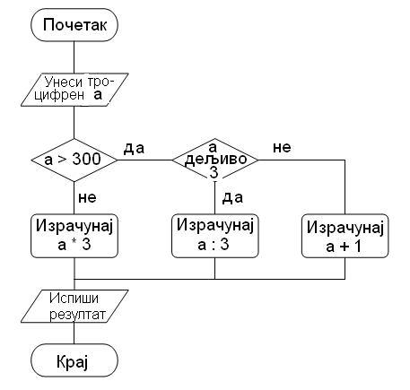

Одреди резултат извршавања тог програма за а = 157;  а = 342;  а = 529. 

Колико цифара ће имати резултат који се добије извршавањем задатог програма? 

Да ли број цифара резултата зависи од улазне вредности троцифреног броја а? 

Измени дати програм тако да се као резултат увек добија двоцифрен број.  

Пројекат 3 - „Трка аутомобила”
~~~~~~~~~~~~~~~~~~~~~~~~~~~~~~

.. level:: 2

Започни нови пројекат који ћеш назвати „Трка аутомобила“, у којем ћеш направити игрицу за два играча. 
На позорници треба да буду 3 лика: 2 аутомобила и капија на којој пише „Циљ“. 
Сваки аутомобил може да се креће напред-назад и да ротира у смеру казаљке на сату и у смеру супротном казаљки на сату. 

Управљачки тастери за први аутомобил су:

- Стрелица на горе - Ауто иде право напред
- Стрелица на доле - Ауто иде право назад
- Стрелица лево - Ауто ротира у смеру супротном казаљки на сату
- Стрелица десно - Ауто ротира у смеру казаљке на сату

Управљачки тастери за други аутомобил су:

- W	-	Ауто иде право напред
- S	-	Ауто иде право назад
- А	-	Ауто ротира у смеру супротном казаљки на сату
- D	-	Ауто ротира у смеру казаљке на сату

Пошто направиш скрипте за први аутомобил, клонирај га и направи неопходне измене у називима тастера и изгледу самог аутомобила. 
Циљна капија се појављује на позорници на случајно изабраној локацији. Аутомобили уз помоћ управљачких тастера возе до циља.
Ко први додирне циљ добија 1 поен. Када ауто додирне циљ, капија нестаје са позорнице и појављује се на новој случајно изабраној локацији 
(води рачуна о димензијама позорнице и координатама доње-леве и горње-десне тачке). 
Аутомобили сада возе према новом циљу. Ко први додирне капију добија 1 поен. Капија опет нестаје и појављује се на новој локацији.... И тако у круг.
Аутомобил који први сакупи 30 поена је победник. Трка се зауставља и на Позорници се исписује порука: „Победник је Играч 1“ или „Победник је Играч 2“. 
Да би се пратили поени сваког аутомобила, потребно је увести променљиве *Играч1* и *Играч2*. За праћење координата циљне капије, уведи променљиве *кx* и *кy*.

