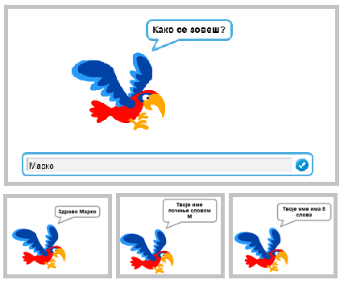
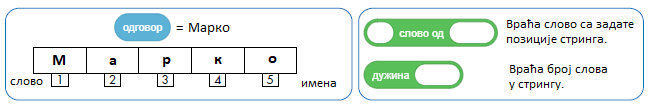
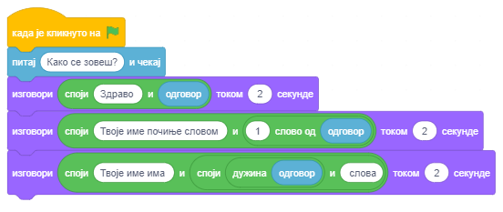
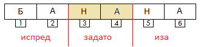
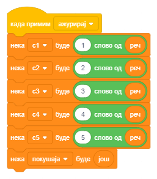
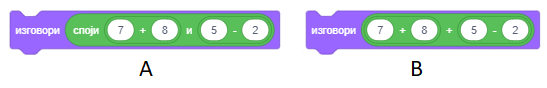
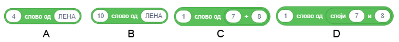

Стрингови
=========

.. include:: blokovi3.txt

.. include:: ikone3.txt

.. infonote::

 |paleta10|

У овој лекцији ћемо показати како се променљиве типа стринг могу користити за решавање различитих типова задатака. Уједно ћемо научити како Скреч памти стрингове и функције блокова који се користе за операције са стринговима.

Стринг представља низ карактера који се третирају као јединствени податак. Стрингови имају велику примену у програмирању. Можемо да креирамо програме који комбинују, пореде, сортирају, шифрују и на друге начине обрађују текст. Притом треба имати на уму да се и бројеви могу третирати као стрингови, али у том случају не радимо са вредностима које представљају већ знаковима – цифрама од којих се састоје. 

.. topic:: Операције над стринговима

 Да бисмо боље разумели операције над стринговима, уз сваку ћемо навести резултат који враћа ако се користи над стринговима s1=БАНАНА и s2=АНА. 
  
 У програмским језицима се често користе следеће операције над стринговима:

 - одређивање дужине стринга
      ``дужина s1`` → 6

 - поређење стрингова 
      утврђивање који је пре у алфабетском уређењу

      ``s1<s2 ?`` → false 

      није тачно јер је „БАНАНА“ алфабетски иза „АНА“,

 - повезивање стрингова 
      ``повежи s1 и s2`` →БАНАНААНА,

 - издвајање знака који се налази на задатој позицији
      ``слово 3 од s1`` → Н,

 - садржи?
      провера да ли стринг s1 садржи стринг s2

      ``s2 у s1 ?`` → true 

      тачно јер се „АНА“ садржи у „БАНАНА“,

 - позиција 
      утврђивање прве позиције у стрингу на којој се налази други стринг

      pos(s1,s2): ``позиција s2 у s1`` → 2,

 - копирање 
      прављење новог стринга који се формира од задатог броја знакова d почев од задате позиције p у полазном стрингу

      copy(s,p,d): ``копирај из s1 знакова 4 почев од 3`` → НАНА,

 - брисање 
      измена стринга s1 брисањем, почев од позиције p, задатог броја знакова d из полазног стринга

      delete(s1,p,d): ``обриши из s1, почев од позиције 3, 2 знака`` → БАНА,

 - уметање 
      измена стринга s1 уметањем стринга s2 у стринг s1 почев од задате позиције p

      insert(s1,s2,p): ``уметни s2 у s1 почев од 3`` → БААНАНАНА.

 Последње четири операције нису уграђене у Скреч, али ћемо у примеру „Стринг операције” показати како их сами можемо реализовати.

  

|prouci| Проучи следеће примере пројеката
-----------------------------------------

Пример 1 - Пројекат „Папагај”
~~~~~~~~~~~~~~~~~~~~~~~~~~~~~

.. level:: 1

Главни лик овог пројекта папагај. Он прво пита корисника како се зове и чека све док корисник не откуца своје име и притисне дирку *Enter* или кликне на знак за чекирање у десном углу поља за одговор.
Затим поздравља корисника по имену, па му каже које је прво слово његовог имена и колико укупно слова има име. Разговор лика и корисника приказан је на следећој слици.  

За креирање овог пројекта коришћене су операције помоћу којих смо издвојили прво слово из имена и утврдили колико слова има у имену.

По извршењу наредбе |pitaj_cekaj| Скреч памти низ знакова које је корисник унео у простору који се зове |odgovor|.

На следећој слици приказано је како се памти одговор и помоћу којих операција се из њега издвајају подаци које лик саопштава као излазне податке наредбом ``изговори``.

Трећа операција која је употребљена за формирање излазне поруке је |povezi|.

Скрипта пројекта *Папагај* приказана је на следећој слици. 

.....

Следи пројекат у коме се показује како се коришћењем стринг операција могу издвајати 
цифре броја.

Пример 2 - Пројекат „Замени цифре”
~~~~~~~~~~~~~~~~~~~~~~~~~~~~~~~~~~

.. level:: 2

**Сценарио пројекта**

Главни део овог пројекта је скрипта која замењују места цифри јединица и цифри стотина у природном троцифреном броју *x* који се уноси са улаза.

Лик водитељ тражи од корисника да унесе троцифрен број. При том се врши провера да ли је заиста унет троцифрен број.
Ако није, понавља се захтев за улаз све док се заиста не унесе троцифрен број. Затим се издвајају прва и трећа цифра, 
па се прави број *замењен* са замењеним цифрама јединица и стотина. Број се формира помоћу две операције |povezi|. 
На крају водитељ изговара  изворни број и број са замењеним цифрама јединица и стотина.

Скрипта пројекта приказана је на следећој слици.

.. image:: ../_images/10/sl10_4.png
   :width: 700px   
   :align: center

.....

У наредном пројекту проверава се да ли је унета реч палиндром. *Палиндром* је реч или речиница која исто гласи било да се чита слева удесно или здесна улево. На пример, реч "потоп" је палиндром. Слично се дефинише и број који је палиндром. На пример, број 12321 је палиндром. 

Пример 3 - Пројекат „Палиндром”
~~~~~~~~~~~~~~~~~~~~~~~~~~~~~~~

.. level:: 3

Лик водитељ тражи од корисника да унесе реч. Променљива *d* добија као вредност дужину речи.
Пореде се прво и последње слово речи, друго и претпоследње и тако редом све до средине речи.
Променљива *i*, чија је почетна вредност 0 и повећава се за 1 у оквиру циклуса, омогућава
да се следећом провером изврше ова поређења.

.. image:: ../_images/10/sl10_5.png
   :width: 430px   
   :align: center

Променљивља *p* указује на број провера. Уколико се при некој од провера покаже да одговарајућа слова нису једнака,
реч није палиндром и то се региструје доделом 0 променљивој *pal* (која је на почетку постављена на 1).
После провере свих парова слова исписује се порука да ли је реч палиндром (*pal* = 1 јесте, у супротном није).

Скрипта пројекта *Палиндром* приказана је на следећој слици.

.. image:: ../_images/10/sl10_6.png
   :width: 525px   
   :align: center

.....

Пример 4 - Пројекат „Стринг операције”
~~~~~~~~~~~~~~~~~~~~~~~~~~~~~~~~~~~~~~

.. level:: 3

У овом пројекту од корисника се тражи да избере једну од операција: копирање (copy) или брисање (delete). У зависности од тога шта је тражио, захтевају се улазни подаци, па се исписује резултат операције. Задавање операције врши се кликом на одговарајуће дугме, које затим разглашава операцију. Када се прими порука о изабраној операцији, покреће се скрипта која је реализује.
У пројекту учествују два лика: дугме *Copy* за копирање и *Delete* за брисање. 
Скрипта која реализује брисање је нешто једноставнија. На основу унетих вредности за број знакова и позицију од које се узимају формира се нови стринг s2. Он је на почетку празан, а формира се додавањем једног по једног знака из задатог дела полазног стринга.
 

   
Скриптe придруженe добијaњу поруке *Copy* приказане су на следећој слици. Уношење података и формирање излазне поруке издвојене су у засебне процедуре. Сличне процедуре се користе и при обради захтева *Delete*. 
 
.. image:: ../_images/10/sl10_8.png
   :width: 625px   
   :align: center
   
Скрипта за брисање ради супротно – од делова испред и иза означених знакова формира нови стринг. Опет се започиње од празног стринга. Прво му се допишу знакови из дела *испред*, а затим се на њих надовежу знакови из дела *иза*. Скриптe придруженe добијaњу поруке *Delete* приказане су на следећој слици.

.. image:: ../_images/10/sl10_9.png
   :width: 635px   
   :align: center 

.....

Наредни пројекат, игра „Вешала”, представља ремикс пројекта „Hangman” из књиге *Научи да програмираш у Скречу* (engl. *Learn to program with Scratch*, Majed Marji).  Код нас је игра прилагођена српском језику јер се погађају речи које су исписане ћирилићним писмом. Кроз њено програмирање ћеш утврдити знање о раду са листама и користити операције за рад са стринговима, али то није једини разлог што је обрађујемо као пример. Корисна је и зато што ћеш кроз њено играње морати да проналазиш на тастатури наша слова (љ, њ, ш, ђ, ж, ч, ћ и џ) будући да смо у списак речи за погађање уврстили управо речи које садрже ова слова. Игру треба покренути у режиму презентације, да дијалошки прозор за уношење података не би прекривао погођена слова.

Пример 5 - Игра „Вешала”
~~~~~~~~~~~~~~~~~~~~~~~~

.. level:: 3

Рачунар "замишља" једну реч од 5 слова из речника (који се чува као листа) и приказује је као низ од 5 звездица. 
Корисник погађа слова те речи.

- Ако погоди, слово замењује звездицу на свим позицијама у речи на којима се налази.
- Ако промаши, црта се део тела на "вешалима": глава, тело,... 

Сме да промаши највише 7 пута јер је при 8. промашају "обешен", односно игра је завршена.

**Позадина и ликови пројекта**

Позадина је наменски направљена за овај пројекат. На њој се налази наслов игре и порука "Преостало покушаја".
Придружена јој је и скрипта за постављање почетних вредности променљивих приликом покретања нове игре.

У игри учествују три лика: "обешен", "нова" и "исход". 

Лик "обешен" има 8 костима који се смењују при сваком промашају корисника.

.. image:: ../_images/10/sl10_11.png
   :width: 755px   
   :align: center

Скрипте које су му придружене су сасвим једноставне.

.. image:: ../_images/10/sl10_12.png
   :width: 365px   
   :align: center

Лик "нова" је дугме. Клик на њега, као и клик на зелену заставицу доводи до разглашавања поруке *Нова игра*. 

.. image:: ../_images/10/sl10_13.png
   :width: 255px   
   :align: center

Логика програма уграђена је у лик "исход". Он је на почетку скривен и појављује се тек по завршетку погађања речи.
Ако је корисник успео да погоди реч са мање од 7 промашаја исход се појављује у првом костиму који представља победу.
Ако то није случај, појављује се у другом костиму који представља пораз.

.. image:: ../_images/10/sl10_14.png
   :width: 900px   
   :align: center

Скрипте придружене овом лику представљене су на следећој слици.

.. image:: ../_images/10/sl10_15.png
   :width: 540px   
   :align: center

|pitaj| Одговори на следећа питања
----------------------------------

Питање 1
~~~~~~~~

.. level:: 1

.. mchoice:: стринг1
   :answer_a: да
   :answer_b: не
   :correct: a
   :feedback_a: Тачно. 
   :feedback_b: 
   
    Да ли стринг може садржати знакове аритметичких операција?

Питање 2
~~~~~~~~

.. level:: 1

.. mchoice:: стринг2
   :answer_a: Л
   :answer_b: Е
   :answer_c: Н
   :answer_d: А
   :correct: b
   :feedback_a: To je слово 1.
   :feedback_b: Тачно.
   :feedback_c: То је слово 3.
   :feedback_d: То је слово 4.
   
   Шта ће бити резултат операције ``слово 2 од ЛЕНА``?
   
Питање 3
~~~~~~~~

.. level:: 1

.. mchoice:: стринг3
   :answer_a: да
   :answer_b: не
   :correct: b
   :feedback_a:  
   :feedback_b: Тачно.
   
    Да ли ће стринг изговорити исто при извршавању наредби А и В?
    
    
Питање 4
~~~~~~~~

.. level:: 1

.. mchoice:: стринг4
   :answer_a: Л
   :answer_b: ЛЕНА
   :answer_c: 4
   :answer_d: дужина ЛЕНА
   :correct: c
   :feedback_a: То би се добило коришћењем операције слово од.
   :feedback_b: 
   :feedback_c: Тачно.
   :feedback_d: То би се добило повезивањем ове две речи.
   
   Шта ће бити резултат операције ``дужина ЛЕНА``?

Питање 5
~~~~~~~~

.. level:: 1

.. mchoice:: стринг5
   :answer_a: БАНА
   :answer_b: БАНАНА
   :answer_c: НАБАНА
   :answer_d: НАНАБА
   :correct: b
   :feedback_a: 
   :feedback_b: Тачно.
   :feedback_c: 
   :feedback_d: 
   
   Шта ће бити резултат операције ``споји БА и НАНА``? 

Питање 6
~~~~~~~~

.. dragndrop:: стринг6
    :feedback: Покушај поново
    :match_1: A|||A
    :match_2: B|||ништа не враћа
    :match_3: C|||1
    :match_4: D|||7
       
    Превлачењем упари наредбе са вредностима које ће вратити.     
   

|pokusaj| Покушај
-----------------

Вежба 1 - Цифре троцифреног броја
~~~~~~~~~~~~~~~~~~~~~~~~~~~~~~~~~

.. level:: 1

.. infonote::

 Напиши програм којим се издвајају цифре троцифреног броја. Водитељ тражи од корисника да унесе троцифрен број, а онда му саопштава која је цифра стотина, која десетица, а која јединица тог броја.

 **Упутство**. Користи операцију |slovo|. 

.....
 
Вежба 2
~~~~~~~
.. level:: 2

.. infonote::

  Састави програм којим се од датог природног броја n формира број са истим цифрама, али у обрнутом поретку.

.....

Вежба 3
~~~~~~~
.. level:: 2

.. infonote::

  Напиши програм који за дати природан број n (1<= n <1000) одређује збир цифара и број цифара. На пример:
 
  - n =12 збир цифара је 3, број цифра је 2; 

  - n =102 збир цифара је 3, број цифра је 3.  

.....

Вежба 4
~~~~~~~
.. level:: 3

.. infonote::

  Напиши програм који у листу уписује све троцифрене Армстронгове бројеве. Број је Армстронгов ако је једнак збиру кубова својих цифара.

    
|knjiga| Шта смо научили
------------------------

У овој лекцији упознали смо се са типом података стринг и најчешћим операцијама које се врше над подацима овог типа. Кроз примере пројеката смо показали како се променљиве типа стринг могу користити за решавање различитих типова задатака и како се користе операције за рад са стринговима уграђене у Скреч.

**Примери пројеката**: 10Studio_

.. _10Studio: https://scratch.mit.edu/studios/25117377/

**Појмови**: стринг, палиндром.

**Функцијски блокови**: |operatori| - |tekst_sadrzi|, |slovo|, |duzina_teksta|.

|project| Уради неки од следећих пројеката
------------------------------------------

Пројекат 1 - „Шифровање”
~~~~~~~~~~~~~~~~~~~~~~~~

.. level:: 3

Састави пројекат који шифрује или дешифрује улазни текст на следећи начин. 

У листи "оригинал" чува се 30 слова азбуке редом. У листи "шифра" чува се свих 30 слова у неком редоследу 
другачијем од редоследа у листи "оригинал". Да би се теже провалила шифра, на месту где се у једној листи 
налази самогласник, и у другој листи треба да се налази самогласник.
Корисник уноси текст, који пројекат треба да шифрује или дешифрује у зависности да ли је корисник кликнуо на дугме "шифруј" или "дешифруј".

На пример, ако листе "оригинал" и "шифра" имају редом следеће садржаје:

= = = = = = = = = = = = = = = = = = = = = = = = = = = = = =

А Б В Г Д Ђ Е Ж З И Ј К Л Љ М Н Њ О П Р С Т Ћ У Ф Х Ц Ч Џ Ш

У Ш Б В Г Д И Ђ Ж Е З Ј К Л Љ М Н А Њ П Р С Т О Ћ Ф Х Ц Ч Џ

= = = = = = = = = = = = = = = = = = = = = = = = = = = = = =

и корисник унесе текст МАСКА, програм треба да га шифрује у ЉУРЈУ. 

Ако је пак улазни текст МАСКА требало дешифровати, програм треба да га претвори у НОТЛО.

Пројекат 2 - „Наопака”
~~~~~~~~~~~~~~~~~~~~~~

.. level:: 3

Састави пројекат у коме се од корисника тражи да унесе колико речи жели да трансформише (n), а потом у циклусу који се понавља
n пута учитава име, уписује га у листу "имена", па га трансформише у стринг који се добије када се име чита здесна улево и уписује 
га у листу "наопака".

На пример, ако је корисник унео n=3 и затим унео имена: ЛЕНА, ВУКАШИН, КАТАРИНА; листа "наопака треба да садржи:
АНЕЛ, НИШАКУВ и АНИРАТАК.

Пројекат 3 - „Бројеви”
~~~~~~~~~~~~~~~~~~~~~~

.. level:: 3

Састави пројекат који уписује у листу све троцифрене бројевe који имају особину да су дељиви бројем који се добија избацивањем средње цифре.

Пројекат 4 - „Пресловљавање у латиницу”
~~~~~~~~~~~~~~~~~~~~~~~~~~~~~~~~~~~~~~~

.. level:: 3

Од корисника се тражи да унесе свој текст великим словима ћирилићним писмом. Пројекат треба да омогући испис (нпр. наредбом "изговори")
текста пресловљеног у латиницу. 

На пример, ако је корисник унео текст "ВОЛИМ ЉУБИЧИЦЕ" треба приказати: "VOLIM LJUBIČICE".

Задатак решити помоћу две листе: "ћирилица" и "латиница" чији су елементи редом велика слова азбуке. У листи "латиница" на месту 
неких појединачних слова ћирилице треба да стоје два латинична слова, на пример на месту 14 у листи "ћирилица" стоји једно слово - Љ,
а у листи "латиница" два слова - LJ.
